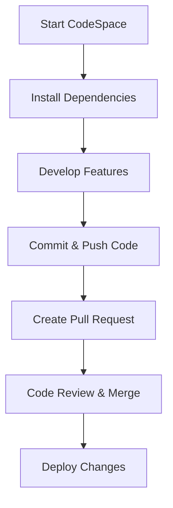
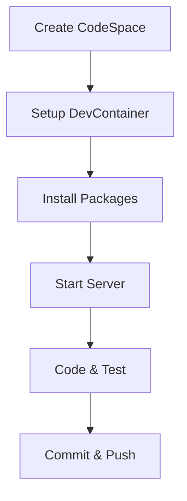
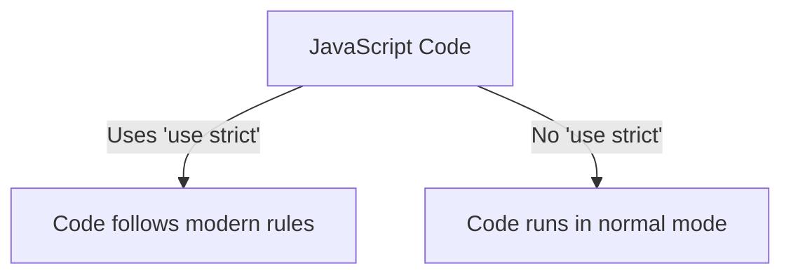
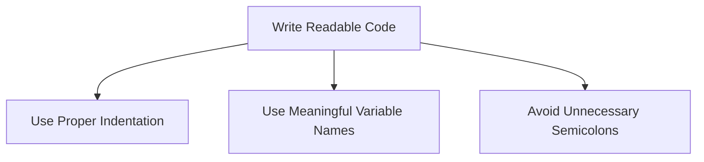
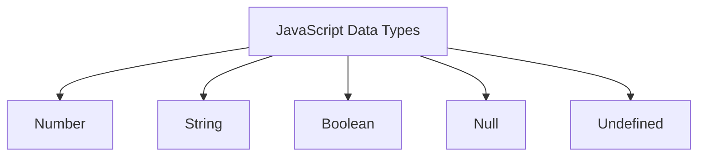
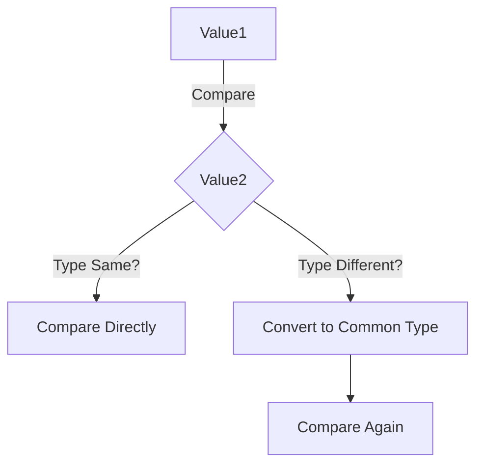
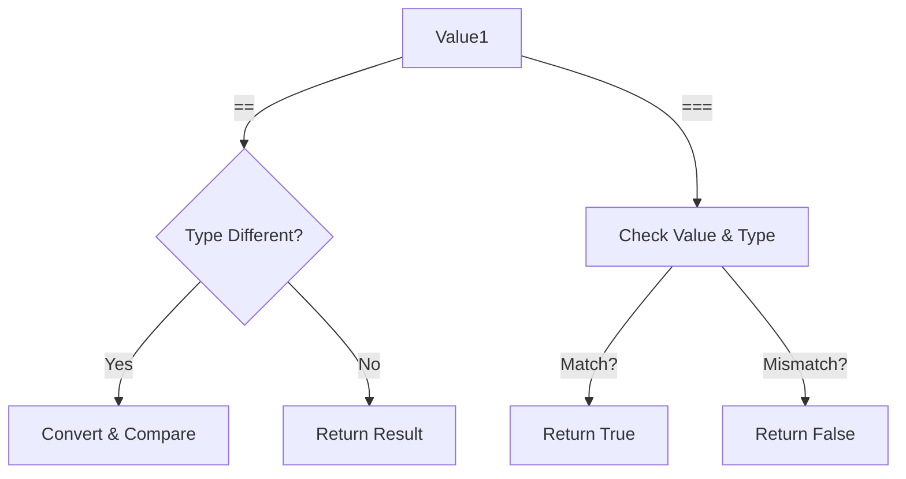
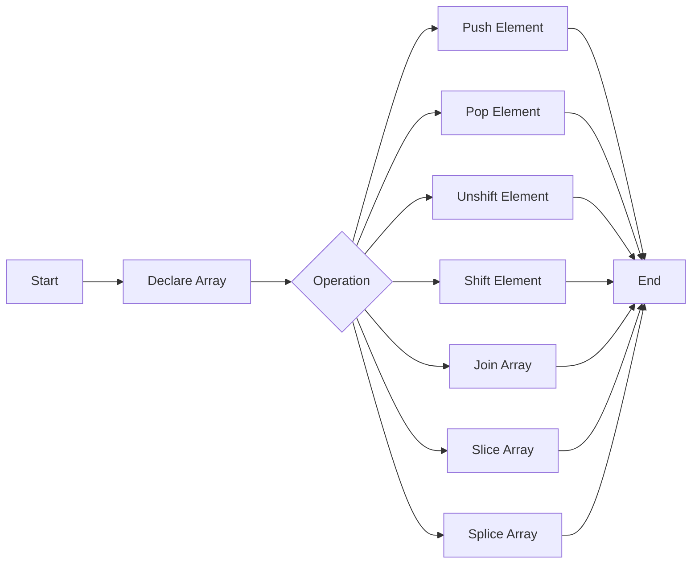

# JavaScript Series - Learn JavaScript from Scratch

## 📌 Introduction
Welcome to the **JavaScript Series**! This series is designed for beginners to advanced learners who want to master JavaScript in a structured manner. If you are just starting out or looking to solidify your understanding, you are in the right place. 

In this README, we will cover:
- **Why learn JavaScript?**
- **Learning approach**
- **Setup and installation**
- **JavaScript fundamentals**
- **In-depth concepts**
- **Projects and real-world applications**
- **Best practices and modern JavaScript**

---

## 🚀 Why Learn JavaScript?
JavaScript is the most popular programming language for web development. It powers:
- **Web Applications** 🖥️ (Frontend & Backend with Node.js)
- **Mobile Applications** 📱 (React Native, Ionic)
- **Game Development** 🎮 (Phaser.js, Three.js)
- **AI & Machine Learning** 🤖 (TensorFlow.js)
- **Internet of Things (IoT)** 🌍

---

## 🎯 Learning Approach
This series will not only teach you JavaScript **syntax** but also help you build **confidence** in writing code. The approach is:

1. **Learn the Basics** - Understanding syntax and structure.
2. **Explore In-Depth Concepts** - Memory management, closures, event loop, etc.
3. **Work on Projects** - Real-world applications for hands-on experience.
4. **Follow Best Practices** - Writing clean, optimized, and modern JavaScript.

> 💡 **Confidence is key!** Syntax can be looked up online, but confidence in problem-solving comes from practice.

---

## 🛠️ Setting Up Your Environment
Before we start coding, let's set up our development environment.

### 1️⃣ Install Node.js
JavaScript was originally used in browsers, but with Node.js, we can run JavaScript outside the browser.

- Download Node.js from: [https://nodejs.org](https://nodejs.org)
- Install Node.js and verify by running:
  ```bash
  node -v
  ```
  ```bash
  npm -v
  ```

### 2️⃣ Install VS Code
A good code editor is essential. Install **VS Code** from [https://code.visualstudio.com](https://code.visualstudio.com).

### 3️⃣ Create Your First JavaScript File
1. Open VS Code.
2. Create a new folder **`JavaScript-Series`**.
3. Inside the folder, create a file named `index.js`.
4. Open the terminal and run:
   ```bash
   node index.js
   ```

---

## 🔥 JavaScript Fundamentals
Here are some essential JavaScript concepts:

### 🔹 Variables & Data Types
JavaScript has three ways to declare variables:
```js
var name = "John"; // Global scope (avoid using it)
let age = 25; // Block scope
const PI = 3.14; // Cannot be changed
```

### 🔹 Functions
Functions allow code reuse and modularity.
```js
function greet(name) {
  return `Hello, ${name}!`;
}
console.log(greet("Alice"));
```

### 🔹 Loops
Loops help in iterating over elements.
```js
for (let i = 0; i < 5; i++) {
  console.log("Iteration:", i);
}
```

### 🔹 Objects & Arrays
```js
let user = {
  name: "John",
  age: 30,
};

let fruits = ["Apple", "Banana", "Cherry"];
console.log(user.name);
console.log(fruits[1]);
```

---

## 📚 In-Depth Concepts
Understanding how JavaScript works under the hood:

### 🌀 Event Loop
JavaScript is **single-threaded** but handles asynchronous operations using the event loop.


### 🛠 Closures & Lexical Scope
```js
function outerFunction(outerVar) {
  return function innerFunction(innerVar) {
    console.log(`Outer: ${outerVar}, Inner: ${innerVar}`);
  };
}
let newFunc = outerFunction("Hello");
newFunc("World");
```

---

## 📌 Projects for Hands-On Learning
We will build real-world projects to reinforce learning.
1. **To-Do List App** 📝
2. **Weather App (API Integration)** 🌤
3. **Expense Tracker** 💰
4. **Blog Website (Full-Stack with Node.js)** 📝

---

## 🎯 Best Practices & Modern JavaScript
- Use **let** and **const** instead of `var`
- Prefer **arrow functions** for shorter syntax
- Use **template literals** for string interpolation
- Avoid **callback hell**, use **async/await**
- Use **modular code** (ES6 Modules)
- Follow **DRY (Don't Repeat Yourself)** principle

---

## 📢 Conclusion
This series will take you from **beginner to advanced** by focusing on both theoretical and practical aspects. Stay patient, practice consistently, and build projects!

> 🚀 **Subscribe and stay tuned for upcoming lessons!**

---

# GitHub CodeSpaces Setup & Development Guide

## Overview
This repository is configured for development in GitHub CodeSpaces. It includes all necessary dependencies, VS Code settings, and an automated setup script to ensure a smooth development experience.

## Table of Contents
1. [Getting Started](#getting-started)
2. [Development Workflow](#development-workflow)
3. [Folder Structure](#folder-structure)
4. [Customization](#customization)
5. [Common Issues & Solutions](#common-issues--solutions)
6. [Flowcharts](#flowcharts)

## Getting Started
### 1. Open CodeSpaces
To start a new development environment:
- Go to your GitHub repository.
- Click on `Code` → `CodeSpaces`.
- Click `New CodeSpace`.

### 2. Install Dependencies
Run the following command in the terminal to install required dependencies:
```sh
npm install
```

### 3. Start Development Server
To start the development server, use:
```sh
npm start
```

## Development Workflow
1. **Clone Repository**: If not using CodeSpaces, clone the repository manually:
   ```sh
   git clone <repository-url>
   ```
2. **Create a Branch**: Always work on a separate branch.
   ```sh
   git checkout -b feature-branch
   ```
3. **Make Changes & Commit**:
   ```sh
   git add .
   git commit -m "Added new feature"
   ```
4. **Push Changes & Create PR**:
   ```sh
   git push origin feature-branch
   ```
   - Create a Pull Request (PR) on GitHub and merge after review.

## Folder Structure
```
├── .github/workflows  # GitHub Actions for CI/CD
├── .devcontainer      # CodeSpaces configuration files
├── src               # Source code files
├── public            # Static assets
├── package.json      # Dependencies and scripts
└── README.md         # Project documentation
```

## Customization
### Modify DevContainer Settings
Edit `.devcontainer/devcontainer.json` to customize:
```json
{
  "name": "My CodeSpace",
  "build": {
    "dockerfile": "Dockerfile"
  },
  "settings": {
    "editor.formatOnSave": true
  }
}
```

## Common Issues & Solutions
| Issue                | Solution |
|----------------------|----------|
| **CodeSpaces slow?** | Restart CodeSpace or upgrade resources |
| **Ports not opening?** | Check `.devcontainer.json` for exposed ports |
| **Build errors?** | Run `npm rebuild` and clear `node_modules` |

## Flowcharts
### Development Workflow


### CodeSpaces Environment Setup


## Conclusion
This guide provides a streamlined development workflow using GitHub CodeSpaces. Happy coding!


# JavaScript Variables and Constants

## Introduction
Variables are fundamental in JavaScript, allowing us to store and manipulate data. This guide explains how to declare variables, the differences between `var`, `let`, and `const`, and best practices for using them in modern JavaScript development.

---

## Table of Contents
1. [Understanding Variable Declaration](#understanding-variable-declaration)
2. [Difference Between `var`, `let`, and `const`](#difference-between-var-let-and-const)
3. [Scope in JavaScript](#scope-in-javascript)
4. [Best Practices for Declaring Variables](#best-practices-for-declaring-variables)
5. [Console Methods for Debugging](#console-methods-for-debugging)
6. [Flowcharts for Better Understanding](#flowcharts-for-better-understanding)

---

## Understanding Variable Declaration
JavaScript allows declaring variables using three keywords:

```javascript
const accountId = 144553; // Constant - cannot be changed
let accountEmail = "example@gmail.com"; // Variable - can be changed
var accountPassword = "12345"; // Variable (not recommended in modern JS)
accountCity = "Jaipur"; // Declared without `var`, `let`, or `const` (Not recommended)
```

Key Observations:
- `const` ensures that the value remains unchanged.
- `let` allows reassignment.
- `var` is outdated and can cause scope-related issues.
- If a variable is declared without `var`, `let`, or `const`, it becomes a global variable.

---

## Difference Between `var`, `let`, and `const`

| Feature      | `var`  | `let`  | `const` |
|-------------|--------|--------|---------|
| Scope       | Function Scope | Block Scope | Block Scope |
| Reassignable | Yes    | Yes    | No       |
| Redeclarable | Yes    | No     | No       |

### Example of Scope Difference
```javascript
function testVar() {
  if (true) {
    var x = 10;
  }
  console.log(x); // Works fine because `var` has function scope
}
testVar();

function testLet() {
  if (true) {
    let y = 20;
  }
  console.log(y); // Error! `let` is block-scoped
}
testLet();
```

**Conclusion**: Always prefer `let` and `const` over `var`.

---

## Scope in JavaScript

### Block Scope vs Function Scope
```javascript
if (true) {
  let blockScoped = "I am inside a block";
  var functionScoped = "I am accessible anywhere in the function";
}

console.log(functionScoped); // Works fine
console.log(blockScoped); // Error!
```

### Flowchart for Variable Scope
```plaintext
Start → Declare variable → Check if using `var` → If yes, function-scoped
                                   ↓
                                   No
                                   ↓
                         Check if using `let` or `const`
                                   ↓
                                   Yes
                                   ↓
                         Block-scoped variable
```

---

## Best Practices for Declaring Variables
1. Always use `const` unless reassignment is needed.
2. Use `let` if the value is meant to change.
3. Avoid using `var` due to its function-scoped behavior.
4. Use meaningful variable names that enhance readability.
5. Avoid global variables unless absolutely necessary.

```javascript
const PI = 3.14; // Good practice
let userName = "Vinay"; // Meaningful variable name
```

---

## Console Methods for Debugging
### `console.log()` vs `console.table()`
```javascript
console.log("User Email: ", accountEmail);
console.table([accountId, accountEmail, accountPassword, accountCity]);
```

- `console.log()` prints messages in the console.
- `console.table()` presents data in a tabular format, improving readability.

---

## Flowcharts for Better Understanding

### Variable Declaration Flowchart
```plaintext
Start → Choose Variable Type → Need constant value?
       ↓                          ↓
      Yes                        No
       ↓                          ↓
 Use `const`                 Need reassignment?
       ↓                          ↓
     Done                        Yes → Use `let`
                                 No → Use `const`
```

### Function vs Block Scope Flowchart
```plaintext
Start → Declaring Variable → Using `var`?
       ↓                          ↓
      Yes                        No
       ↓                          ↓
 Function Scoped       Block Scoped (`let` or `const`)
```

---

## Summary
- **Use `const`** for values that don’t change.
- **Use `let`** for variables that need reassignment.
- **Avoid `var`** due to scope-related issues.
- **Use console methods like `console.log()` and `console.table()`** for debugging.
- **Understand scope** to prevent accidental overwrites.

By following these best practices, you can write clean, efficient, and bug-free JavaScript code!

# JavaScript Basics

## Table of Contents
- [Introduction](#introduction)
- [Strict Mode](#strict-mode)
- [Alerts in JavaScript](#alerts-in-javascript)
- [Arithmetic Operations](#arithmetic-operations)
- [Code Readability & Best Practices](#code-readability--best-practices)
- [JavaScript Documentation](#javascript-documentation)
- [Data Types in JavaScript](#data-types-in-javascript)
- [Conclusion](#conclusion)

---

## Introduction
JavaScript is a versatile programming language used mainly for web development. It has evolved significantly over the years, and understanding modern JavaScript standards ensures that your code remains efficient, readable, and maintainable.

---

## Strict Mode
Strict mode in JavaScript helps catch common coding errors and makes the execution of JavaScript more secure.

### Enabling Strict Mode:
```javascript
'use strict';
```
When you add `'use strict';` at the beginning of a script or function, JavaScript treats all the code in that scope as modern JavaScript.

### Benefits of Strict Mode:
- Prevents the use of undeclared variables.
- Disallows duplicate parameter names in functions.
- Catches silent errors.
- Prevents accidental global variable creation.

### Flowchart for Understanding Strict Mode:


---

## Alerts in JavaScript
The `alert()` function displays a popup box with a message. However, it works only in browsers, not in Node.js.

Example:
```javascript
alert("Hello, World!");
```
In Node.js, use `console.log()` instead.

---

## Arithmetic Operations
JavaScript supports standard arithmetic operations:

```javascript
console.log(3 + 3); // Addition
console.log(3 - 3); // Subtraction
console.log(3 * 3); // Multiplication
console.log(3 / 3); // Division
```

Errors might occur when executing JavaScript arithmetic in different environments (browser vs. Node.js). Always test calculations accordingly.

---

## Code Readability & Best Practices
Good coding practices ensure that JavaScript code is easy to read and maintain.

### Do:
- Write readable and well-indented code.
- Use `console.log()` for debugging.
- Use meaningful variable names.

### Avoid:
- Unnecessary semicolons (`;` can be omitted in most cases).
- Writing long lines without breaks.
- Using global variables excessively.

### Example of Bad Code:
```javascript
console.log(3+3);console.log("Name");
```

### Example of Good Code:
```javascript
console.log(3 + 3);
console.log("Name");
```

Flowchart for Best Practices:


---

## JavaScript Documentation
### Recommended Resources:
- **MDN Web Docs**: User-friendly and comprehensive documentation.
- **TC39 (ECMAScript Standards)**: Defines JavaScript language specifications.

---

## Data Types in JavaScript
JavaScript has several data types that categorize different kinds of values.

### Common Data Types:
| Data Type  | Example      | Description                       |
|------------|-------------|-----------------------------------|
| Number     | `let age = 18;` | Stores numeric values. |
| String     | `let name = "Hitesh";` | Stores text values. |
| Boolean    | `let isLoggedIn = true;` | Stores `true` or `false`. |
| Null       | `let emptyValue = null;` | Represents "nothing". |
| Undefined  | `let notDefined;` | Variable declared but not assigned. |

### Flowchart for Data Types:


---

## Conclusion
Understanding these JavaScript basics helps in writing clean, efficient, and modern JavaScript code. Follow best practices and refer to official documentation for deeper insights. Happy coding!

# JavaScript Data Types & Conversions

## Overview
This document explains JavaScript's data types and type conversions, covering fundamental concepts, best practices, and common pitfalls. Understanding these concepts is crucial for debugging and writing reliable JavaScript code.

---

## Table of Contents
1. [JavaScript Data Types](#javascript-data-types)
2. [Type Checking](#type-checking)
3. [Type Conversion](#type-conversion)
4. [Common Issues & Best Practices](#common-issues--best-practices)
5. [Flowcharts](#flowcharts)

---

## JavaScript Data Types
JavaScript has two main categories of data types:

1. **Primitive Types**
   - `Number`
   - `String`
   - `Boolean`
   - `Undefined`
   - `Null`
   - `Symbol`
   - `BigInt`

2. **Non-Primitive Types (Objects)**
   - `Object`
   - `Array`
   - `Function`

```javascript
let num = 42;            // Number
let text = "Hello";       // String
let isTrue = true;       // Boolean
let nothing = null;      // Null
let notDefined;          // Undefined
let uniqueId = Symbol(); // Symbol
let bigNum = 123n;       // BigInt
```

---

## Type Checking
JavaScript provides two main ways to check a variable's type:

### Using `typeof`
```javascript
console.log(typeof 42);      // "number"
console.log(typeof "text"); // "string"
console.log(typeof true);   // "boolean"
console.log(typeof null);   // "object" (known JavaScript quirk)
console.log(typeof {});     // "object"
```

### Using `instanceof` (for objects)
```javascript
console.log([] instanceof Array); // true
console.log({} instanceof Object); // true
```

---

## Type Conversion
JavaScript allows implicit and explicit type conversions.

### String to Number Conversion
```javascript
let strNum = "33";
let num = Number(strNum);
console.log(typeof num); // "number"
```

### Boolean Conversion
```javascript
console.log(Boolean(1));      // true
console.log(Boolean(0));      // false
console.log(Boolean(""));     // false
console.log(Boolean("text")); // true
```

### Number to String
```javascript
let num = 100;
let str = String(num);
console.log(typeof str); // "string"
```

### Null & Undefined Conversion
```javascript
console.log(Number(null));       // 0
console.log(Number(undefined));  // NaN
```

---

## Common Issues & Best Practices
### Issue 1: `null` being an object
**Problem:**
```javascript
console.log(typeof null); // "object"
```
**Solution:** Always check explicitly:
```javascript
if (value === null) {
    console.log("Value is null");
}
```

### Issue 2: `NaN` (Not-A-Number)
**Problem:**
```javascript
let result = Number("abc");
console.log(result); // NaN
```
**Solution:** Check using `isNaN()`:
```javascript
if (isNaN(result)) {
    console.log("Invalid number conversion");
}
```

### Issue 3: Unexpected Boolean Conversion
**Problem:**
```javascript
console.log(Boolean("false")); // true (because it's a non-empty string)
```
**Solution:** Always compare explicitly with `===`:
```javascript
if (value === "false") {
    console.log("This is a string, not a boolean");
}
```

---

## Flowcharts

### 1. Type Conversion Flowchart
```
Input Value → Is it a Number? → YES → Return as Number
                           → NO → Is it a String? → YES → Convert to Number
                                                   → NO → Is it a Boolean? → YES → Convert to 1 or 0
```

### 2. Boolean Conversion Flowchart
```
Input Value → Is it 0, "", false, null, undefined, or NaN? → YES → Convert to false
                                                   → NO → Convert to true
```

---

## Conclusion
Understanding JavaScript's data types and type conversions is fundamental for writing robust code. Always test and verify type conversions to avoid unintended errors in your programs.

# JavaScript Data Types, Operations, and Type Conversion

## Table of Contents
- [Introduction](#introduction)
- [Mathematical Operations](#mathematical-operations)
- [String Concatenation](#string-concatenation)
- [Type Conversion in JavaScript](#type-conversion-in-javascript)
- [Tricky Cases](#tricky-cases)
- [Assignment Operators](#assignment-operators)
- [Best Practices](#best-practices)

---

## Introduction
In JavaScript, data types and operations can sometimes behave unexpectedly due to automatic type conversion (also known as type coercion). This document explains different operations and how JavaScript processes them internally.

## Mathematical Operations
JavaScript supports basic arithmetic operations:

| Operation | Example | Output |
|-----------|---------|---------|
| Addition | `2 + 2` | `4` |
| Subtraction | `2 - 2` | `0` |
| Multiplication | `2 * 2` | `4` |
| Exponentiation | `2 ** 3` | `8` |
| Division | `10 / 2` | `5` |
| Modulus (Remainder) | `10 % 3` | `1` |

**Flowchart: Mathematical Operations**
```
Start → Input Values → Perform Operation → Output Result → End
```

## String Concatenation
When using the `+` operator, JavaScript automatically converts numbers to strings if one operand is a string:

```javascript
console.log("Hello" + " World"); // Output: "Hello World"
console.log("1" + 2); // Output: "12"
console.log(1 + "2"); // Output: "12"
console.log("1" + 2 + 3); // Output: "123"
console.log(1 + 2 + "3"); // Output: "33"
```

**Flowchart: String Concatenation**
```
Start → Check Data Type → If String Exists → Convert to String → Concatenate → Output Result → End
```

## Type Conversion in JavaScript
JavaScript automatically converts values between different data types based on the context.

| Expression | Output | Explanation |
|------------|---------|-------------|
| `true + 1` | `2` | `true` is converted to `1` |
| `false + 1` | `1` | `false` is converted to `0` |
| `"5" - 2` | `3` | String `"5"` is converted to number |
| `"5" + 2` | `"52"` | Number `2` is converted to string |

**Flowchart: Type Conversion**
```
Start → Identify Type → Apply Operation → Convert Data Type if Needed → Output Result → End
```

## Tricky Cases
Sometimes, JavaScript's implicit conversion leads to unexpected results:

```javascript
console.log(1 + "2" + 2); // Output: "122"
console.log(1 + 2 + "2"); // Output: "32"
console.log(1 + true); // Output: 2 (true is converted to 1)
console.log("5" - true); // Output: 4 (true is converted to 1)
console.log("5" - "2"); // Output: 3 (Both strings are converted to numbers)
console.log("5" * "2"); // Output: 10 (Both strings are converted to numbers)
```

## Assignment Operators
JavaScript allows assigning values using different assignment operators:

```javascript
let num1, num2, num3;
num1 = num2 = num3 = 5; // All variables are assigned the value 5
console.log(num1, num2, num3); // Output: 5 5 5
```

While this shorthand is possible, it's not recommended for readability.

**Flowchart: Assignment Operators**
```
Start → Initialize Variables → Assign Values → Output Values → End
```

## Best Practices
### ✅ Do’s:
- Use parentheses for clarity in operations.
- Explicitly convert values using `Number()`, `String()`, or `Boolean()`.
- Use `===` instead of `==` to avoid unintended type coercion.

```javascript
console.log(Number("5") + 2); // Output: 7
console.log(String(5) + "2"); // Output: "52"
console.log(Boolean("Hello")); // Output: true
```

### ❌ Don’ts:
- Avoid implicit type coercion in critical logic.
- Don't rely on JavaScript's automatic type conversion for crucial calculations.
- Avoid complex nested expressions without parentheses.

```javascript
console.log(1 + "2" + 2); // Bad Practice
console.log(1 + (2 + 2)); // Good Practice: Output is 5
```

---

### Summary
- JavaScript automatically converts data types in certain operations.
- String concatenation with numbers results in strings.
- Boolean values convert to `1` (true) and `0` (false) in numeric operations.
- Using explicit conversions improves code readability and prevents unexpected behavior.
- Follow best practices to write maintainable and predictable JavaScript code.

---

This README provides structured knowledge about JavaScript operations and type conversions, ensuring a solid understanding of how JavaScript behaves in different scenarios. 🚀

# JavaScript Comparison and Data Types

## Introduction
This document explains JavaScript comparison operations, type coercion, and best practices for avoiding unpredictable results. We will also discuss JavaScript data types and their significance in memory allocation.

## Table of Contents
- [Comparison Operators](#comparison-operators)
  - [Type Coercion in Comparisons](#type-coercion-in-comparisons)
  - [Strict vs. Loose Equality](#strict-vs-loose-equality)
- [Common Issues in Comparison](#common-issues-in-comparison)
  - [Comparing `null` and `undefined`](#comparing-null-and-undefined)
  - [Boolean Conversion](#boolean-conversion)
- [JavaScript Data Types](#javascript-data-types)
  - [Primitive vs. Non-Primitive Types](#primitive-vs-non-primitive-types)
- [Best Practices](#best-practices)
- [Flowcharts](#flowcharts)

---

## Comparison Operators
JavaScript provides various operators for comparing values:
- `>` (greater than)
- `<` (less than)
- `>=` (greater than or equal to)
- `<=` (less than or equal to)
- `==` (loose equality)
- `===` (strict equality)

### Type Coercion in Comparisons
JavaScript attempts to convert values to a common type before making a comparison, which can lead to unexpected results.

Example:
```js
console.log(2 > '1'); // true (string '1' is converted to number 1)
console.log('02' == 2); // true (string '02' is converted to number 2)
console.log(null == 0); // false (null is only loosely equal to undefined)
console.log(null >= 0); // true (null is converted to 0)
```

### Strict vs. Loose Equality
- **`==` (Loose Equality):** Allows type conversion before comparison.
- **`===` (Strict Equality):** Compares both value and data type without conversion.

Example:
```js
console.log('5' == 5); // true (string is converted to number)
console.log('5' === 5); // false (different data types)
```

## Common Issues in Comparison

### Comparing `null` and `undefined`
`null` and `undefined` behave inconsistently in comparisons:
```js
console.log(null == undefined); // true
console.log(null === undefined); // false
console.log(null > 0); // false
console.log(null >= 0); // true (null is converted to 0)
```

### Boolean Conversion
JavaScript converts values to boolean in conditions:
```js
console.log(Boolean(0)); // false
console.log(Boolean('')); // false
console.log(Boolean('0')); // true
console.log(Boolean([])); // true
```

## JavaScript Data Types

### Primitive vs. Non-Primitive Types
| Primitive Data Types | Non-Primitive Data Types |
|----------------------|-------------------------|
| Number              | Object                   |
| String              | Array                    |
| Boolean             | Function                 |
| Null                | Date                     |
| Undefined           | RegExp                   |
| Symbol              |                           |
| BigInt              |                           |

### Call by Value vs. Call by Reference
Primitive types are passed **by value**, while non-primitive types are passed **by reference**.

Example:
```js
let a = 5;
let b = a; // Copy of 'a' is assigned to 'b'
b = 10;
console.log(a); // 5

let obj1 = { value: 5 };
let obj2 = obj1; // 'obj2' references 'obj1'
obj2.value = 10;
console.log(obj1.value); // 10
```

## Best Practices
1. Always use `===` instead of `==` to avoid unintended type conversions.
2. Convert data types explicitly using `Number()`, `String()`, `Boolean()`.
3. Avoid comparing `null` and `undefined` directly.
4. Use meaningful variable names to improve code readability.
5. Follow JavaScript best practices for clean and maintainable code.

## Flowcharts
### Type Coercion in Comparisons


### Strict vs. Loose Equality


## Conclusion
Understanding JavaScript comparisons, type coercion, and data types is crucial for writing reliable and bug-free code. By following best practices, developers can avoid common pitfalls and write cleaner, more predictable JavaScript applications.

# JavaScript Data Types Explained

## Table of Contents
1. Introduction
2. Primitive Data Types
   - Undefined
   - Null
   - Boolean
   - Number
   - BigInt
   - String
   - Symbol
3. Non-Primitive (Reference) Data Types
   - Arrays
   - Objects
   - Functions
4. Type Checking in JavaScript
5. Flowcharts for Understanding
6. Conclusion

## 1. Introduction
JavaScript has different types of data structures that can be categorized into two types:
- **Primitive Data Types** (store single values)
- **Non-Primitive (Reference) Data Types** (store collections and complex entities)

This document explains each data type with examples and diagrams.

## 2. Primitive Data Types
Primitive data types are immutable and directly stored in memory.

### a) Undefined
A variable that has been declared but not assigned a value automatically has the value `undefined`.

```js
let user;
console.log(user); // Output: undefined
```

### b) Null
`null` represents an intentional absence of any object value.

```js
let temperature = null;
console.log(temperature); // Output: null
```

### c) Boolean
Boolean values are `true` or `false`.

```js
let isJavaScriptFun = true;
console.log(isJavaScriptFun); // Output: true
```

### d) Number
JavaScript uses `number` for both integers and floating-point values.

```js
let age = 25;
let price = 99.99;
console.log(age, price);
```

### e) BigInt
BigInt is used to store large numbers beyond `Number.MAX_SAFE_INTEGER`.

```js
let bigNumber = 123456789012345678901234567890n;
console.log(bigNumber);
```

### f) String
Strings are sequences of characters enclosed in quotes.

```js
let name = "Vinay";
console.log(name);
```

### g) Symbol
A unique identifier.

```js
const id1 = Symbol("123");
const id2 = Symbol("123");
console.log(id1 === id2); // Output: false
```

## 3. Non-Primitive (Reference) Data Types
Non-primitive data types store references in memory rather than actual values.

### a) Arrays
Arrays hold multiple values in a single variable.

```js
let heroes = ["Shaktiman", "Krish", "Iron Man"];
console.log(heroes[0]); // Output: Shaktiman
```

### b) Objects
Objects hold key-value pairs.

```js
let person = {
    name: "Vinay",
    age: 22
};
console.log(person.name); // Output: Vinay
```

### c) Functions
Functions are first-class objects in JavaScript.

```js
const greet = function() {
    return "Hello, World!";
};
console.log(greet());
```

## 4. Type Checking in JavaScript
To determine the data type of a variable, use `typeof`.

```js
console.log(typeof 25); // Output: number
console.log(typeof "Hello"); // Output: string
console.log(typeof null); // Output: object (JavaScript bug)
console.log(typeof []); // Output: object
console.log(typeof function(){}); // Output: function
```

## 5. Flowcharts for Understanding
### **Primitive vs Non-Primitive Data Types**

```
               ┌─────────────┐
               │ JavaScript  │
               └──────┬──────┘
                      │
        ┌─────────────┴─────────────┐
        │                           │
 ┌──────┴──────┐             ┌──────┴──────┐
 │  Primitive  │             │ Non-Primitive │
 └──────┬──────┘             └──────┬──────┘
        │                           │
 ┌──────┴──────┐             ┌──────┴──────┐
 │ Undefined   │             │   Arrays    │
 │ Null        │             │   Objects   │
 │ Boolean     │             │   Functions │
 │ Number      │             └─────────────┘
 │ BigInt      │
 │ String      │
 │ Symbol      │
 └─────────────┘
```

### **Type Checking Decision Tree**
```
     ┌───────────────┐
     │  typeof X     │
     └───────┬───────┘
             │
    ┌────────┴────────┐
    │                 │
 ┌──┴──┐         ┌────┴───┐
 │Primitive     │ Reference │
 └──────┬──────┘ └──────┬───┘
        │               │
 ┌──────┴──────┐   ┌────┴────┐
 │   String    │   │  Object │
 │   Number    │   │  Array  │
 │   Boolean   │   │ Function│
 │   BigInt    │   └─────────┘
 │   Symbol    │
 │   Undefined │
 │   Null      │
 └─────────────┘
```

## 6. Conclusion
Understanding JavaScript data types is fundamental for writing efficient and bug-free code. Always be cautious with `typeof null` returning `object`, and remember that functions in JavaScript are special objects.

# JavaScript Memory Management: Stack vs Heap

## Introduction
Understanding memory management in JavaScript is crucial for writing efficient and bug-free code. This guide explains how JavaScript manages memory using Stack and Heap, the difference between primitive and non-primitive data types, and how variables reference values.

## Table of Contents
- [JavaScript Memory: Stack vs Heap](#javascript-memory-stack-vs-heap)
- [Primitive Data Types and Stack](#primitive-data-types-and-stack)
- [Non-Primitive Data Types and Heap](#non-primitive-data-types-and-heap)
- [Example: Value vs Reference](#example-value-vs-reference)
- [Understanding Object References](#understanding-object-references)
- [String Manipulation in JavaScript](#string-manipulation-in-javascript)
- [Conclusion](#conclusion)

---

## JavaScript Memory: Stack vs Heap
JavaScript uses two types of memory storage:
1. **Stack Memory**: Used for storing primitive data types (numbers, strings, booleans, etc.). When assigned to a variable, the value is copied.
2. **Heap Memory**: Used for storing non-primitive data types (objects, arrays, functions). When assigned to a variable, a reference to the original value is given.

 *(Illustrative representation of Stack and Heap memory)*

---

## Primitive Data Types and Stack
Primitive data types include:
- Numbers: `let x = 10;`
- Strings: `let name = "John";`
- Booleans: `let isTrue = true;`
- Null & Undefined: `let val = null;`
- Symbols: `let sym = Symbol("id");`

**Behavior in Stack Memory:**
- Each time a primitive value is assigned to a variable, a copy of the value is stored in the stack.
- Changing one variable does not affect others.

Example:
```javascript
let a = 10;
let b = a;
b = 20;
console.log(a); // Output: 10 (unchanged)
console.log(b); // Output: 20
```

---

## Non-Primitive Data Types and Heap
Non-primitive data types include:
- Objects: `let obj = { key: "value" };`
- Arrays: `let arr = [1, 2, 3];`
- Functions: `function greet() { console.log("Hello!"); }`

**Behavior in Heap Memory:**
- Non-primitive values are stored in the heap, and variables only get a reference.
- Modifying one reference affects all references pointing to the same object.

Example:
```javascript
let user1 = { name: "Alice" };
let user2 = user1;
user2.name = "Bob";
console.log(user1.name); // Output: "Bob"
console.log(user2.name); // Output: "Bob"
```

Here, `user1` and `user2` both reference the same memory location.

---

## Example: Value vs Reference
Consider the following code:
```javascript
let myString = "Hello";
let anotherString = myString;
anotherString = "World";
console.log(myString); // Output: "Hello"
console.log(anotherString); // Output: "World"
```
*Primitive data types are copied, so changes in `anotherString` do not affect `myString`.*

For objects:
```javascript
let obj1 = { channel: "CodeWorld" };
let obj2 = obj1;
obj2.channel = "NewCode";
console.log(obj1.channel); // Output: "NewCode"
console.log(obj2.channel); // Output: "NewCode"
```
*Non-primitive data types share references, so changes affect all references.*

---

## Understanding Object References
A common mistake is assuming that assigning an object to another variable creates a copy. Instead, it creates a reference.

### Diagram Representation
```
user1 -> { name: "Alice" } <- user2
```
Both `user1` and `user2` point to the same object in heap memory.

If we assign a new object to `user2`, it will now reference a different object:
```javascript
user2 = { name: "Charlie" };
```
Now, `user1` and `user2` reference different objects.

---

## String Manipulation in JavaScript
### String Declaration Methods
```javascript
let str1 = "Hello"; // Using literals
let str2 = new String("Hello"); // Using object constructor
```
Literals are stored in stack, while objects are stored in heap.

### String Concatenation
```javascript
let name = "Alice";
let repoCount = 50;

// Traditional Concatenation
console.log("User " + name + " has " + repoCount + " repositories.");

// Template Literals (Modern Approach)
console.log(`User ${name} has ${repoCount} repositories.`);
```
Using template literals improves readability and flexibility.

### String Methods
```javascript
let gameName = "Cyberpunk";
console.log(gameName.toUpperCase()); // "CYBERPUNK"
console.log(gameName.toLowerCase()); // "cyberpunk"
console.log(gameName.length); // 9
```

---

## Conclusion
- **Stack stores primitive values**, providing copies.
- **Heap stores non-primitive values**, providing references.
- **Changing a primitive variable does not affect the original value.**
- **Changing a non-primitive reference affects all variables pointing to the same reference.**

Understanding these concepts is essential for writing efficient and bug-free JavaScript code!

---

### 📌 Additional Resources
- [MDN Web Docs: Memory Management](https://developer.mozilla.org/en-US/docs/Web/JavaScript/Memory_Management)
- [JavaScript.info: Garbage Collection](https://javascript.info/garbage-collection)

🚀 *Happy Coding!*

# String Methods in JavaScript

## Overview
This document covers important string methods in JavaScript with examples, explanations, and flowcharts to make concepts easy to understand.

---

## Table of Contents
- [Character Position](#character-position)
- [Finding the Index of a Character](#finding-the-index-of-a-character)
- [Breaking a String into Parts](#breaking-a-string-into-parts)
- [Substring vs Slice](#substring-vs-slice)
- [Trimming Whitespace](#trimming-whitespace)
- [Replacing Text in a String](#replacing-text-in-a-string)
- [Checking if a String Includes Another String](#checking-if-a-string-includes-another-string)
- [Splitting a String into an Array](#splitting-a-string-into-an-array)

---

## Character Position
The `charAt()` method returns the character at a specific position in a string.
```javascript
let str = "Hello";
console.log(str.charAt(1)); // Output: 'e'
```

### Flowchart
```
Start → Input string → Use charAt(index) → Output character → End
```

---

## Finding the Index of a Character
The `indexOf()` method returns the first occurrence of a character.
```javascript
let str = "Hello";
console.log(str.indexOf('l')); // Output: 2
```

---

## Breaking a String into Parts
We can extract a part of a string using `substring()` and `slice()`.

### `substring(start, end)`
Extracts a section of a string between start and end indexes.
```javascript
let str = "JavaScript";
console.log(str.substring(0, 4)); // Output: 'Java'
```

### `slice(start, end)`
Same as `substring()` but supports negative indices.
```javascript
console.log(str.slice(-6, -2)); // Output: 'Scri'
```

### Flowchart
```
Start → Input string → Choose method (substring/slice) → Extract portion → Output result → End
```

---

## Trimming Whitespace
The `trim()` method removes leading and trailing whitespace.
```javascript
let str = "  Hello World!  ";
console.log(str.trim()); // Output: 'Hello World!'
```

---

## Replacing Text in a String
The `replace()` method replaces occurrences of text.
```javascript
let str = "Visit example.com";
console.log(str.replace("example.com", "mysite.com")); // Output: 'Visit mysite.com'
```

### Flowchart
```
Start → Input string → Apply replace() → Output modified string → End
```

---

## Checking if a String Includes Another String
The `includes()` method checks if a substring exists in a string.
```javascript
let str = "Hello World";
console.log(str.includes("World")); // Output: true
```

---

## Splitting a String into an Array
The `split()` method divides a string into an array based on a separator.
```javascript
let str = "apple,banana,orange";
let arr = str.split(",");
console.log(arr); // Output: ['apple', 'banana', 'orange']
```

### Flowchart
```
Start → Input string → Use split(separator) → Output array → End
```

---

## Conclusion
Mastering string methods helps in efficient string manipulation, a crucial skill in JavaScript programming. Regular practice with real-world examples will reinforce understanding.

# JavaScript Data Types and Methods Documentation

## Introduction
This document provides detailed notes on JavaScript data types, particularly focusing on numbers, their properties, methods, and practical examples. Additionally, we will explore the `Math` object and its useful functions. This guide will also include flowcharts and examples for better understanding.

---

## Table of Contents
1. [JavaScript Data Types Overview](#1-javascript-data-types-overview)
2. [Numbers in JavaScript](#2-numbers-in-javascript)
    - Declaring Numbers
    - Using Methods: `toString()`, `toFixed()`, and `toPrecision()`
    - Practical Examples
3. [Using the Math Object](#3-using-the-math-object)
    - Overview of Math Object
    - Useful Math Methods
4. [Conclusion](#4-conclusion)

---

## 1. JavaScript Data Types Overview

JavaScript provides a variety of built-in data types. Here, we focus primarily on numbers and their usage. Numbers in JavaScript are 64-bit floating point values, meaning they can represent integers as well as decimals.

### Examples of Data Types:
- String
- Number
- Object
- Boolean

---

## 2. Numbers in JavaScript

JavaScript allows us to define numbers both implicitly and explicitly. Numbers are fundamental data types used for calculations and can be expressed in various formats.

### Declaring Numbers

You can declare a number using either `const`, `let`, or `var`:
```javascript
const score = 400; // Implicitly defined
const balance = new Number(100); // Explicitly defined as a Number object
```

### Using Methods

- **`toString()`**: Converts a number to a string.
- **`toFixed()`**: Formats a number to a fixed number of decimal places.
- **`toPrecision()`**: Specifies the number of significant digits.

#### Example:

```javascript
let balance = 100;
console.log(balance.toString()); // Converts number to string
console.log(balance.toFixed(2)); // Converts number to a string with 2 decimal places
console.log(balance.toPrecision(4)); // Shows 4 significant digits
```

### Practical Example: Using `toString()`, `toFixed()`, and `toPrecision()`

- **`toString()` Example**:
    - Converts `100` to the string `"100"`.
    - You can access string methods such as `.length` after conversion.
  
```javascript
let num = 100;
let str = num.toString();
console.log(str.length); // Outputs: 3
```

- **`toFixed()` Example**:
    - Useful for applications that need a fixed decimal precision (like e-commerce apps).
  
```javascript
let price = 23.8966;
console.log(price.toFixed(2)); // 23.90
```

- **`toPrecision()` Example**:
    - Controls the precision of significant digits.
  
```javascript
let value = 1234.56789;
console.log(value.toPrecision(3)); // 1230
```

---

## 3. Using the Math Object

JavaScript provides the `Math` object, which contains a collection of mathematical functions and constants. This object is essential for performing complex calculations.

### Overview of Math Object
The `Math` object is a built-in object in JavaScript. It is not a function, but a static object that holds various properties and methods.

```javascript
console.log(Math.PI); // Outputs: 3.141592653589793
console.log(Math.sqrt(16)); // Outputs: 4
```

### Useful Math Methods

- **`Math.abs()`**: Returns the absolute value of a number.
- **`Math.floor()`**: Rounds a number down to the nearest integer.
- **`Math.ceil()`**: Rounds a number up to the nearest integer.
- **`Math.round()`**: Rounds a number to the nearest integer.
- **`Math.pow()`**: Returns the base raised to the power of the exponent.

#### Example:

```javascript
console.log(Math.abs(-4)); // Outputs: 4
console.log(Math.floor(5.8)); // Outputs: 5
console.log(Math.ceil(5.2)); // Outputs: 6
console.log(Math.pow(2, 3)); // Outputs: 8
```

### Example for `Math.random()`:

```javascript
let randomValue = Math.random(); // Generates a random number between 0 and 1
console.log(randomValue); // Random output
```

---

## 4. Conclusion

In JavaScript, understanding data types, especially numbers, is essential for building efficient applications. By leveraging built-in methods and objects like `Math`, you can handle various calculations and manipulations of data. Whether you are formatting numbers, performing complex calculations, or generating random numbers, JavaScript provides powerful built-in tools for these tasks.

### Flowcharts
Below is a flowchart summarizing the number type conversions and the usage of methods:

```plaintext
Start -> Declare a number -> Apply Method (toString(), toFixed(), etc.) -> Output the result
```

For more detailed examples or to explore other Math methods, you can refer to the official [MDN documentation](https://developer.mozilla.org/en-US/docs/Web/JavaScript/Reference/Global_Objects/Math).

---

This guide offers a comprehensive understanding of JavaScript numbers and their properties, as well as practical examples for everyday usage. Happy coding!

Certainly! Here is the **`README.md`** file, formatted with detailed notes and explanations, along with a flowchart concept for better understanding:

---

# JavaScript Math and Date Manipulations

This guide covers the concept of JavaScript `Math` operations, including random number generation, and basic `Date` manipulation. It explains how to generate random numbers within a specific range, avoid unwanted values like `0`, and explore JavaScript's `Date` object and related methods.

## Table of Contents

1. [Math.random() and Number Ranges](#mathrandom-and-number-ranges)
2. [Handling Zero and Negative Numbers](#handling-zero-and-negative-numbers)
3. [Multiplying and Rounding Random Numbers](#multiplying-and-rounding-random-numbers)
4. [JavaScript Date Object](#javascript-date-object)
5. [Converting Dates](#converting-dates)
6. [Common Date Methods](#common-date-methods)
7. [Flowchart](#flowchart)

---

## Math.random() and Number Ranges

### Generating Random Numbers

In JavaScript, `Math.random()` generates a floating-point number between 0 (inclusive) and 1 (exclusive). You can multiply this value by a specific number (like 10) to shift the decimal point and generate values between `0` and `10`.

Example:

```javascript
let randomNum = Math.random() * 10;
console.log(randomNum);  // Will log a random number between 0 and 10
```

### Handling Range Restrictions

When you need to ensure that the value doesn't fall below a minimum threshold, you can adjust it using `Math.floor()` to round the value down and add a fixed offset.

Example:

```javascript
let min = 10;
let max = 20;
let randomInRange = Math.floor(Math.random() * (max - min + 1) + min);
console.log(randomInRange);  // Will log a value between 10 and 20
```

This approach avoids unexpected `0` values and guarantees the output lies between `10` and `20`.

---

## Handling Zero and Negative Numbers

While working with random numbers, you might encounter undesired zero values. To ensure that a value of `0` is not generated, an adjustment like adding `1` can help. 

Example:

```javascript
let randomAdjusted = Math.floor(Math.random() * (max - min) + min) + 1;
console.log(randomAdjusted);  // Will guarantee a value between 1 and 20
```

This ensures no zero is ever returned in the generated range.

---

## Multiplying and Rounding Random Numbers

In cases where you want to multiply random numbers and then round them, you can use a combination of `Math.random()` with multiplication and rounding functions.

Example:

```javascript
let randomNum = Math.floor(Math.random() * 10) + 1;
console.log(randomNum);  // Rounds to nearest integer between 1 and 10
```

By applying `Math.floor()`, values are rounded down to the nearest whole number.

---

## JavaScript Date Object

The `Date` object in JavaScript represents a single point in time and provides various methods for manipulating dates. Dates are internally stored as milliseconds since January 1, 1970 (Unix Epoch).

### Creating a Date Object

You can create a new Date object by simply calling the constructor:

```javascript
let currentDate = new Date();
console.log(currentDate);  // Will log the current date and time
```

### Converting Date to String

To convert a Date object to a string, JavaScript provides a `toString()` method.

```javascript
let dateStr = currentDate.toString();
console.log(dateStr);  // Converts Date object to string format
```

This converts the current date into a human-readable string.

---

## Converting Dates

JavaScript provides several methods for converting date objects into different string formats. The most commonly used methods are:

1. **`toString()`**: Converts to a full date string in the browser's time zone.
2. **`toISOString()`**: Converts the date to an ISO 8601 string.
3. **`toLocaleString()`**: Converts the date to a string based on the local time zone.

Example:

```javascript
let dateStr = currentDate.toISOString();
console.log(dateStr);  // Converts date to ISO string format
```

---

## Common Date Methods

Here are some commonly used methods when working with dates:

- **`getDate()`**: Returns the day of the month.
- **`getMonth()`**: Returns the month (0-based index).
- **`getFullYear()`**: Returns the full year.
- **`getHours()`**: Returns the hour of the day.
- **`getMinutes()`**: Returns the minute of the hour.

Example:

```javascript
let dayOfMonth = currentDate.getDate();
console.log(dayOfMonth);  // Logs the current day of the month
```

---

## Flowchart

Here’s a flowchart that illustrates the process of generating a random number within a range, adjusting for minimum values, and rounding it:

```plaintext
        Start
           |
    Generate Math.random()
           |
    Multiply by Max - Min
           |
    Add Min to get the range
           |
    Apply Math.floor() for rounding
           |
    Check if zero or negative value
           |
    If yes, add offset (e.g., +1)
           |
    End
```

This chart outlines the basic steps for ensuring random numbers fall within a specified range and are handled correctly without unexpected zero or negative values.

---

By following these concepts and examples, you can better manage `Math.random()` values and `Date` objects in JavaScript to handle both numeric and date-related tasks efficiently.

Sure! Here's a detailed `README.md` file with explanations, code examples, and flowcharts. I’ve structured it for better clarity:

---

# JavaScript Date & Time Handling: A Comprehensive Guide

This guide explains how to handle dates and times in JavaScript, including date object creation, formatting, comparison, and manipulation. We will cover various methods and best practices for handling date and time data in JavaScript, which is essential for real-world applications like booking systems, polls, and other time-based features.

## Table of Contents

1. [Introduction to Date in JavaScript](#introduction-to-date-in-javascript)
2. [Date Creation and Formatting](#date-creation-and-formatting)
3. [Working with Date Methods](#working-with-date-methods)
4. [Working with Timestamps](#working-with-timestamps)
5. [Date Manipulation](#date-manipulation)
6. [Time Conversion](#time-conversion)
7. [Custom Formatting and Localization](#custom-formatting-and-localization)
8. [Conclusion](#conclusion)

---

## Introduction to Date in JavaScript

JavaScript provides a built-in `Date` object that allows you to work with dates and times. The `Date` object represents a single moment in time in a platform-independent format.

### Key Features:
- Can store a specific date and time.
- Provides methods to extract and manipulate date and time components.

---

## Date Creation and Formatting

### Basic Date Declaration
You can create a `Date` object in various ways, including by using a date string or timestamp.

Example:
```javascript
let myDate = new Date();
console.log(myDate); // Current date and time
```

### Formatting Dates

You can specify the date in different formats:

1. **MM-DD-YYYY format**:
   ```javascript
   let date = new Date('2023-01-14');
   console.log(date); // Output: Sat Jan 14 2023
   ```

2. **DD-MM-YYYY format**:
   ```javascript
   let date = new Date('14-01-2023');
   console.log(date); // Invalid date due to format mismatch
   ```

To avoid issues, ensure the correct date format or use JavaScript's built-in formatting functions.

---

## Working with Date Methods

JavaScript offers several built-in methods to extract information from a `Date` object. Some commonly used methods are:

### 1. `getMonth()`
- Returns the month (0 for January, 1 for February, etc.).

Example:
```javascript
let date = new Date('2023-01-14');
console.log(date.getMonth()); // Output: 0 (January)
```

### 2. `getDay()`
- Returns the day of the week (0 for Sunday, 1 for Monday, etc.).

Example:
```javascript
let date = new Date('2023-01-14');
console.log(date.getDay()); // Output: 6 (Saturday)
```

### 3. `getFullYear()`
- Returns the full year (e.g., 2023).

Example:
```javascript
let date = new Date('2023-01-14');
console.log(date.getFullYear()); // Output: 2023
```

### 4. `getTime()`
- Returns the timestamp in milliseconds (milliseconds since 1970-01-01).

Example:
```javascript
let timestamp = new Date().getTime();
console.log(timestamp); // Example output: 1612555073419
```

---

## Working with Timestamps

Timestamps represent time in milliseconds since January 1, 1970 (Unix Epoch). They are helpful for comparing dates and times.

### Example: Getting Timestamp
```javascript
let timestamp = new Date().getTime();
console.log(timestamp); // Current timestamp
```

### Converting Timestamps to Date Objects
You can convert a timestamp back to a `Date` object like this:
```javascript
let timestamp = 1612555073419; // Example timestamp
let date = new Date(timestamp);
console.log(date); // Output: Sat Jan 14 2023 00:00:00 GMT+0000
```

---

## Date Manipulation

You can manipulate dates in JavaScript using methods like `setDate()`, `setMonth()`, and `setFullYear()`.

### Example: Changing a Date

```javascript
let date = new Date('2023-01-14');
date.setDate(20);
console.log(date); // Output: Fri Jan 20 2023
```

---

## Time Conversion

### Converting Milliseconds to Seconds
Sometimes, you may need to convert milliseconds to seconds. You can do this by dividing the value by `1000`.

Example:
```javascript
let date = new Date();
let milliseconds = date.getTime();
let seconds = Math.floor(milliseconds / 1000);
console.log(seconds); // Converts milliseconds to seconds
```

---

## Custom Formatting and Localization

JavaScript allows you to format and localize dates using the `toLocaleString()` method. You can specify locale and options to customize the output format.

### Example: Custom Date Formatting
```javascript
let date = new Date();
let formattedDate = date.toLocaleString('en-US', { year: 'numeric', month: 'long', day: 'numeric' });
console.log(formattedDate); // Example output: January 14, 2023
```

### Example: Using Custom Formats with `toLocaleString`
You can define custom date formats by passing options to `toLocaleString()`.
```javascript
let date = new Date();
let options = { weekday: 'long', year: 'numeric', month: 'long', day: 'numeric' };
let formattedDate = date.toLocaleString('en-US', options);
console.log(formattedDate); // Example output: Saturday, January 14, 2023
```

---

## Flowchart: Understanding Date Methods

```plaintext
               +--------------------+
               |    Create Date     |
               +--------------------+
                        |
                        v
             +-----------------------+
             |   Extract Date Values |
             +-----------------------+
                        |
        +---------------+------------------+
        |                                  |
        v                                  v
 +-------------------+           +--------------------+
 | Get Full Year     |           | Get Day of Week    |
 +-------------------+           +--------------------+
        |                                  |
        v                                  v
 +-------------------+           +--------------------+
 | Get Month         |           | Get Date Value     |
 +-------------------+           +--------------------+
        |
        v
 +-------------------+
 | Get Time (Timestamp) |
 +-------------------+
```

---

## Conclusion

JavaScript's `Date` object is powerful for working with dates and times. It provides several methods for date manipulation, formatting, and localization. By using these methods, you can handle time-based logic effectively in your applications.

---

This `README.md` should provide you with a solid understanding of date handling in JavaScript. Feel free to experiment with the examples and methods, and explore more advanced concepts as you build real-world projects.

---
# JavaScript Arrays: Concepts, Methods, and Best Practices

This README file explains the core concepts, methods, and practical applications of JavaScript arrays, providing detailed explanations, flowcharts, and code snippets to help you master array operations.

## Table of Contents
1. [Introduction to Arrays](#introduction-to-arrays)
2. [Declaring Arrays](#declaring-arrays)
3. [Array Methods](#array-methods)
4. [Common Pitfalls](#common-pitfalls)
5. [Flowchart of Array Operations](#flowchart-of-array-operations)
6. [Conclusion](#conclusion)

---

### 1. Introduction to Arrays
Arrays in JavaScript are data structures used to store multiple values in a single variable. Arrays can hold a collection of elements, whether of the same type or different types.

#### Key Properties of Arrays:
- **Length**: The number of elements in an array.
- **Prototype**: The inherited methods and properties of arrays.

Example:

```javascript
const numbers = [1, 2, 3, 4];
console.log(numbers.length); // Outputs: 4
```

---

### 2. Declaring Arrays
There are several ways to declare arrays in JavaScript.

#### Method 1: Using Square Brackets
The most common way to declare an array is by using square brackets.

```javascript
const heroes = ['Ironman', 'Spiderman', 'Thor'];
```

#### Method 2: Using the `new Array()` Constructor
You can also declare an array using the `new Array()` syntax.

```javascript
const numbers = new Array(1, 2, 3, 4);
```

---

### 3. Array Methods
Arrays come with various built-in methods that allow for powerful manipulations. Here are some commonly used array methods:

#### 3.1 **Push**
The `push()` method adds new elements to the end of the array.

```javascript
let numbers = [1, 2, 3, 4];
numbers.push(5); // Adds 5 to the end
console.log(numbers); // Outputs: [1, 2, 3, 4, 5]
```

#### 3.2 **Pop**
The `pop()` method removes the last element of the array.

```javascript
let numbers = [1, 2, 3, 4];
numbers.pop(); // Removes the last element
console.log(numbers); // Outputs: [1, 2, 3]
```

#### 3.3 **Unshift**
The `unshift()` method adds new elements to the beginning of the array.

```javascript
let numbers = [1, 2, 3, 4];
numbers.unshift(0); // Adds 0 at the beginning
console.log(numbers); // Outputs: [0, 1, 2, 3, 4]
```

#### 3.4 **Shift**
The `shift()` method removes the first element of the array.

```javascript
let numbers = [1, 2, 3, 4];
numbers.shift(); // Removes the first element
console.log(numbers); // Outputs: [2, 3, 4]
```

#### 3.5 **Includes**
The `includes()` method checks if an array contains a specific element.

```javascript
let numbers = [1, 2, 3, 4];
console.log(numbers.includes(3)); // Outputs: true
console.log(numbers.includes(5)); // Outputs: false
```

#### 3.6 **IndexOf**
The `indexOf()` method returns the index of the first occurrence of an element.

```javascript
let numbers = [1, 2, 3, 4];
console.log(numbers.indexOf(3)); // Outputs: 2
```

#### 3.7 **Join**
The `join()` method converts all elements of an array into a string, separated by commas.

```javascript
let numbers = [1, 2, 3, 4];
console.log(numbers.join('-')); // Outputs: '1-2-3-4'
```

#### 3.8 **Slice**
The `slice()` method returns a shallow copy of a portion of an array.

```javascript
let numbers = [1, 2, 3, 4];
let slicedArray = numbers.slice(1, 3); // Copies elements from index 1 to 3
console.log(slicedArray); // Outputs: [2, 3]
```

#### 3.9 **Splice**
The `splice()` method can add or remove elements from an array at any index.

```javascript
let numbers = [1, 2, 3, 4];
numbers.splice(2, 1, 5); // Removes 1 element at index 2 and adds 5
console.log(numbers); // Outputs: [1, 2, 5, 4]
```

---

### 4. Common Pitfalls
Understanding these common pitfalls will help avoid errors when working with arrays in JavaScript:

1. **Modifying arrays while iterating**: Modifying an array while iterating over it may result in unexpected behavior.
   
2. **Accessing out-of-bounds indices**: JavaScript arrays are zero-indexed, so always ensure the index you're accessing is valid.

3. **Array mutability**: Methods like `push()`, `pop()`, `shift()`, and `unshift()` modify the original array. If you need to avoid mutation, consider using methods like `concat()`, `slice()`, or `map()` that return new arrays.

---

### 5. Flowchart of Array Operations

Here's a simple flowchart of common array operations:



---

### 6. Conclusion
JavaScript arrays are powerful tools for handling collections of data. By mastering the methods and understanding the best practices, you can efficiently manipulate arrays to suit various scenarios. Understanding array operations like `push()`, `pop()`, `shift()`, `unshift()`, and others will make your code more readable and functional.

Feel free to explore additional methods like `map()`, `filter()`, and `reduce()` as you progress!

---

By learning these methods and techniques, you will be better equipped to handle more complex array operations and optimize your code for performance.
Here's how you can structure your `README.md` file with detailed notes and flowcharts for the JavaScript array project you've described. This file will help others understand the concepts you're working on, along with explanations, code snippets, and visual aids.

---

# JavaScript Array Methods Project

## Introduction

This repository explores various JavaScript array methods, including basic operations, merging arrays, handling nested arrays, and converting different data types into arrays. Throughout this project, we will cover key array methods such as `push`, `concat`, `flat`, and `Array.from()`. We'll also look at how arrays can hold different data types, and how we can manipulate and merge them for different use cases.

## Project Overview

The project includes multiple JavaScript files demonstrating array operations, from basic creation and modification to complex merging and flattening techniques. This will help you build a strong foundation in working with arrays in JavaScript, especially for tasks like data manipulation in applications like React.js or Node.js.

### Key Features

- **Array Creation and Initialization**
- **Common Array Methods (`push`, `concat`, etc.)**
- **Handling Nested Arrays**
- **Flattening Nested Arrays**
- **Using `Array.from()` to Create Arrays from Other Data Types**

---

## Detailed Notes

### 1. Basic Array Operations

#### Creating an Array

To create an array in JavaScript, you can initialize it with elements, like:

```javascript
let marvelHeroes = ['Thor', 'Iron Man', 'Spider-Man'];
let dcHeroes = ['Superman', 'Flash', 'Batman'];
```

You can perform common operations such as adding or removing items from an array.

#### Adding Items to an Array

Using the `push()` method adds items to the end of an array:

```javascript
marvelHeroes.push('Hulk');
console.log(marvelHeroes);  // ['Thor', 'Iron Man', 'Spider-Man', 'Hulk']
```

However, `push()` modifies the original array. If you want to merge arrays without changing the original ones, consider using `concat()`.

### 2. Merging Arrays

#### Using `concat()` Method

To merge two arrays without modifying the original ones, use `concat()`:

```javascript
let allHeroes = marvelHeroes.concat(dcHeroes);
console.log(allHeroes);  // ['Thor', 'Iron Man', 'Spider-Man', 'Hulk', 'Superman', 'Flash', 'Batman']
```

`concat()` does not modify the original arrays. It returns a new array with the merged elements.

#### Using Spread Operator

The spread operator (`...`) can be used to merge arrays in a cleaner way:

```javascript
let newHeroes = [...marvelHeroes, ...dcHeroes];
console.log(newHeroes);  // ['Thor', 'Iron Man', 'Spider-Man', 'Hulk', 'Superman', 'Flash', 'Batman']
```

---

### 3. Flattening Nested Arrays

#### Using `flat()` Method

If you have nested arrays, `flat()` can be used to merge them into a single array:

```javascript
let nestedArray = [1, [2, 3], [4, 5], [6]];
let flatArray = nestedArray.flat();
console.log(flatArray);  // [1, 2, 3, 4, 5, 6]
```

You can also specify the depth of flattening using `flat(depth)`. For example, `flat(2)` would flatten up to two levels.

#### Example with Multiple Nested Levels

```javascript
let multiNestedArray = [1, [2, [3, [4, 5]]]];
let flatMultiLevel = multiNestedArray.flat(3);
console.log(flatMultiLevel);  // [1, 2, 3, 4, 5]
```

---

### 4. Array Conversion

#### Using `Array.from()`

The `Array.from()` method is useful for converting other data types (like objects or strings) into arrays. For example:

```javascript
let nameString = "Hitesh";
let nameArray = Array.from(nameString);
console.log(nameArray);  // ['H', 'i', 't', 'e', 's', 'h']
```

You can also convert a NodeList to an array:

```javascript
let nodeList = document.querySelectorAll('div');
let nodeArray = Array.from(nodeList);
```

---

## Flowcharts

Here are a couple of flowcharts to illustrate the key array operations.

### Flowchart 1: Merging Arrays

```plaintext
[Start] --> [Create Two Arrays] --> [Use concat or spread] --> [Merge Arrays] --> [End]
```

### Flowchart 2: Flattening Nested Arrays

```plaintext
[Start] --> [Create Nested Array] --> [Use flat() Method] --> [Flatten Array] --> [End]
```

---

## Conclusion

Through this project, we've covered several fundamental array operations that are essential for JavaScript developers. Understanding how to manipulate arrays will help you build more efficient and scalable applications. You can experiment with the provided examples to see how each method works in action.

Feel free to clone the repository and explore the code files directly on [GitHub](https://github.com/h-chaudhary/js-hindi-youtube3).

---

Let me know if you need further details, additions, or more flowcharts!

Here's a detailed `README.md` for the content you've shared, with proper structure, explanation, and flowcharts:

---

# JavaScript Objects and Advanced Concepts

## Overview

This README provides an in-depth explanation of JavaScript objects, including declaration methods, accessing values, and important concepts like "Singletons" and "Symbols." By the end of this guide, you'll have a solid understanding of working with JavaScript objects and how to handle them effectively in various scenarios.

---

## Table of Contents

- [Introduction](#introduction)
- [What Are JavaScript Objects?](#what-are-javascript-objects)
- [Declaring Objects](#declaring-objects)
  - [Literal Declaration](#literal-declaration)
  - [Constructor Declaration](#constructor-declaration)
  - [Singleton vs. Multiple Instances](#singleton-vs-multiple-instances)
- [Accessing Object Properties](#accessing-object-properties)
  - [Dot Notation](#dot-notation)
  - [Bracket Notation](#bracket-notation)
- [Advanced Concepts](#advanced-concepts)
  - [Symbols](#symbols)
  - [Freezing Objects](#freezing-objects)
- [Functions in Objects](#functions-in-objects)
- [Conclusion](#conclusion)

---

## Introduction

In JavaScript, **objects** are a fundamental building block that allows you to store collections of data, including variables and functions. Objects are used to represent real-world entities, and they are one of the most important concepts in JavaScript programming.

---

## What Are JavaScript Objects?

A **JavaScript object** is a standalone entity, with properties and types. It is a collection of related data and functionality (which includes variables and functions).

### Basic Syntax:

An object is created using curly braces `{}`, where you define key-value pairs.

```javascript
const user = {
  name: 'John Doe',
  age: 30,
  location: 'New York'
};
```

In the above example, `name`, `age`, and `location` are the keys, and `'John Doe'`, `30`, and `'New York'` are the corresponding values.

---

## Declaring Objects

### Literal Declaration

The simplest and most common way to declare an object is using the **object literal** syntax:

```javascript
const user = {
  name: 'John Doe',
  age: 30,
  location: 'New York'
};
```

This method directly defines an object, and the properties can be accessed using dot notation (`user.name`).

### Constructor Declaration

Alternatively, you can create objects using the **constructor method**. The `Object.create()` method is used for this purpose, allowing you to create an object through the `Object` constructor:

```javascript
const user = Object.create({
  name: 'John Doe',
  age: 30,
  location: 'New York'
});
```

### Singleton vs. Multiple Instances

- **Singleton**: When using the constructor method, a **Singleton** object is created, meaning only one instance of the object exists. This is useful in scenarios where you need to ensure that there is only a single object managing a certain state or resource.

- **Multiple Instances**: If an object is created using the literal method, you can create multiple instances of similar objects.

---

## Accessing Object Properties

### Dot Notation

You can access the properties of an object using the **dot notation**.

```javascript
console.log(user.name); // Output: John Doe
```

### Bracket Notation

Alternatively, you can access properties using **bracket notation**, which is useful when the property name contains spaces, special characters, or is dynamically generated.

```javascript
console.log(user['name']); // Output: John Doe
```

---

## Advanced Concepts

### Symbols

A **symbol** is a unique and immutable data type in JavaScript. You can use symbols as object keys to avoid name collisions, ensuring that the key names are unique across all objects.

```javascript
const uniqueKey = Symbol('unique');
const obj = {
  [uniqueKey]: 'This is a unique value'
};
console.log(obj[uniqueKey]); // Output: This is a unique value
```

### Freezing Objects

You can **freeze** an object to prevent modification of its properties. This is done using the `Object.freeze()` method.

```javascript
const user = {
  name: 'John Doe',
  age: 30
};

Object.freeze(user);
user.age = 35; // This will not change the object
console.log(user.age); // Output: 30
```

---

## Functions in Objects

Functions can also be stored inside objects. These are treated as first-class citizens in JavaScript and can be accessed just like other properties.

```javascript
const user = {
  name: 'John Doe',
  age: 30,
  greet: function() {
    console.log(`Hello, ${this.name}`);
  }
};

user.greet(); // Output: Hello, John Doe
```

---

## Conclusion

JavaScript objects are incredibly powerful tools for managing and structuring data. By understanding how to create, modify, and access objects efficiently, you can streamline your code and improve performance. Concepts like Singleton, Symbols, and object freezing further enhance how objects are used in various programming scenarios.

---

## Flowchart: Object Declaration

```plaintext
+----------------+      +--------------------+
| Object Literal | ---> | Object Creation     |
| Syntax         |      | (Object.create)     |
+----------------+      +--------------------+
       |
       V
+-------------------------+
| Define Properties       |
|  - name: "John Doe"      |
|  - age: 30               |
+-------------------------+
```

This flowchart illustrates the process of declaring objects using both the literal and constructor methods.

---

Feel free to refer to this guide when working with JavaScript objects, as it provides both basic and advanced knowledge to help improve your coding experience.

# JavaScript Objects Explained: Deep Dive and Best Practices

## Table of Contents
1. **Introduction**
2. **Understanding Object Literals**
3. **Working with Functions in Objects**
4. **String Interpolation and `this` Keyword**
5. **Nested Objects and Accessing Nested Values**
6. **Handling Undefined and Optional Chaining**
7. **Combining Objects**
8. **Conclusion**

---

### 1. Introduction

In this guide, we'll explore the concept of **Objects** in JavaScript. Objects are essential building blocks in JavaScript and are used to store multiple values in a single variable, often referred to as properties. Understanding objects thoroughly is crucial for writing efficient JavaScript code, especially when dealing with data structures and user interaction.

---

### 2. Understanding Object Literals

An object literal is a way to define an object in JavaScript. It consists of a collection of key-value pairs, where keys (also known as properties) are strings and values can be any data type, including other objects.

```javascript
const user = {
  name: "John",
  age: 30,
  city: "New York"
};
```

This object has three properties: `name`, `age`, and `city`, each assigned a corresponding value.

---

### 3. Working with Functions in Objects

Objects can also contain functions as properties. These functions are called **methods**.

```javascript
const user = {
  name: "John",
  greet: function() {
    console.log(`Hello, ${this.name}`);
  }
};
```

When calling the method `greet()`, the `this` keyword refers to the object itself, which allows you to access its properties.

---

### 4. String Interpolation and `this` Keyword

JavaScript allows **string interpolation** with **backticks** and `${}` for inserting variables into strings.

```javascript
const user = {
  name: "John",
  greet: function() {
    return `Hello, ${this.name}!`;
  }
};
```

The `this` keyword refers to the object the function is attached to. This is helpful for dynamically accessing properties of the object.

```javascript
console.log(user.greet()); // Output: Hello, John!
```

---

### 5. Nested Objects and Accessing Nested Values

Objects can contain other objects, and this is known as **nested objects**.

```javascript
const user = {
  name: "John",
  address: {
    city: "New York",
    postalCode: "10001"
  }
};
```

To access nested properties, you can use dot notation:

```javascript
console.log(user.address.city); // Output: New York
```

---

### 6. Handling Undefined and Optional Chaining

When working with nested objects, you may encounter `undefined` if a property does not exist. To handle this without causing errors, you can use **optional chaining** (`?.`), a feature introduced in ES2020.

```javascript
console.log(user.address?.city); // Output: New York
console.log(user.address?.zipcode); // Output: undefined
```

This prevents runtime errors when trying to access properties that might not exist.

---

### 7. Combining Objects

In JavaScript, you can merge two or more objects into a single object. This is often done using the **spread syntax** (`...`), which allows for copying properties from one object into another.

```javascript
const user1 = {
  name: "John",
  age: 30
};

const user2 = {
  city: "New York",
  occupation: "Developer"
};

const mergedUser = { ...user1, ...user2 };
console.log(mergedUser);
```

This results in a new object with properties from both `user1` and `user2`.

---

### 8. Conclusion

In this guide, we've covered the fundamental concepts of **JavaScript objects**, including:

- How to define and access object properties
- Using methods and functions within objects
- String interpolation and understanding the `this` keyword
- Accessing and handling nested objects
- Using optional chaining to handle undefined values
- Combining objects using spread syntax

By mastering these concepts, you’ll be equipped to handle complex data structures and improve the maintainability of your JavaScript code.

---

### Flowchart for Object Access

```plaintext
+------------+        +-------------------+
|  Object    | ---->  | Property Access   |
|  Creation  |        | (dot or bracket)  |
+------------+        +-------------------+
         |
         v
  +--------------+
  | Nested Object|
  | Access       |
  +--------------+
         |
         v
  +----------------------+
  | Optional Chaining    |
  +----------------------+
```

---

### Final Notes

- Always use **dot notation** for accessing object properties whenever possible, but **bracket notation** is necessary in certain cases (e.g., when using dynamic keys).
- Keep in mind that **nested objects** can be tricky to work with, but JavaScript offers solutions like optional chaining to handle undefined values safely.
- The **spread syntax** makes combining objects simple and avoids mutation.

With this knowledge, you're well on your way to becoming proficient with JavaScript objects!

