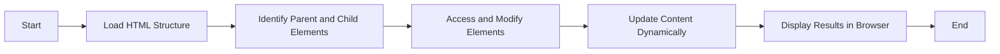
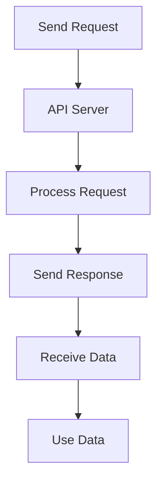
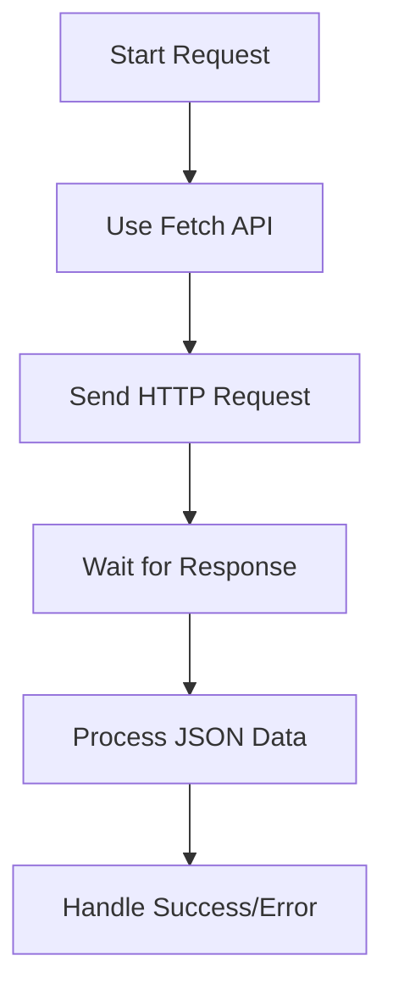
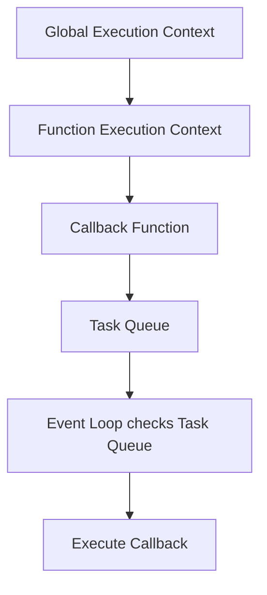
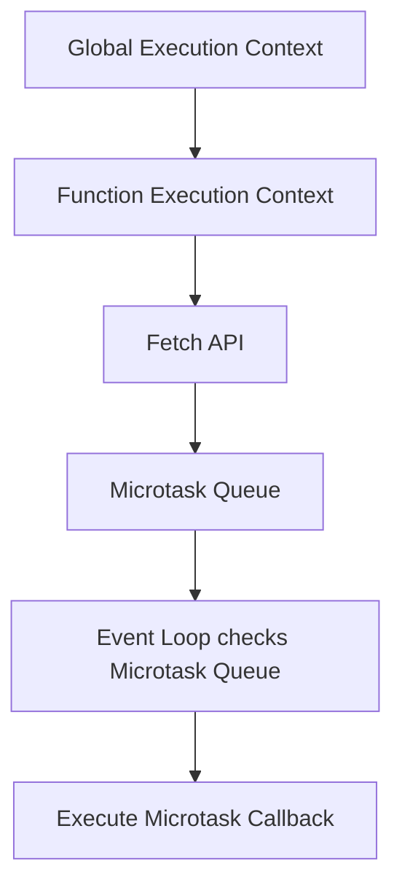
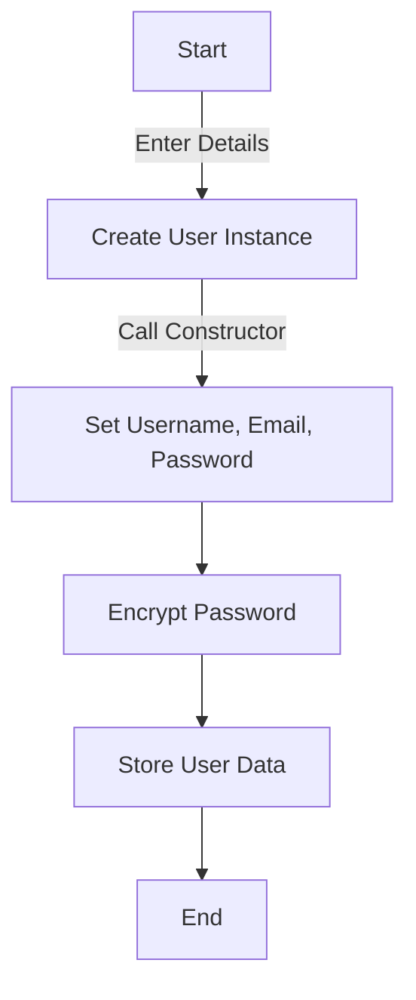
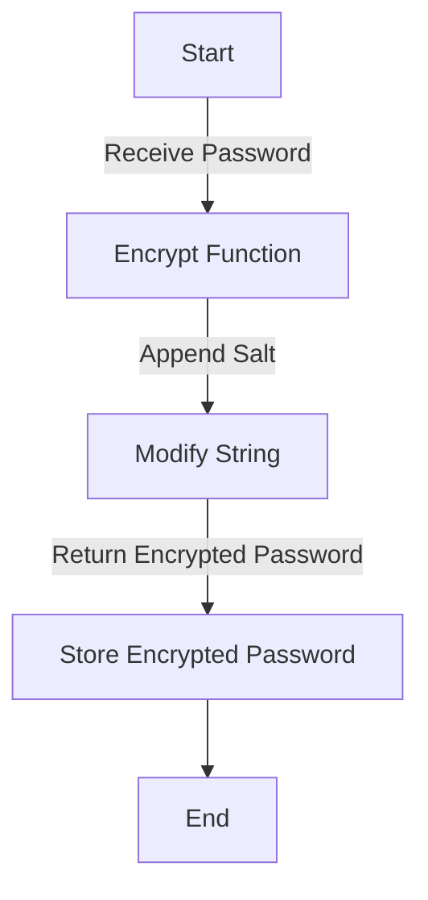
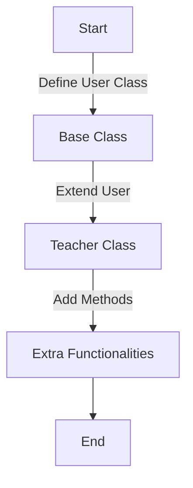

Here’s a detailed `README.md` file for your project based on the content you’ve provided. It includes flowcharts, descriptions, and relevant information for your HTML DOM manipulation project:

---

# DOM Manipulation Learning Project

Welcome to the DOM Manipulation Learning project! This project aims to help you understand and practice DOM (Document Object Model) manipulation in JavaScript. By the end of this project, you will be able to manipulate HTML elements dynamically, handle browser events, and prepare yourself for creating interactive web applications.

---

## Table of Contents

1. [Introduction](#introduction)
2. [Getting Started](#getting-started)
3. [Folder Structure](#folder-structure)
4. [Basic HTML Setup](#basic-html-setup)
5. [DOM Manipulation Concepts](#dom-manipulation-concepts)
6. [Events Handling](#events-handling)
7. [Project Flow Diagram](#project-flow-diagram)
8. [Conclusion](#conclusion)

---

## Introduction

This project aims to teach the fundamentals of **DOM Manipulation** by creating a simple web page. DOM manipulation is one of the key aspects of front-end web development that allows you to interact with web elements dynamically.

### Key Topics Covered:
- Basic DOM structure
- How to access and modify HTML elements
- Event handling in JavaScript
- Dynamic element creation
- Adding attributes to elements

---

## Getting Started

To get started with the project, follow the steps below:

1. **Create a new directory** for the project:
   ```bash
   mkdir dom-manipulation
   cd dom-manipulation
   ```

2. **Create an HTML file** to hold the basic structure of the page:
   ```bash
   touch index.html
   ```

---

## Folder Structure

The folder structure for this project looks like this:

```plaintext
dom-manipulation/
├── index.html
└── script.js (Optional, for JavaScript code)
```

---

## Basic HTML Setup

In your `index.html`, you’ll start by setting up a simple HTML structure:

```html
<!DOCTYPE html>
<html lang="en">
<head>
    <meta charset="UTF-8">
    <meta name="viewport" content="width=device-width, initial-scale=1.0">
    <title>DOM Manipulation Learning</title>
</head>
<body>
    <div class="container">
        <h1>DOM Learning on Chai Aur Code</h1>
        <p>Lorem ipsum dolor sit amet, consectetur adipiscing elit.</p>
    </div>
</body>
</html>
```

---

## DOM Manipulation Concepts

The DOM represents the structure of a web page. When you open a page, the browser creates a **document object model (DOM)** for the HTML document. Here's how to interact with it:

- **Accessing Elements**: Use `document.getElementById()`, `document.querySelector()`, etc.
- **Modifying Elements**: Change content, attributes, or styles of elements.

---

### Flow Diagram of Document Structure

Before diving into code, it’s important to understand the structure of the DOM. Here's a flow diagram representing the basic structure of a web page:

```plaintext
Window
   |
   v
Document
   |
   v
HTML (HTML Element)
   |
   +--- Head
   |      |
   |      +--- Title
   |
   +--- Body
          |
          +--- Div (with class="container")
                |
                +--- H1 (Heading)
                |
                +--- P (Paragraph)
```

---

## Events Handling

Events in the browser allow you to react to user actions. For example, clicking a button can trigger a specific function.

```javascript
document.getElementById("myButton").addEventListener("click", function() {
    alert("Button clicked!");
});
```

By using `addEventListener()`, you can attach events to elements in the DOM.

---

## Conclusion

This project introduces you to **DOM Manipulation**, where you learn to create, modify, and interact with HTML elements using JavaScript. By following this project structure and learning how to work with the DOM, you'll be prepared for more advanced web development concepts like React and Angular.

---

By following this README, you should now have a clear understanding of how to structure your project and begin learning DOM manipulation in JavaScript. As you continue, you can create more complex projects that involve user interaction and dynamic content updates. Happy coding!

Here’s a detailed `README.md` based on your script, formatted with flowcharts and brief descriptions. It covers basic DOM manipulation in JavaScript, including methods for selecting, modifying, and handling HTML elements:

---

# DOM Manipulation in JavaScript

This guide will provide a detailed walkthrough of how to perform DOM manipulation using JavaScript. You will learn how to select, modify, and interact with HTML elements dynamically through JavaScript. The topics include:

1. **Introduction to DOM**  
2. **Selecting Elements**  
3. **Modifying Elements**  
4. **Handling Attributes**  
5. **Practical Examples**

---

## 1. Introduction to DOM

The **Document Object Model (DOM)** is the structure that allows developers to interact with the HTML or XML document in a structured way. Using JavaScript, we can manipulate this structure to update content, style, and behavior dynamically.

---

## 2. Selecting Elements

In JavaScript, we can select DOM elements using various methods. These include:

- **getElementById()**  
- **getElementsByClassName()**  
- **getElementsByTagName()**  
- **querySelector()**

### Example: Selecting an element by ID
```javascript
const title = document.getElementById('title');
console.log(title.innerText);
```

---

## 3. Modifying Elements

Once you’ve selected an element, you can modify its properties, such as the text content or style.

### Example: Changing the text content of an element
```javascript
const title = document.getElementById('title');
title.innerText = "New Title";
```

---

## 4. Handling Attributes

You can also work with an element's attributes (e.g., class, id, style) using JavaScript.

### Get Attribute Example:
```javascript
const title = document.getElementById('title');
console.log(title.getAttribute('class')); // Retrieves the class attribute
```

### Set Attribute Example:
```javascript
title.setAttribute('class', 'newClass'); // Changes the class attribute
```

---

## 5. Practical Examples

### Example 1: Changing the Background Color of the Page
```javascript
document.body.style.backgroundColor = "#f0f0f0"; // Changes the background color
```

### Example 2: Adding and Removing Classes Dynamically
```javascript
const element = document.getElementById('myElement');
element.classList.add('newClass');  // Adds a new class
element.classList.remove('oldClass');  // Removes an existing class
```

---

## Flowchart

Here’s a flowchart that illustrates the basic flow of DOM manipulation:

```plaintext
       +-----------------+
       | Start           |
       +-----------------+
             |
             v
       +-------------------+
       | Select Element     |
       +-------------------+
             |
             v
       +-------------------+
       | Modify Element     |
       +-------------------+
             |
             v
       +-------------------+
       | Handle Attributes  |
       +-------------------+
             |
             v
       +-------------------+
       | End               |
       +-------------------+
```

---

## Conclusion

This guide has introduced you to basic DOM manipulation in JavaScript, covering how to:

- Select elements
- Modify their content or style
- Work with attributes

With this knowledge, you can start building interactive and dynamic web pages.

For more advanced usage, explore topics like **event handling**, **form manipulation**, and **animations** in JavaScript.

---

This `README.md` serves as an introduction to JavaScript's DOM manipulation, and will help you better understand the relationship between JavaScript and HTML.

# Project: Document Selection and Manipulation in JavaScript

## Introduction
This project demonstrates how to interact with and manipulate DOM elements using JavaScript. It covers various methods like `getElementById`, `getElementsByClassName`, `querySelector`, and `querySelectorAll`. Additionally, it explains how to access and modify content, including `innerText`, `innerHTML`, and using different query selectors.

---

## Table of Contents
1. [Overview](#overview)
2. [Selecting Elements](#selecting-elements)
3. [Modifying Content](#modifying-content)
4. [Working with Query Selectors](#working-with-query-selectors)
5. [Accessing Text and HTML Content](#accessing-text-and-html-content)
6. [Flowcharts](#flowcharts)
7. [Conclusion](#conclusion)

---

## Overview

This project primarily focuses on the JavaScript DOM (Document Object Model) manipulation, specifically:
- Selecting elements.
- Changing content (text, HTML).
- Working with different types of query selectors like `querySelector` and `querySelectorAll`.

It is essential for web development as it allows developers to interact dynamically with the webpage. This project gives a detailed understanding of how to use different methods to select and manipulate DOM elements.

---

## Selecting Elements

### `getElementById`
The `getElementById` method is used to select an element by its unique ID. For example:

```javascript
let element = document.getElementById("myElement");
```

### `getElementsByClassName`
This method allows you to select elements by their class name.

```javascript
let elements = document.getElementsByClassName("myClass");
```

### `querySelector` and `querySelectorAll`
- `querySelector` selects the first matching element.
- `querySelectorAll` selects all matching elements.

Example:
```javascript
let firstHeading = document.querySelector("h1"); // Selects the first h1 element
let allHeadings = document.querySelectorAll("h1"); // Selects all h1 elements
```

---

## Modifying Content

JavaScript provides several ways to modify the content inside selected elements:

### `innerText`
Used to get or set the visible text content of an element.

```javascript
let headingText = document.querySelector("h1").innerText;
document.querySelector("h1").innerText = "New Heading Text";
```

### `innerHTML`
This property allows you to retrieve or set the HTML content inside an element.

```javascript
let htmlContent = document.querySelector("div").innerHTML;
document.querySelector("div").innerHTML = "<p>New Paragraph</p>";
```

---

## Working with Query Selectors

The `querySelector` and `querySelectorAll` methods are incredibly powerful and can select elements in various ways. Here’s an overview of some options:
- **ID Selector**: Use `#` to select an element by its ID.
  ```javascript
  let element = document.querySelector("#myElement");
  ```
- **Class Selector**: Use `.` to select elements by class.
  ```javascript
  let element = document.querySelector(".myClass");
  ```
- **Attribute Selector**: Select elements by specific attributes.
  ```javascript
  let input = document.querySelector('input[type="password"]');
  ```

---

## Accessing Text and HTML Content

When you want to access or manipulate the content of a DOM element, you can use the following properties:

- **`textContent`**: Retrieves all text content, including hidden text.
- **`innerHTML`**: Retrieves HTML content, including nested tags.

For example:
```javascript
let divContent = document.querySelector("div").textContent;
let divHTML = document.querySelector("div").innerHTML;
```

---

## Flowcharts

### 1. Selecting DOM Elements
```plaintext
+------------------+
| Select Method    |
|  (ID, Class, etc.)|
+------------------+
        |
        v
+------------------+
| Select DOM Node  |
| (Returns Element)|
+------------------+
```

### 2. Modifying Content
```plaintext
+-------------------+
| Select Element    |
| (e.g., querySelector)|
+-------------------+
        |
        v
+-------------------+
| Access/Modify Content|
+-------------------+
```

---

## Conclusion

This project covers essential techniques for selecting and manipulating HTML elements using JavaScript. Understanding how to interact with the DOM is fundamental to modern web development. By using methods like `getElementById`, `querySelector`, and working with content properties like `innerText` and `innerHTML`, developers can create interactive and dynamic web pages.

---

For a complete version of this project, please refer to the following resources:
- [JavaScript MDN Docs](https://developer.mozilla.org/en-US/docs/Web/API/Document)
- [DOM Manipulation Guide](https://developer.mozilla.org/en-US/docs/Web/API/Document_object_model)

Here's a detailed `README.md` file for your project, including explanations, flowcharts, and code snippets.

---

# Project Title: JavaScript DOM Manipulation and Element Selection

## Overview

This project demonstrates various JavaScript techniques for manipulating the DOM (Document Object Model), selecting elements, modifying them, and understanding the differences between NodeLists and HTMLCollections. It also covers the conversion of one data structure into another for more flexible data handling.

## Table of Contents

- [Introduction](#introduction)
- [Project Flow](#project-flow)
- [Methods and Techniques](#methods-and-techniques)
- [Code Example](#code-example)
- [Conclusion](#conclusion)

## Introduction

This project is centered around understanding and manipulating HTML elements through JavaScript. We will explore how to:

- Select elements using different methods like `querySelector` and `getElementsByClassName`.
- Work with collections such as `HTMLCollection` and `NodeList`.
- Convert between different data structures for enhanced flexibility.
- Modify element styles and content dynamically.

## Project Flow

1. **Element Selection**:
    - Using `querySelector` and `getElementsByClassName` to select elements from the DOM.
    - Differentiating between NodeLists and HTMLCollections.
    
2. **Element Manipulation**:
    - Modifying element styles such as background color.
    - Iterating over collections and modifying each item.

3. **Data Structure Conversion**:
    - Converting `HTMLCollection` to an array for easier manipulation.
    - Using methods like `Array.from()` and `.map()`.

## Flowchart

Below is the flowchart that explains the sequence of operations in the script:

```plaintext
+------------------+
|   Select Element |
+------------------+
         |
         v
+----------------------------+
| Check Data Structure Type  |
+----------------------------+
         |
   +-----+-----+
   |           |
   v           v
+----------+  +------------+
| NodeList |  | HTMLCollection |
+----------+  +------------+
         |
         v
+-------------------+
| Convert to Array  |
+-------------------+
         |
         v
+------------------------+
| Iterate and Modify DOM  |
+------------------------+
```

## Methods and Techniques

### `querySelector` and `getElementsByClassName`

- `querySelector`: Selects the first element that matches a CSS selector.
- `getElementsByClassName`: Selects all elements with a specific class name and returns an `HTMLCollection`.

### NodeList vs HTMLCollection

- **NodeList**: Returns a collection of nodes, usually returned by methods like `querySelectorAll`. This is an array-like object, but it doesn't have array methods like `.map()` or `.forEach()`.
- **HTMLCollection**: A collection of HTML elements returned by methods like `getElementsByClassName` or `getElementsByTagName`. It's also array-like but lacks array methods and needs to be converted to an array for advanced manipulation.

### Converting Between Data Structures

To perform operations like `.map()` or `.forEach()` on an `HTMLCollection`, it needs to be converted to an array:

```javascript
const collection = document.getElementsByClassName('list-item');
const array = Array.from(collection);
array.forEach(item => item.style.backgroundColor = 'green');
```

### Iteration with `forEach` and `for...of`

Once converted into an array, you can use `forEach` or `for...of` to iterate and modify elements:

```javascript
array.forEach(item => {
  item.style.backgroundColor = 'green'; // Change background color to green
});
```

Alternatively, if you are working with a `NodeList`, you can use the `for...of` loop directly:

```javascript
const nodeList = document.querySelectorAll('.list-item');
for (const item of nodeList) {
  item.style.backgroundColor = 'green';
}
```

### Modifying Styles and Content

You can dynamically change the styles and content of elements using JavaScript:

```javascript
const elements = document.querySelectorAll('.list-item');
elements.forEach(element => {
  element.style.backgroundColor = 'green';
  element.innerText = 'Updated Text';
});
```

## Code Example

### HTML Structure

```html
<ul>
  <li class="list-item">Item 1</li>
  <li class="list-item">Item 2</li>
  <li class="list-item">Item 3</li>
</ul>
```

### JavaScript

```javascript
// Selecting elements by class name
const listItems = document.getElementsByClassName('list-item');

// Converting HTMLCollection to an array
const listItemsArray = Array.from(listItems);

// Iterating over the array and changing the background color
listItemsArray.forEach(item => {
  item.style.backgroundColor = 'green';
});

// Selecting all elements using querySelectorAll
const nodeList = document.querySelectorAll('.list-item');

// Iterating over NodeList and updating content
nodeList.forEach(item => {
  item.innerText = 'Updated Item';
});
```

## Conclusion

This project demonstrates how to manipulate DOM elements using JavaScript effectively. You learned about different selection methods, data structures like NodeLists and HTMLCollections, and techniques to manipulate elements dynamically. Additionally, the conversion of `HTMLCollection` into arrays helps leverage the full power of array methods for manipulation.

In the future, you can explore more advanced topics like event handling, dynamically creating elements, and working with APIs.

---

I hope this `README.md` provides a clear overview of your project, including the concepts you covered. Let me know if you need further clarification or additions!

Here’s a detailed README.md file for your project that involves understanding and applying the Document Object Model (DOM) in web development:

---

# DOM Documentation and Application

## Overview
This project focuses on the Document Object Model (DOM), which is a programming interface for web documents. It represents the structure of an HTML document as a tree of objects, allowing programming languages like JavaScript to manipulate the document's structure, style, and content.

The goal of this series is to enhance your understanding of DOM, focusing on its applications in web development using JavaScript. By understanding DOM thoroughly, you will be better equipped to handle tasks like dynamic content generation, element manipulation, and creating interactive user interfaces.

## Key Concepts Covered

1. **Document Object Model (DOM) Basics:**
   - DOM is a hierarchical model that represents the document as a tree of nodes.
   - Each element, attribute, and piece of text is represented as a node.
   - DOM allows JavaScript to interact with HTML and CSS, enabling dynamic page changes.

2. **Parent-Child Relationship in DOM:**
   - Understanding the parent-child relationship between DOM elements is crucial for manipulating the structure.
   - You can easily access child elements, iterate through them, and modify them using JavaScript.

3. **DOM Manipulation with JavaScript:**
   - Select and interact with HTML elements dynamically.
   - Modify the content, attributes, and style of elements.
   - Add and remove elements in real time.
   
4. **Live Examples:**
   - A practical example demonstrates how to select parent and child elements, access their values, and modify their properties using JavaScript.
   
5. **Best Practices:**
   - How to optimize DOM manipulation for better performance.
   - Techniques for querying elements and selecting nodes efficiently.

## Project Structure

- **index.html:** This file contains the basic HTML structure with a `<div>` element as the parent container and child elements (days of the week).
- **styles.css:** Used to style the HTML elements.
- **script.js:** Contains JavaScript to manipulate the DOM, including selecting parent-child elements and modifying the content dynamically.

### Flowchart

The flow of operations can be visualized as follows:



## Detailed Steps in the Project

### Step 1: HTML Setup

We begin by creating a basic HTML structure. Inside the `<body>` tag, a `div` element is used to contain the days of the week. This `div` is the parent element, and each individual day is a child element.

```html
<!DOCTYPE html>
<html lang="en">
<head>
  <meta charset="UTF-8">
  <meta name="viewport" content="width=device-width, initial-scale=1.0">
  <title>DOM Manipulation</title>
  <link rel="stylesheet" href="styles.css">
</head>
<body>
  <div class="parent">
    <div class="day">Monday</div>
    <div class="day">Tuesday</div>
    <div class="day">Wednesday</div>
    <div class="day">Thursday</div>
  </div>
  <script src="script.js"></script>
</body>
</html>
```

### Step 2: Selecting Elements

Using JavaScript, we select the parent element and its children. 

```javascript
let parent = document.querySelector('.parent');
let children = parent.children;
```

### Step 3: Looping Through Child Elements

Once we have selected the parent and its children, we can loop through the children using a `for` loop.

```javascript
for (let i = 0; i < children.length; i++) {
  console.log(children[i].innerHTML);
}
```

### Step 4: Modifying Content and Styling

We can dynamically change the content and styling of the elements. Here, we are changing the background color of the first child element.

```javascript
children[0].style.backgroundColor = 'orange';
children[0].innerHTML = 'Updated Monday';
```

### Step 5: Adding New Elements

We can add new elements into the DOM dynamically, allowing for real-time updates.

```javascript
let newDay = document.createElement('div');
newDay.classList.add('day');
newDay.innerHTML = 'Friday';
parent.appendChild(newDay);
```

### Step 6: Removing Elements

We can also remove elements from the DOM as needed. This is done using the `removeChild()` method.

```javascript
parent.removeChild(children[3]); // Remove the Thursday element
```

### Step 7: Displaying Results in Browser

Finally, we use a browser to view the changes. The HTML content is updated dynamically using JavaScript.

---

## Conclusion

By mastering the Document Object Model (DOM) and its interactions with JavaScript, you will gain the ability to build dynamic web applications where the user interface can be updated in response to user interactions, data changes, or any other triggers. This knowledge will also be beneficial for handling more advanced JavaScript frameworks like React.

Feel free to reach out if you have any questions or need clarification!

---

## Contributing

Feel free to contribute to this project by adding more features, improving existing functionality, or sharing insights. Please make sure to follow the guidelines and best practices while contributing.

## License

This project is licensed under the MIT License - see the [LICENSE](LICENSE) file for details.

---

This README file covers all aspects of the DOM manipulation process, from the basics of selecting and modifying elements to handling more advanced operations such as adding and removing elements dynamically. Let me know if you'd like to add any more specific details!

Here's a detailed README.md for the project discussed, incorporating the information, flowcharts, and brief descriptions:

---

# Project: DOM Manipulation and Node List Creation

## Overview
This project is a comprehensive guide on how to create, manipulate, and display HTML elements dynamically using JavaScript. It introduces key concepts such as the creation of child nodes, attributes, and IDs, with practical demonstrations for effective DOM manipulation. This README will guide you through the important aspects of the project, explaining how to create and manage elements programmatically.

## Table of Contents
- [Introduction](#introduction)
- [Key Concepts](#key-concepts)
- [Project Workflow](#project-workflow)
- [Creating and Manipulating Nodes](#creating-and-manipulating-nodes)
- [Flowchart](#flowchart)
- [Detailed Explanation](#detailed-explanation)
- [Conclusion](#conclusion)

## Introduction
This project explores the interaction between parent-child nodes in the DOM, focusing on how elements are created and manipulated dynamically. The core of this tutorial will cover:
- Creating new nodes
- Adding attributes and text
- Appending child elements to parent elements
- Utilizing JavaScript functions to automate tasks

## Key Concepts
- **Node List**: The structure that holds all the nodes in a document, where each element can be manipulated.
- **Child Node**: Elements contained inside a parent element in the DOM.
- **Attributes**: Characteristics such as `id`, `class`, `title`, or `style` that can be assigned to elements.
- **Create Element**: The process of creating HTML elements programmatically using JavaScript.

## Project Workflow
1. **Create an Element**: Use JavaScript to create an HTML element dynamically using `document.createElement`.
2. **Assign Attributes**: Set attributes (like `class`, `id`, `title`, etc.) to the created element using `setAttribute`.
3. **Add Text**: Create text nodes using `document.createTextNode` and append them to the created elements.
4. **Append Child Elements**: Append the created elements and text nodes to parent elements using `appendChild`.
5. **Manipulate the DOM**: Use loops, random values, and functions to generate multiple nodes programmatically.

## Creating and Manipulating Nodes
### Step-by-Step Process
1. **HTML Structure**: Start with an empty `body` and dynamically insert elements.
2. **JavaScript Code**:
    - Use `document.createElement('div')` to create a new `div` element.
    - Set attributes using `div.setAttribute('id', 'uniqueID')` and `div.setAttribute('class', 'container')`.
    - Append text using `div.appendChild(document.createTextNode('Some text here'))`.
    - Append the `div` element to the body using `document.body.appendChild(div)`.

3. **Randomization**: We use `Math.random()` to generate random IDs and add variety in the elements.
4. **Dynamic Styles**: Add inline styles like background colors using `div.style.backgroundColor`.

### Example Code Snippet
```javascript
let div = document.createElement('div');
div.setAttribute('class', 'content');
div.setAttribute('id', Math.random().toString(36).substr(2, 9));
div.appendChild(document.createTextNode('This is a dynamic element'));
document.body.appendChild(div);
```

## Flowchart
```plaintext
+---------------------+
| Start               |
+---------------------+
         |
         v
+---------------------+
| Create Element (div)|
+---------------------+
         |
         v
+---------------------+
| Set Attributes      |
+---------------------+
         |
         v
+---------------------+
| Add Text            |
+---------------------+
         |
         v
+---------------------+
| Append to Body      |
+---------------------+
         |
         v
+---------------------+
| End                 |
+---------------------+
```

## Detailed Explanation
### 1. Creating a Node:
Using `document.createElement('div')`, a new `div` is created programmatically. This allows us to dynamically generate content.

### 2. Setting Attributes:
Once the element is created, attributes such as `id` and `class` are added using `setAttribute()`. For instance:
```javascript
div.setAttribute('id', 'uniqueID');
div.setAttribute('class', 'container');
```

### 3. Adding Text:
We can add text to the newly created element by creating a text node with `document.createTextNode()`. This text is appended to the element using `appendChild`.

### 4. Appending Child Elements:
To display the element in the browser, it must be appended to a parent element (in this case, the `body`). This is done using `document.body.appendChild(div)`.

### 5. Randomization and Styling:
To make the content more dynamic, random IDs are generated using `Math.random()`, and custom styling is applied using `div.style`.

## Conclusion
Through this project, we've learned how to create dynamic HTML content using JavaScript and manipulate the DOM by programmatically adding attributes, text, and styles. The key takeaway is that DOM manipulation is essential for creating interactive web applications, and understanding how to efficiently work with nodes will enhance your web development skills.

This project lays the foundation for more complex tasks such as handling events, interacting with APIs, and building larger web applications.

---

Let me know if you need further clarification or if you would like additional details for any section!

# README.md

## Project Overview

This project demonstrates how to dynamically manipulate the DOM (Document Object Model) using JavaScript. The main operations covered include creating HTML elements, adding content, appending children, and replacing elements efficiently.

---

## Flowchart

**1. Create Elements**
   - Create an element using `document.createElement()`.
   - Add content using either `innerHTML` or `textContent`.
   - Append the element to a parent element using `appendChild()`.

**2. Append Child**
   - Use `appendChild()` to add newly created elements as children to a parent.

**3. Replace Element**
   - Select an element and replace it using `replaceChild()` or `replaceWith()`.

---

## Step-by-Step Explanation

### 1. Create and Add Content to Elements

In JavaScript, the first step is creating an HTML element using `document.createElement()`. For example:

```javascript
let listItem = document.createElement("li"); // Creating a new list item
listItem.innerHTML = "JavaScript"; // Adding content to the list item
```

### 2. Append the Created Element

After creating an element and adding content to it, append it to a parent element using `appendChild()`:

```javascript
let list = document.querySelector(".language-list"); // Select the parent list
list.appendChild(listItem); // Append the newly created list item
```

### 3. Optimize Approach to Adding Elements

To make the code more efficient, avoid repeatedly traversing the entire DOM tree when adding elements. Instead, create the element and append it directly:

```javascript
function addLanguage(language) {
    let listItem = document.createElement("li");
    listItem.textContent = language;
    let list = document.querySelector(".language-list");
    list.appendChild(listItem);
}

addLanguage("Python");
addLanguage("TypeScript");
```

### 4. Edit and Replace Content Dynamically

To edit an existing list item, select it and modify its content:

```javascript
let secondLanguage = document.querySelector(".language-list li:nth-child(2)");
secondLanguage.textContent = "Go";
```

You can also replace an entire element using `replaceChild()`:

```javascript
let newListItem = document.createElement("li");
newListItem.textContent = "Go";
let list = document.querySelector(".language-list");
list.replaceChild(newListItem, secondLanguage);
```

Alternatively, `replaceWith()` can be used:

```javascript
secondLanguage.replaceWith(newListItem);
```

### 5. Optimized Replacement Method

In large projects, instead of manipulating inner HTML frequently, consider replacing the element with a new one to improve performance and reduce unnecessary traversing of the DOM tree.

```javascript
function optimizedReplace(language) {
    let newItem = document.createElement("li");
    newItem.textContent = language;
    let secondLanguage = document.querySelector(".language-list li:nth-child(2)");
    secondLanguage.replaceWith(newItem);
}
```

### 6. Conclusion

The methods covered in this project are essential for efficiently manipulating the DOM. Whether you are creating new elements, editing existing ones, or replacing them entirely, the key is to avoid excessive DOM traversal and optimize your approach based on the project's scale.

---

## Notes

- **InnerHTML vs. TextContent:** Use `innerHTML` when you need to insert HTML tags. Use `textContent` for text-only content to avoid security issues like XSS (Cross-Site Scripting).
- **Optimizing DOM Manipulation:** Repeatedly selecting and appending to the DOM can be inefficient, especially for large-scale projects. Minimize DOM operations to enhance performance.

---

## License

This project is licensed under the MIT License. See the LICENSE file for more details.

Here's an English `README.md` file for your project, which includes detailed explanations, flowcharts, and brief descriptions.

---

# Project Name: DOM Manipulation and Dynamic Elements

## Introduction

This project demonstrates how to effectively manipulate the DOM (Document Object Model) using JavaScript. We cover the essential techniques for selecting, editing, and deleting elements, as well as optimizing these processes for efficient web development. 

In this tutorial, we will explore the following concepts:

- **DOM Traversing**: Moving through elements (Parent-Child, Sibling, etc.).
- **NodeList**: Working with collections of DOM nodes.
- **Creating New Elements**: Adding new HTML elements dynamically.
- **Query Selectors**: Using selectors to find elements.
- **Removing Elements**: Deleting elements from the DOM.
  
We will build a project that applies these concepts to manipulate DOM elements and create a dynamic webpage.

## Table of Contents

1. [DOM Traversing](#dom-traversing)
2. [Creating New Elements](#creating-new-elements)
3. [Editing Elements](#editing-elements)
4. [Removing Elements](#removing-elements)
5. [Project Structure](#project-structure)
6. [Flowchart](#flowchart)
7. [Conclusion](#conclusion)

## DOM Traversing

### Overview
DOM Traversing refers to navigating through the DOM tree, where every HTML element is a node. The most common traversals include moving from parent to child, sibling to sibling, and vice versa.

**Important Methods:**
- `parentElement`
- `childElementCount`
- `lastElementChild`

### Example Code
```javascript
let lastChild = document.querySelector('.parent').lastElementChild;
lastChild.remove();
```
In this example, the last child of a parent element is selected and removed from the DOM.

## Creating New Elements

### Overview
Creating new elements in JavaScript allows dynamic content generation. You can create new HTML tags and append them to the DOM, enabling you to modify the page without reloading it.

### Example Code
```javascript
let newElement = document.createElement('div');
newElement.classList.add('new-class');
newElement.textContent = 'This is a new element';
document.body.appendChild(newElement);
```
Here, a new `div` element is created, styled, and appended to the body of the webpage.

## Editing Elements

### Overview
You can manipulate the content and style of elements directly using JavaScript. This includes changing text content, attributes, or applying styles dynamically.

### Example Code
```javascript
let element = document.querySelector('.some-element');
element.textContent = 'New Text';
element.style.color = 'blue';
```
This code will change the text of an element and apply a new color.

## Removing Elements

### Overview
Removing elements from the DOM can help in maintaining performance by eliminating unnecessary content.

### Example Code
```javascript
let elementToRemove = document.querySelector('.remove-this');
elementToRemove.remove();
```
The `remove()` method removes the selected element from the DOM entirely.

## Project Structure

The project consists of the following files and folders:

- `index.html`: The HTML file where the structure of the page is defined.
- `style.css`: The CSS file for styling the webpage.
- `script.js`: The JavaScript file where all the DOM manipulation is handled.
- `README.md`: This file containing the documentation for the project.

### Folder Structure:
```
/project-folder
|-- index.html
|-- style.css
|-- script.js
|-- README.md
```

## Flowchart

Here is the flow of operations for DOM manipulation:

```
1. Select elements using querySelector.
2. Determine if you need to edit, create, or remove elements.
3. Apply the necessary changes (editing or creating).
4. If removing elements, use the remove method.
5. Refresh the DOM to apply changes.
```


## Conclusion

In this project, we covered the fundamentals of DOM manipulation in JavaScript. You learned how to:

- Traverse the DOM to select parent, child, and sibling elements.
- Create new elements dynamically.
- Edit the content and style of elements.
- Remove unnecessary elements from the page.

By mastering these techniques, you will be able to create interactive, dynamic websites that respond to user interactions and events.

## Additional Resources

- [W3Schools DOM Tutorial](https://www.w3schools.com/js/js_htmldom.asp)
- [MDN DOM Reference](https://developer.mozilla.org/en-US/docs/Web/API/Document_Object_Model)

## How to Run the Project

1. Download the repository or clone it.
2. Open `index.html` in a web browser.
3. Ensure your browser’s console is open to observe any JavaScript operations.
4. Modify and experiment with the code in `script.js` to see real-time changes.

---

This structure will guide the user through the DOM manipulation concepts and help them understand the underlying processes involved in the project. Let me know if you'd like to make any further adjustments!

# README.md for Color Switcher Project

## Project Overview

This project demonstrates a simple **Color Switcher** implementation using HTML, CSS, and JavaScript. The main goal of this project is to allow users to click buttons that change the background color of the webpage. The buttons are dynamically selected through JavaScript, and each button is linked to a color (such as gray, white, blue, and yellow). The JavaScript code uses event listeners to handle clicks on the buttons and change the body's background color accordingly.

## Project Description

### Technologies Used:
- **HTML** for structuring the web page.
- **CSS** for styling the page elements.
- **JavaScript** for adding interactivity by dynamically changing the background color based on user input.

### Core Components:
1. **Buttons**: The interface includes buttons with unique IDs (`gray`, `white`, `blue`, `yellow`). These buttons, when clicked, change the background color of the webpage.
2. **JavaScript Logic**: 
    - The buttons are selected using `document.querySelectorAll()`.
    - Event listeners are added to each button to listen for the `click` event.
    - Upon clicking, the event listener triggers a function to change the background color based on the ID of the clicked button.
   
## Flowchart

The flowchart below represents the process from selecting the button to changing the background color.

```
+-------------------+
|   Start           |
+-------------------+
        |
        v
+-------------------+
| Select buttons    |
+-------------------+
        |
        v
+-------------------+
| Add event listeners|
+-------------------+
        |
        v
+-------------------+
| Button clicked?   |
+-------------------+
        |
        v
+-------------------+
| Change background |
| color based on ID |
+-------------------+
        |
        v
+-------------------+
|   End             |
+-------------------+
```

## Steps to Achieve the Goal

1. **Element Selection**: 
   - First, we need to select all the buttons on the page. This can be done using the `document.querySelectorAll()` method, which allows us to select multiple elements with specific class or ID.
   - Select the `body` element to later manipulate its style.

2. **Adding Event Listeners**:
   - We loop through each button and add a `click` event listener that listens for clicks on the buttons.
   - When a button is clicked, it triggers a function that will change the background color of the `body`.

3. **Changing Background Color**:
   - The function checks the ID of the clicked button and updates the `backgroundColor` of the `body` element to the corresponding color (e.g., gray, white, blue, or yellow).

4. **Optional Enhancement**:
   - New colors or buttons can easily be added to expand functionality.

## Code Example

```html
<!DOCTYPE html>
<html lang="en">
<head>
  <meta charset="UTF-8">
  <meta name="viewport" content="width=device-width, initial-scale=1.0">
  <title>Color Switcher</title>
  <style>
    body {
      transition: background-color 0.5s ease;
    }
    .btn {
      padding: 10px 20px;
      margin: 5px;
      cursor: pointer;
      border: none;
      font-size: 16px;
    }
  </style>
</head>
<body>
  <button class="btn" id="gray">Gray</button>
  <button class="btn" id="white">White</button>
  <button class="btn" id="blue">Blue</button>
  <button class="btn" id="yellow">Yellow</button>

  <script>
    const buttons = document.querySelectorAll('.btn');
    const body = document.body;

    buttons.forEach(button => {
      button.addEventListener('click', (event) => {
        const color = event.target.id;
        body.style.backgroundColor = color;
      });
    });
  </script>
</body>
</html>
```

## Features

- **Simple User Interface**: The webpage includes buttons that users can click to change the background color.
- **Dynamic Interaction**: The color change is immediate when a button is clicked.
- **Expandable**: Easily add more buttons and colors by modifying the HTML and JavaScript.

## How to Run

1. Clone the repository or copy the code into an HTML file.
2. Open the file in a browser.
3. Click any of the buttons to change the background color of the page.

## Conclusion

This project is a basic demonstration of how to interact with the DOM (Document Object Model) and manipulate styles using JavaScript. It showcases the use of event listeners, dynamic DOM manipulation, and how to enhance user experience with interactive elements. 

Here's an English `README.md` file for your project with detailed notes, flowcharts, and brief descriptions:

---

# BMI Calculator Project

## Overview

This project demonstrates the use of HTML forms, JavaScript event handling, and basic validation to calculate Body Mass Index (BMI). The project takes height and weight as input, validates the data, and then computes the BMI.

## Project Flow

### Step 1: Form Setup

The main part of the project is an HTML form that takes the user's height and weight as inputs.

- **Input Fields:**
  - Height (in centimeters)
  - Weight (in kilograms)
  
- **Submit Button:**
  - This is the button to trigger the calculation.

### Step 2: Event Handling

We use JavaScript to handle events when the form is submitted. When the user clicks the submit button:
1. The form data is captured (height and weight).
2. Event handling stops the form from submitting the data to the server, as we are performing client-side calculations.

### Step 3: Data Validation

Before performing the BMI calculation, we validate the input data:
1. Ensure that both height and weight are not empty.
2. Check that the height is a positive number.
3. Ensure the weight is a positive number and is in kilograms.

### Step 4: BMI Calculation

BMI is calculated using the formula:

```
BMI = Weight (kg) / (Height (m))^2
```

- We convert the height from centimeters to meters (by dividing by 100).
- We square the height and divide the weight by the squared height.

### Step 5: Displaying Results

After the BMI is calculated, the result is displayed in a result field on the page. The result is formatted to show two decimal places.

## Flowchart

```plaintext
    Start
      |
  [User Input] - Height & Weight
      |
  [Event Trigger] - Form Submit
      |
  [Validate Input] -- If Invalid --> Show Error
      |
  [Calculate BMI]
      |
  [Display Result] - BMI Value
      |
    End
```

## Code Breakdown

### HTML

The HTML structure consists of:
- Two input fields (`height` and `weight`).
- A submit button that triggers the form submission.
- A div where the BMI result is displayed.

### JavaScript

The JavaScript code handles:
1. **Event Listener:** Listens for the form submission and prevents it from submitting to the server.
2. **Data Validation:** Ensures that the inputs are valid.
3. **BMI Calculation:** Performs the calculation of BMI using the formula.
4. **Result Display:** Displays the BMI result in the specified result section.

### Example:

```javascript
const form = document.querySelector("#bmi-form");
const heightInput = document.querySelector("#height");
const weightInput = document.querySelector("#weight");
const resultDiv = document.querySelector("#result");

form.addEventListener("submit", function(event) {
    event.preventDefault();  // Prevent form submission
    
    // Validate inputs
    const height = parseFloat(heightInput.value);
    const weight = parseFloat(weightInput.value);
    
    if (isNaN(height) || isNaN(weight) || height <= 0 || weight <= 0) {
        resultDiv.innerHTML = "Please enter valid values for height and weight.";
        return;
    }

    // Calculate BMI
    const heightInMeters = height / 100;
    const bmi = (weight / (heightInMeters ** 2)).toFixed(2);

    // Display the result
    resultDiv.innerHTML = `Your BMI is: ${bmi}`;
});
```

### Validation Logic

- **Height and Weight Validation:** Ensure that height and weight are numbers and that they are greater than zero.
- **Numeric Check:** For numeric values, we use `isNaN()` and `parseFloat()` to ensure that the input is valid.

### Result Display

- After the BMI is calculated, the result is inserted into a designated area in the HTML using `innerHTML`.

---

## Future Enhancements

1. **Graphical Representation:** Add a graphical chart to display the BMI ranges (underweight, normal, overweight, obese).
2. **Unit Conversion:** Allow users to switch between metric and imperial units (e.g., feet/inches and pounds).
3. **Styling Enhancements:** Use CSS to enhance the user interface.

---

## Conclusion

This project serves as a basic example of form handling, data validation, and event-driven programming in JavaScript. It also introduces the concept of client-side validation before submitting data.

--- 

Let me know if you'd like any changes or additions to this README!

Below is the detailed `README.md` file for your Digital Clock project, which includes flowcharts and brief descriptions for easy understanding:

---

# Digital Clock Project

This project is a simple digital clock that displays the local time. The clock is updated every second using JavaScript, and the display is centered using Flexbox in the CSS.

## Description

The goal of this project is to display the current local time in a digital clock format on the webpage. The clock is updated every second using JavaScript's `setInterval()` method to ensure that the time remains accurate.

## Features
- **Live Clock**: The time updates every second.
- **Flexible Layout**: The clock is centered on the screen using Flexbox.
- **Dynamic Time**: The time is displayed in the format `HH:MM:SS`.

## Flowchart

### 1. HTML Structure
```plaintext
+-------------------------+
|        Container         |
|-------------------------|
|    Clock Display (ID)    |
+-------------------------+
```
- The main container holds the clock display.
- We use the `id="clock"` to target the clock display in the JavaScript code.

### 2. JavaScript Flow
```plaintext
+---------------------------+
| Initialize JavaScript Code |
+---------------------------+
            |
            V
+---------------------------+
| Get the element by ID      |
| (document.getElementById)  |
+---------------------------+
            |
            V
+---------------------------+
| Get current date and time  |
| (new Date())               |
+---------------------------+
            |
            V
+---------------------------+
| Update every second       |
| (setInterval())            |
+---------------------------+
            |
            V
+---------------------------+
| Display time in the clock |
| (innerHTML)                |
+---------------------------+
```

## Steps

### 1. HTML Structure

In the `index.html` file, we create a simple structure with a `div` to display the clock. It uses Flexbox to center the clock on the page.

```html
<!DOCTYPE html>
<html lang="en">
<head>
    <meta charset="UTF-8">
    <meta name="viewport" content="width=device-width, initial-scale=1.0">
    <title>Digital Clock</title>
    <link rel="stylesheet" href="style.css">
</head>
<body>
    <div id="container">
        <div id="clock"></div>
    </div>
    <script src="script.js"></script>
</body>
</html>
```

### 2. CSS Styling

We use Flexbox to center the clock on the page. The clock itself is styled to have an orange background.

```css
body {
    margin: 0;
    display: flex;
    justify-content: center;
    align-items: center;
    height: 100vh;
    background-color: #f0f0f0;
}

#container {
    display: flex;
    justify-content: center;
    align-items: center;
}

#clock {
    font-size: 50px;
    color: white;
    background-color: orange;
    padding: 20px;
    border-radius: 10px;
}
```

### 3. JavaScript Code

In the `script.js` file, we use `setInterval()` to update the clock every second. The `Date` object is used to get the current time, and it's formatted before being displayed.

```javascript
// Get the clock element by ID
const clock = document.getElementById("clock");

// Function to update the clock
function updateClock() {
    const date = new Date(); // Get current date and time
    let hours = date.getHours();
    let minutes = date.getMinutes();
    let seconds = date.getSeconds();

    // Add leading zero if minutes or seconds are less than 10
    hours = (hours < 10) ? "0" + hours : hours;
    minutes = (minutes < 10) ? "0" + minutes : minutes;
    seconds = (seconds < 10) ? "0" + seconds : seconds;

    // Display the formatted time
    clock.innerHTML = `${hours}:${minutes}:${seconds}`;
}

// Update the clock every second
setInterval(updateClock, 1000);

// Initial call to display time immediately when the page loads
updateClock();
```

### 4. Functionality

- **`setInterval()`**: This JavaScript method is used to run the `updateClock()` function every second (1000 milliseconds).
- **`Date()`**: We use this to get the current time from the user's device.
- **Time Formatting**: The hours, minutes, and seconds are formatted with leading zeros if necessary.

## Running the Project

1. Clone this repository.
2. Open the `index.html` file in your browser to view the digital clock in action.
3. The time will update every second automatically.

---

Let me know if you need any further clarifications or additions to this!

Certainly! Below is the detailed `README.md` for the project based on the description you've provided:

---

# Game Guessing Project

This project involves creating a guessing game where the user tries to guess a random number generated by the system within a specified range. The game provides feedback on whether the guess is correct, too low, or too high. Additionally, it tracks the number of attempts, and ensures that guesses remain valid. If the user guesses incorrectly too many times, the game will disable further attempts and prompt the user to restart.

## Features

- **Random Number Generation**: A random number between 1 and 100 is generated at the start of the game.
- **Guessing Attempts**: Users can input guesses, and the system will inform them whether the guess is too low, too high, or correct.
- **Input Validation**: The input will be validated to ensure that the guessed number is within the allowed range and is a valid number.
- **Game Restart**: Users can restart the game once they finish their attempts or if they wish to play again.
- **Display Previous Guesses**: The game keeps track of previous guesses to prevent the user from guessing the same number.
- **Attempt Limit**: The user is allowed a fixed number of guesses, after which further guesses are disabled.

## Flowchart

Below is the flow of the game:

```plaintext
Start
  |
  V
Generate Random Number
  |
  V
User Input Guess
  |
  V
Validate Guess (Is it a number? Is it within range?)
  |
  V
If Valid
  |
  V
Check if Guess Matches Random Number
  |
  V
Is it Correct? -> Yes -> Display "You Win!" -> End
                |
                V
            Too Low? -> Yes -> Display "Too Low!" -> Next Guess
                        |
                        V
                   Too High? -> Yes -> Display "Too High!" -> Next Guess
  |
  V
If Invalid, Display Error Message
  |
  V
Attempt Limit Reached? -> Yes -> Disable Guessing -> Restart Game Option
  |
  V
End
```

## Setup

### Prerequisites

- **HTML** for structuring the content.
- **CSS** for styling the game interface.
- **JavaScript** for game logic and functionality.

### Installation

1. Clone the repository or download the files.
2. Open the `index.html` file in any browser to play the game.

```bash
git clone <repository-url>
cd game-directory
open index.html
```

### Game Flow and Functions

1. **Initial Setup**: 
   The game will generate a random number between 1 and 100 when the game starts.
   
2. **Guess Validation**:
   The guess entered by the user will be validated:
   - If the guess is not a number, an error message is shown.
   - If the guess is outside the range (1-100), an error message is shown.
   - If the guess is a valid number within the range, it is checked against the random number.

3. **Feedback**:
   - If the guess is correct, the user is congratulated, and the game ends.
   - If the guess is too low or too high, the user is given feedback, and they can try again.
   
4. **Attempt Limitation**:
   - The user can make a limited number of guesses. Once the limit is reached, the game will disable further guesses.
   
5. **Restart Option**:
   - Once the game ends or after reaching the guess limit, the user can opt to restart the game and try again.

### Key Functions

#### 1. `validateGuess()`
This function ensures that the user's input is a valid number and falls within the range of 1-100.

```javascript
function validateGuess(guess) {
    if (isNaN(guess)) {
        alert("Please enter a valid number.");
        return false;
    }
    if (guess < 1 || guess > 100) {
        alert("Please enter a number between 1 and 100.");
        return false;
    }
    return true;
}
```

#### 2. `checkGuess()`
This function compares the user's guess to the generated random number and provides feedback.

```javascript
function checkGuess(guess, target) {
    if (guess === target) {
        alert("You win!");
        return true;
    }
    if (guess < target) {
        alert("Too low!");
    } else {
        alert("Too high!");
    }
    return false;
}
```

#### 3. `startNewGame()`
This function restarts the game by resetting all variables, generating a new random number, and resetting the attempt counter.

```javascript
function startNewGame() {
    attempts = 0;
    targetNumber = Math.floor(Math.random() * 100) + 1;
    alert("New Game Started!");
}
```

### CSS

The CSS file styles the elements of the game, ensuring a visually pleasing user experience.

```css
body {
    font-family: Arial, sans-serif;
    text-align: center;
}

#guess-form {
    margin-top: 20px;
}

button {
    padding: 10px;
    background-color: #4CAF50;
    color: white;
    border: none;
    cursor: pointer;
}

button:disabled {
    background-color: #ddd;
    cursor: not-allowed;
}
```

### Conclusion

This guessing game provides a fun way to practice programming and gain hands-on experience with user input validation, random number generation, and simple game logic. The game can be enhanced by adding additional features such as score tracking, difficulty levels, and animations.

---

This is a basic README that includes all the necessary details, including an explanation of how the game works, key functions, and flowcharts. Let me know if you need any further adjustments!


Here is a detailed `README.md` for your project, based on the provided code breakdown:

```markdown
# Number Guessing Game

## Overview
The Number Guessing Game is an interactive game that involves the user guessing a random number between 1 and 100. The user will receive feedback whether their guess is too high, too low, or correct. Once the game ends, the user can start a new game. The game displays the number of guesses and the random number at the end of the game.

## Features
- User inputs a guess.
- Displays messages if the guess is too low, too high, or correct.
- Tracks the number of guesses.
- Ends the game with a message indicating the number of guesses taken.
- Allows the user to start a new game.
- Displays a random number after the game ends.

## Table of Contents
- [Game Flow](#game-flow)
- [Flowchart](#flowchart)
- [Method Descriptions](#method-descriptions)
- [Setup and Running](#setup-and-running)

## Game Flow
1. **Start the Game**: The user inputs a guess.
2. **Check the Guess**: The program checks whether the guess is correct.
   - If the guess is too high, a message is displayed saying "Number is too high."
   - If the guess is too low, a message is displayed saying "Number is too low."
   - If the guess is correct, a success message is displayed and the game ends.
3. **End Game**: The random number is displayed, and the number of guesses is shown.
4. **New Game**: The user can start a new game by clicking the "New Game" button, which resets the game state and allows a fresh start.

## Flowchart

```plaintext
       +------------------------+
       |   Start the Game       |
       +------------------------+
                |
                v
       +------------------------+
       |   User Inputs Guess    |
       +------------------------+
                |
                v
       +------------------------+
       |  Is Guess Correct?     |
       +------------------------+
         |            |            |
        v            v            v
  +-------------------+  +-------------------+  +-------------------+
  |  Too Low Message  |  |   Too High Message |  | Correct Guess     |
  +-------------------+  +-------------------+  +-------------------+
                |                    |                   |
                v                    v                   v
       +------------------------+  +------------------------+
       |   Update Guess Count    |  | Display Correct Msg    |
       +------------------------+  +------------------------+
                |                    |
                v                    v
       +------------------------+  +------------------------+
       |   Show Remaining Guesses | |  Display Random Number  |
       +------------------------+  +------------------------+
                |
                v
       +------------------------+
       |   Start New Game        |
       +------------------------+
```

## Method Descriptions

### 1. `checkGuess()`
- **Purpose**: Compares the user's guess with the random number.
- **Input**: The guess entered by the user.
- **Output**: Displays whether the guess is too low, too high, or correct.

### 2. `displayMessage()`
- **Purpose**: Displays messages to the user based on their guess.
- **Input**: The message to display (either too high, too low, or correct).
- **Output**: Shows the appropriate message to the user.

### 3. `newGame()`
- **Purpose**: Resets the game state for a fresh start.
- **Input**: None.
- **Output**: Clears all input fields, resets the guess count, and displays a new random number.

### 4. `cleanup()`
- **Purpose**: Clears user input after each guess and prepares the UI for the next guess.
- **Input**: None.
- **Output**: Clears the input field and updates the guess count.

### 5. `updateRemainingGuesses()`
- **Purpose**: Updates and displays the number of remaining guesses.
- **Input**: The total number of guesses made.
- **Output**: Updates the remaining guesses counter and displays it on the screen.

## Setup and Running

1. **Clone the repository**:

   ```bash
   git clone https://github.com/your-username/number-guessing-game.git
   cd number-guessing-game
   ```

2. **Open the index.html file** in your browser to run the game.

3. **Interact with the game**: 
   - Enter a number in the input field.
   - Click "Submit Guess" to check if your guess is correct.
   - Click "New Game" to restart the game.

## Contribution

If you would like to contribute to this project, feel free to submit a pull request with your improvements or fixes. Ensure that your code follows the existing structure and conventions.

## License

This project is licensed under the MIT License - see the [LICENSE.md](LICENSE.md) file for details.
```

This README file includes a flowchart, method descriptions, and a detailed breakdown of the game logic and features. You can modify or add further details based on the specific structure of your project.

## Project Overview - Event Listener and JavaScript Implementation

### Introduction

This project demonstrates how event listeners work in JavaScript, specifically focusing on handling click events, resetting variables, and managing HTML elements. We will walk through the implementation step-by-step, with detailed notes on what each part does.

### Key Concepts

1. **Event Listeners**: These are used to listen for events like clicks, keypresses, etc., and then execute a function when the event occurs.
2. **DOM Manipulation**: Using JavaScript to interact with HTML elements by adding, removing, or modifying their content or attributes.
3. **State Management**: Keeping track of variables and updating them based on user interactions.

---

### Flowchart

```plaintext
+-------------------------+
|  Start Event Listener   |
+-------------------------+
            |
            v
+-------------------------+
|  Reset Game Variables   |
+-------------------------+
            |
            v
+-------------------------+
|  Generate New Random Number|
+-------------------------+
            |
            v
+-------------------------+
|  Remove Previous Guesses |
+-------------------------+
            |
            v
+-------------------------+
|  Update Remaining Guesses|
+-------------------------+
            |
            v
+-------------------------+
|  Enable User Input      |
+-------------------------+
            |
            v
+-------------------------+
|  End of Game            |
+-------------------------+
```

---

### Step-by-Step Process

1. **Event Listener Setup**
   - We use an event listener to wait for user input, typically a click event. Once the event is triggered, it calls a function.
   
   Example:
   ```javascript
   document.getElementById('playGame').addEventListener('click', function() {
       startGame();
   });
   ```

2. **Reset Game Variables**
   - When the event listener is triggered, we reset the game variables to their initial values.
   
   Example:
   ```javascript
   let previousGuesses = [];
   let randomNumber = Math.floor(Math.random() * 100) + 1;
   ```

3. **Generate New Random Number**
   - A random number is generated using `Math.random()` and assigned to `randomNumber`. This ensures a new number is used each time the game starts.
   
   Example:
   ```javascript
   let randomNumber = Math.floor(Math.random() * 100) + 1;
   ```

4. **Remove Previous Guesses**
   - We clear out any previous guesses displayed on the screen. This is done by removing the child elements inside the guesses container.
   
   Example:
   ```javascript
   document.getElementById('previousGuesses').innerHTML = '';
   ```

5. **Update Remaining Guesses**
   - The counter for remaining guesses is updated and displayed on the screen.

   Example:
   ```javascript
   let remainingGuesses = 5;
   document.getElementById('remainingGuesses').innerText = remainingGuesses;
   ```

6. **Enable User Input**
   - Once the game is reset, we enable the user to start entering guesses again by activating the relevant input fields and buttons.

   Example:
   ```javascript
   document.getElementById('guessInput').disabled = false;
   ```

7. **End of Game**
   - The game continues until the player guesses the number or runs out of guesses. A restart option can be provided at the end.

---

### Final Notes

- **DOM Manipulation**: This process involves updating HTML elements dynamically with JavaScript. We can reset values, add new content, or delete existing content as needed.
  
- **Event Handling**: The event listener responds to user actions like clicks. We can attach multiple listeners to different elements based on user needs.

- **User Input Handling**: The user enters guesses, and we track these guesses using JavaScript. If a guess is correct or incorrect, the relevant feedback is provided.

---

### Conclusion

This project helps in understanding basic event handling and DOM manipulation in JavaScript. It's crucial for interactive web applications where user input drives the behavior of the page.

For a more complex implementation, you can explore adding features like error handling, animations, or even a scoring system!

# README.md

## Project Overview

This project explores event handling and propagation in JavaScript, including an analysis of various approaches for handling user interactions like clicks and key presses. The project covers three main approaches: the use of `onclick` handlers, `addEventListener`, and event delegation. In addition, it discusses the event object and its properties, as well as the important concept of event propagation.

---

## Table of Contents

1. [Introduction](#introduction)
2. [Approaches to Event Handling](#approaches-to-event-handling)
   - 2.1 [OnClick Event](#onclick-event)
   - 2.2 [AddEventListener](#addeventlistener)
   - 2.3 [Event Delegation](#event-delegation)
3. [Event Object and Its Properties](#event-object-and-its-properties)
4. [Event Propagation](#event-propagation)
   - 4.1 [Bubbling](#bubbling)
   - 4.2 [Capturing](#capturing)
5. [Code Examples](#code-examples)
6. [Conclusion](#conclusion)

---

## Introduction

In modern web development, handling user interactions is essential. JavaScript provides several methods for responding to events such as clicks, key presses, or mouse movements. This document covers different approaches to handling events, examining their advantages, drawbacks, and the role of the event object in processing events.

---

## Approaches to Event Handling

### 2.1 OnClick Event

The `onclick` event is one of the simplest and most widely used event-handling methods. It is attached directly to an element, usually via HTML attributes or inline JavaScript.

#### Issues:
- Limited flexibility for handling multiple events on the same element.
- Does not allow for event propagation control.

### 2.2 AddEventListener

The `addEventListener` method is a more robust approach to handling events. It allows for attaching multiple event listeners to a single element, giving greater flexibility.

#### Features:
- Can listen for multiple events on a single element.
- Allows control over event propagation (bubbling and capturing).
  
**Example Code**:

```javascript
document.getElementById("myButton").addEventListener("click", function(event) {
    console.log("Button clicked!", event);
});
```

### 2.3 Event Delegation

Event delegation involves adding a single event listener to a parent element, which then listens for events on its child elements. This method reduces the number of event listeners needed, especially for dynamically added elements.

**Example Code**:

```javascript
document.getElementById("parentElement").addEventListener("click", function(event) {
    if (event.target && event.target.matches("button.classname")) {
        console.log("Button clicked!");
    }
});
```

---

## Event Object and Its Properties

When an event occurs, an event object is generated, which provides a wealth of information about the event, such as the type, the target element, and mouse position.

### Key Properties:
- **type**: The type of event (e.g., "click").
- **target**: The element that triggered the event.
- **clientX, clientY**: Mouse cursor's position relative to the viewport.
- **timestamp**: The time at which the event occurred.
- **sourceElement**: The element that generated the event.

**Example Code**:

```javascript
document.addEventListener("click", function(event) {
    console.log(event.type); // "click"
    console.log(event.clientX); // Mouse X position
    console.log(event.target); // Target element
});
```

---

## Event Propagation

### 4.1 Bubbling

Event bubbling is the default propagation mode in which an event starts from the target element and then bubbles up to its parent elements, triggering the same event listener on each ancestor.

**Example**:

If a button inside a div is clicked, the event will first be handled by the button and then by the parent div.

### 4.2 Capturing

Event capturing, in contrast, works in the opposite direction. The event starts from the root of the document and moves downward to the target element. This is useful in certain use cases, such as when an event should be handled before it reaches its target.

---

## Code Examples

### Example 1: Basic Click Event Using `addEventListener`

```html
<button id="myButton">Click Me!</button>

<script>
  document.getElementById("myButton").addEventListener("click", function() {
    alert("Button clicked!");
  });
</script>
```

### Example 2: Event Delegation

```html
<ul id="parentElement">
  <li><button class="classname">Item 1</button></li>
  <li><button class="classname">Item 2</button></li>
</ul>

<script>
  document.getElementById("parentElement").addEventListener("click", function(event) {
    if (event.target && event.target.matches("button.classname")) {
      console.log("Button clicked:", event.target.textContent);
    }
  });
</script>
```

---

## Conclusion

In this document, we have explored various event handling techniques in JavaScript, focusing on the `onclick` event, `addEventListener`, and event delegation. Each method has its own set of advantages and drawbacks, and choosing the right one depends on the specific requirements of the project. Furthermore, understanding the event object and its properties, as well as event propagation techniques like bubbling and capturing, is crucial for advanced event management and optimization.

---

## Flowchart

 

---

### Future Considerations

- Explore the differences between event delegation and capturing in more depth.
- Delve into advanced event handling techniques, such as custom events and dynamic event listeners.
- Investigate performance optimizations when working with large-scale applications involving event handling.

Here's an example of a `README.md` file for your project, based on the detailed notes you provided:

```markdown
# Event Propagation and Default Behavior in JavaScript

## Overview

This project demonstrates the use of event propagation techniques, such as event bubbling and capturing, as well as the prevention of default behavior using JavaScript. It provides an example of stopping event propagation and preventing default actions through a clickable image gallery and event listeners.

## Table of Contents

- [Introduction](#introduction)
- [Concepts Covered](#concepts-covered)
- [Installation](#installation)
- [Code Explanation](#code-explanation)
- [Flowchart](#flowchart)
- [Conclusion](#conclusion)

## Introduction

In JavaScript, when an event occurs, it propagates through the DOM (Document Object Model) tree. The propagation can either be "bubbling" or "capturing." In this project, we demonstrate how to stop or alter this propagation using methods such as `stopPropagation()` and `preventDefault()`.

## Concepts Covered

- **Event Bubbling**: The event starts from the innermost target element and then propagates outward to the parent elements.
- **Event Capturing**: The event starts from the outermost element and propagates inward to the target element.
- **stopPropagation()**: Prevents further propagation of the current event in the capturing and bubbling phases.
- **preventDefault()**: Prevents the default action that belongs to the event (e.g., following a link when clicking a hyperlink).

## Installation

1. Clone the repository:
   ```bash
   git clone <repository-url>
   ```
2. Open the `index.html` file in your preferred browser to run the project.

## Code Explanation

### Event Handling

1. **Preventing Default Behavior**:
   - In the case of a link (`<a>` tag), we prevent the default action (navigation) using `preventDefault()`.
   - Example:
     ```javascript
     document.getElementById('google').addEventListener('click', function(event) {
       event.preventDefault();  // Prevents navigation
       console.log('Google link clicked');
     });
     ```

2. **Stopping Event Propagation**:
   - To stop the event from bubbling up the DOM tree, we use `stopPropagation()`.
   - Example:
     ```javascript
     document.getElementById('google').addEventListener('click', function(event) {
       event.stopPropagation();  // Stops bubbling
       console.log('Event propagation stopped');
     });
     ```

3. **Removing Image from Gallery**:
   - We dynamically remove images from the gallery by selecting all images and adding event listeners to each one.
   - Example:
     ```javascript
     let images = document.querySelectorAll('.image');
     images.forEach(function(image) {
       image.addEventListener('click', function(event) {
         event.target.remove();  // Removes the clicked image
       });
     });
     ```

### Flowchart

Here is a flowchart to illustrate the event handling process:

```
      +------------------+
      |   User Clicks    |
      |   on Element     |
      +------------------+
              |
              v
    +---------------------+
    | Event Capturing?     |<--------- No -----------+
    +---------------------+                          |
              | Yes                                    |
              v                                       |
    +----------------------------+     +-------------------------+
    | Event Propagation:         |---->| Event Bubbling          |
    | Capturing Phase            |     | Event Reaches Parent    |
    +----------------------------+     +-------------------------+
              |                                      |
              v                                      v
    +----------------------------+     +-------------------------+
    | Event Handlers Triggered   |<----| Event Handlers Triggered|
    +----------------------------+     +-------------------------+
              |                                      |
              v                                      v
    +----------------------------+     +-------------------------+
    | Prevent Default Action?    |---->| Stop Propagation?       |
    +----------------------------+     +-------------------------+
              |                                      |
              v                                      v
    +----------------------------+     +-------------------------+
    | Default Action Prevented    |     | Event Propagation Stopped|
    +----------------------------+     +-------------------------+
```

## Conclusion

Event propagation is a powerful concept in JavaScript that allows you to manage how events are handled in a document. By utilizing methods like `preventDefault()` and `stopPropagation()`, you can control how events interact with different elements and prevent undesired behaviors. In this example, we demonstrated how to stop event bubbling and capture events, providing more control over the event flow.


Here's a detailed `README.md` file for your JavaScript asynchronous concepts:

```markdown
# JavaScript Asynchronous Code: A Detailed Overview

## Introduction
This document provides an in-depth exploration of JavaScript's asynchronous behavior, focusing on its core concepts, flow, and practical usage. This guide is intended for developers who want to understand how asynchronous code works in JavaScript, why it's important, and how to implement it effectively in their projects.

## Table of Contents
1. [Understanding JavaScript's Execution Model](#understanding-javascripts-execution-model)
2. [Execution Context](#execution-context)
3. [Blocking vs Non-blocking Code](#blocking-vs-non-blocking-code)
4. [Promises and Asynchronous Programming](#promises-and-asynchronous-programming)
5. [Flowcharts and Diagrams](#flowcharts-and-diagrams)
6. [Common Use Cases and Examples](#common-use-cases-and-examples)
7. [Conclusion](#conclusion)

## Understanding JavaScript's Execution Model
JavaScript is a single-threaded language, which means it executes code one line at a time in a sequential manner. However, asynchronous programming allows JavaScript to perform non-blocking operations, enabling multiple tasks to be executed concurrently.

### Key Characteristics:
- **Synchronous**: By default, JavaScript executes operations synchronously (one at a time).
- **Single-threaded**: JavaScript runs on a single thread, meaning only one operation can be processed at a time.
- **Asynchronous**: JavaScript uses asynchronous programming to allow long-running operations (like reading a file or making a network request) to run without blocking the rest of the code execution.

### The Execution Context:
Each function in JavaScript has its own execution context, which includes information about the function’s scope and execution environment. This context is created when a function is invoked, and it's essential for managing the execution flow.

#### Key Points:
- Execution contexts form a stack called the **call stack**.
- When a function is executed, its execution context is pushed to the stack, and when it finishes, it's popped off.
- The global execution context exists at the base of the stack and is always available.

## Execution Context
Understanding the execution context is crucial for mastering asynchronous programming. Asynchronous code runs in the event loop, which handles non-blocking operations and allows other code to continue executing while waiting for the asynchronous operation to complete.

- **Call Stack**: A stack of execution contexts, with the most recent context being on top.
- **Memory Heap**: The area where memory is allocated for variables and objects.
- **Web APIs**: In a browser environment, Web APIs (like `setTimeout()`, `fetch()`, etc.) provide an interface to perform asynchronous operations outside the call stack.

## Blocking vs Non-blocking Code
### Blocking Code:
Blocking code halts the execution of subsequent lines of code until the current operation is completed. For example, reading a file synchronously in JavaScript is a blocking operation, meaning the program cannot continue until the file is read.

#### Example:
```javascript
const fs = require('fs');
let data = fs.readFileSync('file.txt'); // Blocking code
console.log('File data:', data);
```

### Non-blocking Code:
Non-blocking code allows JavaScript to continue executing other operations while waiting for the current operation to finish. This is done using callbacks, promises, or async/await.

#### Example:
```javascript
const fs = require('fs');
fs.readFile('file.txt', 'utf8', (err, data) => { // Non-blocking code
  if (err) throw err;
  console.log('File data:', data);
});
console.log('This message logs before file data');
```

## Promises and Asynchronous Programming
Promises are a key feature of JavaScript that allow for more manageable asynchronous code. A Promise represents a value that may be available now, or in the future, or never.

### Key Concepts:
- **Pending**: The initial state of a promise before it is resolved or rejected.
- **Resolved**: The state of a promise when the asynchronous operation is complete and the result is available.
- **Rejected**: The state of a promise if the operation fails.

#### Example:
```javascript
let promise = new Promise((resolve, reject) => {
  let success = true;
  if (success) {
    resolve('Operation successful');
  } else {
    reject('Operation failed');
  }
});

promise
  .then(result => console.log(result))
  .catch(error => console.log(error));
```

## Flowcharts and Diagrams
The following flowchart illustrates the JavaScript execution model, highlighting the role of the call stack, memory heap, and event loop in handling asynchronous tasks.

### Flowchart 1: JavaScript Execution Flow
```plaintext
  +-----------------+      
  |  Global Context |      
  +-----------------+      
          |               
    +----------------+   
    | Function 1     |   
    | Execution      |   
    +----------------+   
          |               
    +----------------+   
    | Function 2     |   
    | Execution      |   
    +----------------+   
          |               
    +----------------+   
    | Async Task     |  
    +----------------+   
          |
   (Event Loop checks)
          |
    +----------------+   
    | Task Queue     |   
    +----------------+   
          |               
    +----------------+   
    | Function 3     |   
    | Execution      |   
    +----------------+   
```

## Common Use Cases and Examples
1. **API Requests**: Asynchronous code is essential when making network requests. For instance, the `fetch()` API returns a promise that can be used with `.then()` or `async/await`.
   
2. **Database Queries**: Non-blocking code allows querying databases without freezing the user interface or blocking other tasks.

3. **Timers and Intervals**: Functions like `setTimeout()` and `setInterval()` allow asynchronous execution of code after a specified delay.

## Conclusion
JavaScript's asynchronous nature is a powerful tool that enables non-blocking, concurrent operations in a single-threaded environment. By understanding the execution context, blocking vs non-blocking code, and promises, developers can write more efficient and scalable JavaScript applications.

For further reading, check out resources on **Async/Await** and **Event Loop** to dive deeper into advanced asynchronous concepts.

```

This file breaks down the core concepts of asynchronous JavaScript in a beginner-friendly manner with descriptions and flowcharts. It will help readers grasp how asynchronous code functions and how to implement it effectively.

Here is a detailed `README.md` file for the discussed JavaScript concepts with flowcharts, brief descriptions, and code snippets:

```markdown
# JavaScript Timeout and Interval Functions

This project demonstrates the usage of JavaScript's `setTimeout()` and `setInterval()` functions, which are browser-based APIs that allow asynchronous behavior and task scheduling in the execution of code.

## Overview

### Concepts Covered:
1. **`setTimeout()`**: Executes a function after a specified delay.
2. **`setInterval()`**: Executes a function at regular intervals.
3. **Promises**: Handling asynchronous operations with promises.

### Objective:
- Understand how `setTimeout()` and `setInterval()` work.
- Learn how to manage asynchronous behavior using these functions.
- Understand the flow of execution and how callbacks are handled in JavaScript.

## Flowcharts

### `setTimeout()` Function Flow:
```
Start
  |
[Set Timeout]  --> Executes function after specified delay
  |
  v
[Function Execution]
  |
End
```

### `setInterval()` Function Flow:
```
Start
  |
[Set Interval]  --> Executes function at regular intervals
  |
  v
[Function Execution]
  |
  v
[Repeat]
  |
End (on cancelation)
```

## Key JavaScript Functions

### 1. `setTimeout()`

- The `setTimeout()` function sets a timer which executes a specified function after a delay in milliseconds.
- Example:

```javascript
setTimeout(function() {
    console.log("This will run after 2 seconds");
}, 2000); // 2000 ms = 2 seconds
```

#### Description:
- `setTimeout()` accepts two arguments:
  1. A callback function to execute after the timeout.
  2. A delay in milliseconds.

#### Flow:
1. The timer starts when the function is called.
2. After the specified delay, the callback function executes.

### 2. `setInterval()`

- The `setInterval()` function repeatedly calls a function at fixed time intervals.
- Example:

```javascript
setInterval(function() {
    console.log("This will print every 2 seconds");
}, 2000); // Every 2 seconds
```

#### Description:
- `setInterval()` executes the callback function at regular intervals.
- It continues until `clearInterval()` is called to stop it.

### 3. `clearTimeout()` and `clearInterval()`

- These functions are used to cancel the timeouts or intervals set by `setTimeout()` and `setInterval()`, respectively.

```javascript
let timeoutID = setTimeout(() => {
    console.log("This will be canceled");
}, 5000);

clearTimeout(timeoutID); // Cancels the timeout before it executes.
```

## Practical Examples

### Example 1: Using `setTimeout()` with an ID:
```javascript
let messageHandler = function() {
    console.log("This message is delayed by 2 seconds.");
}

let timeoutID = setTimeout(messageHandler, 2000); // Delays execution by 2 seconds
```

### Example 2: Using `setInterval()` to Change HTML Content:
```html
<!DOCTYPE html>
<html lang="en">
<head>
    <meta charset="UTF-8">
    <meta name="viewport" content="width=device-width, initial-scale=1.0">
    <title>JavaScript Timers</title>
</head>
<body>
    <h1 id="text">Original Text</h1>
    <button onclick="startChangeText()">Change Text Every 2 seconds</button>

    <script>
        function startChangeText() {
            let count = 0;
            const intervalID = setInterval(function() {
                count++;
                document.getElementById('text').innerHTML = "Changed " + count + " times";
                if(count >= 5) {
                    clearInterval(intervalID); // Stop after 5 changes
                }
            }, 2000); // Change text every 2 seconds
        }
    </script>
</body>
</html>
```

### Example 3: Combining `setTimeout()` and `setInterval()`:
```javascript
let intervalID = setInterval(function() {
    console.log("This happens every 3 seconds.");
}, 3000);

setTimeout(function() {
    clearInterval(intervalID); // Stops the interval after 10 seconds
    console.log("Stopped the interval after 10 seconds.");
}, 10000); // 10-second timeout to stop the interval
```

## Key Concepts

### Event Loop and Asynchronous Execution:
- JavaScript runs code in an event-driven, non-blocking loop.
- Functions like `setTimeout()` and `setInterval()` delegate the actual execution of code to a later point, allowing other code to execute in the meantime.

### Promise Handling in `fetch()`:
- `fetch()` allows fetching resources asynchronously, and it returns a promise.
- Promises enable chaining of actions once the fetch completes or fails.

### `setTimeout()` vs `setInterval()`:
- **`setTimeout()`** runs a function once after the specified delay.
- **`setInterval()`** runs a function repeatedly at specified intervals until canceled.

## Conclusion

- These asynchronous JavaScript functions are crucial for handling delays, intervals, and managing tasks that should happen after a certain time or repeatedly.
- Understanding the event loop and callback mechanisms is essential to building production-ready applications that manage time-sensitive operations efficiently.

---

Feel free to explore further with practical coding examples and more advanced use cases involving these functions.
```

This `README.md` file provides a thorough explanation of the `setTimeout()` and `setInterval()` functions, flowcharts for better understanding, and practical code examples to help you get hands-on experience.

# Project: Background Color Changer with Start/Stop Functionality

This README provides a detailed overview of the JavaScript project designed to change the background color every second when a button is clicked. The color change is halted when the "Stop" button is clicked. The project utilizes `setInterval` to repeatedly change the background color and `clearInterval` to stop the color change.

## Project Overview

This project aims to create an interactive webpage with two buttons: "Start" and "Stop". When the "Start" button is pressed, the background color of the webpage will change every second, and when the "Stop" button is pressed, the color change will stop.

### Key Features:
- **Start Button**: Initiates the background color change process.
- **Stop Button**: Halts the color change process.
- **Random Color Generation**: A random color is generated every second.
- **JavaScript Functions**:
  - `setInterval`: Executes a function at specified intervals (every second).
  - `clearInterval`: Stops the interval function when the "Stop" button is pressed.

## Flowchart

```plaintext
Start --> Wait for Start Button Click --> Generate Random Color --> Change Background Color --> Wait for 1 second --> Repeat
Start --> Wait for Stop Button Click --> Stop Changing Background Color
```

### Explanation:
1. **Start Button**: Triggers the start of the background color changing process by calling `setInterval`.
2. **Stop Button**: Triggers the `clearInterval` function to stop the interval that changes the background color.

## Files Structure

- **index.html**: Contains the structure of the webpage, including the Start and Stop buttons.
- **script.js**: Includes JavaScript to handle the background color change and the logic for the Start and Stop buttons.
- **styles.css**: Contains basic styling for the buttons and the webpage.

## Code Implementation

### index.html

```html
<!DOCTYPE html>
<html lang="en">
<head>
    <meta charset="UTF-8">
    <meta name="viewport" content="width=device-width, initial-scale=1.0">
    <title>Background Color Changer</title>
    <link rel="stylesheet" href="styles.css">
</head>
<body>
    <button id="start">Start</button>
    <button id="stop">Stop</button>

    <script src="script.js"></script>
</body>
</html>
```

### script.js

```javascript
let intervalId;

document.getElementById("start").addEventListener("click", startChangingColor);
document.getElementById("stop").addEventListener("click", stopChangingColor);

function startChangingColor() {
    intervalId = setInterval(() => {
        document.body.style.backgroundColor = generateRandomColor();
    }, 1000); // Change color every 1 second
}

function stopChangingColor() {
    clearInterval(intervalId);
}

function generateRandomColor() {
    const letters = '0123456789ABCDEF';
    let color = '#';
    for (let i = 0; i < 6; i++) {
        color += letters[Math.floor(Math.random() * 16)];
    }
    return color;
}
```

### styles.css

```css
body {
    font-family: Arial, sans-serif;
    text-align: center;
    margin-top: 100px;
}

button {
    padding: 15px;
    font-size: 18px;
    margin: 10px;
    cursor: pointer;
}

#start {
    background-color: green;
    color: white;
}

#stop {
    background-color: red;
    color: white;
}
```

## Explanation of Code

### HTML (`index.html`):
- Contains two buttons with IDs `start` and `stop` to control the functionality.
- Links to external JavaScript (`script.js`) and CSS (`styles.css`) files.

### JavaScript (`script.js`):
- The `startChangingColor` function starts the background color change every second using `setInterval`.
- The `stopChangingColor` function stops the interval using `clearInterval` when the "Stop" button is clicked.
- `generateRandomColor` generates a random hex color code.

### CSS (`styles.css`):
- Styles the webpage, including centering the content and providing different button styles for the "Start" and "Stop" buttons.

## How to Run the Project
1. Clone or download the repository.
2. Open `index.html` in a browser.
3. Click the "Start" button to begin the background color change, and click the "Stop" button to halt it.

## Future Enhancements
- Add a timer to display how many times the color has changed.
- Allow users to change the color change interval through the UI.
- Add animations or transitions for smoother color transitions.

## Conclusion
This project demonstrates basic JavaScript functionality for handling intervals and events. By using `setInterval` and `clearInterval`, the project successfully changes the background color every second and allows the user to stop it with a button click.

Here is a detailed `README.md` for your project, including flowcharts and brief descriptions of the process.

---

# Project Title

A JavaScript-based timer management system that efficiently handles starting, stopping, and resetting intervals with a cleaner and more professional approach.

## Description

This project demonstrates the concept of controlling intervals and timeouts using JavaScript. It incorporates features like starting, stopping, and resetting an interval using `setInterval`, `clearInterval`, and additional cleanup techniques to optimize code. 

### Key Concepts Covered:
- **Start and Stop Timer**: Manage the state of the timer.
- **Clean Code Practices**: Use of null references, safety checks, and proper memory management.
- **Efficiency in Code**: Writing optimal, readable, and maintainable code.
- **Event Handling**: Handling events like keyboard presses with proper state management.

---

## Features

- **Start/Stop Timer**: Start a timer and stop it when needed.
- **Clean Code**: Clear references and optimize memory.
- **Keyboard Event Handling**: Track and display key presses in real-time.
- **Interval Management**: Use of `setInterval` and `clearInterval` with proper checks.

---

## Flowchart

### 1. Timer Control Flow

```plaintext
+--------------------+           +---------------------+
|     Start Timer    |           |     Stop Timer      |
|  (setInterval)     |  <----->  |  (clearInterval)    |
+--------------------+           +---------------------+
           |                            |
           v                            v
    +-------------------+      +------------------+
    |     Safety Check  |      |   Memory Cleanup |
    |  (Check Interval) |      | (Set to null)     |
    +-------------------+      +------------------+
           |                            |
           +----------------------------+
                      |
                      v
           +-----------------------------+
           | Timer Resets After Cleanup  |
           +-----------------------------+
```

### 2. Keyboard Event Handling Flow

```plaintext
+--------------------+            +--------------------+
|    Key Pressed     |  <-------->|   Display Value    |
|  (Track key events)|            |   (innerHTML)      |
+--------------------+            +--------------------+
           |
           v
    +--------------------+
    | Handle Special Keys |
    | (e.g., Space, Enter)|
    +--------------------+
           |
           v
   +---------------------+
   | Update HTML Output  |
   | (Dynamic Updates)   |
   +---------------------+
```

---

## Installation

1. Clone the repository.
   ```bash
   git clone https://github.com/yourusername/timer-management.git
   ```
2. Open `index.html` in your browser or start a local server to view the project.

---

## How It Works

### 1. Timer Control
- The interval is started by calling `setInterval`, and it is stored in a variable `intervalId`.
- The interval is cleared using `clearInterval`, and the reference to the interval is set to `null` for better memory management.
- The system performs safety checks to ensure `intervalId` is not `null` before attempting to clear it.

### 2. Keyboard Event Handling
- Key events are captured using `keydown` or `keyup` events.
- The key presses are tracked, and corresponding actions are performed, such as displaying the pressed key value dynamically.
- Special cases such as the "Space" key are handled by checking if the input is empty and setting a default value if necessary.

### 3. Efficiency and Best Practices
- **Memory Optimization**: By setting `intervalId` to `null` after clearing the interval, memory is freed up.
- **Event Handling**: Proper handling of key events and updates to the HTML content ensures smooth interaction.
  
---

## Code Overview

### Timer Management
```javascript
let intervalId = null;

function startTimer() {
  if (!intervalId) {
    intervalId = setInterval(() => {
      console.log('Timer Running');
    }, 1000);
  }
}

function stopTimer() {
  if (intervalId) {
    clearInterval(intervalId);
    intervalId = null;
  }
}
```

### Keyboard Event Handling
```javascript
document.addEventListener('keydown', (event) => {
  let keyValue = event.key === ' ' ? 'Space' : event.key;
  document.getElementById('output').innerText = keyValue;
});
```

### HTML Example
```html
<div id="output"></div>
<button onclick="startTimer()">Start</button>
<button onclick="stopTimer()">Stop</button>
```

---

## Future Improvements

- **Advanced Timer Features**: Add functionality for countdowns, time tracking, and saving intervals.
- **User Interface Enhancements**: Improve the layout and interactivity of the timer interface.
- **Cross-Browser Compatibility**: Ensure the project works seamlessly on all modern browsers.

---

## License

This project is licensed under the MIT License - see the [LICENSE](LICENSE) file for details.

---

By following these practices and keeping the code efficient, the project can be improved for real-world applications, providing smoother user interactions and more manageable code.

Here is the README.md file that includes a detailed explanation along with flowcharts and brief descriptions based on the information you provided:

---

# API Development Guide

## Introduction
This project involves understanding and implementing APIs (Application Programming Interfaces), with a focus on how two different systems can communicate. We'll be exploring how APIs interact with various frontend and backend frameworks, focusing on concepts like requests, responses, and advanced topics like promises and fetch requests.

## Table of Contents
1. [API Overview](#api-overview)
2. [Basic API Structure](#basic-api-structure)
3. [Handling API Requests](#handling-api-requests)
4. [Working with JSON](#working-with-json)
5. [Advanced Topics](#advanced-topics)
6. [Flowcharts](#flowcharts)

## API Overview
APIs allow two systems to communicate, regardless of their language or platform. This is essential for backend and frontend communication, where data is exchanged through structured requests and responses.

### Key Points:
- **API Definition**: An API is a set of protocols that allow different software systems to communicate.
- **Examples**: APIs like **GetUp API** provide access to user data across platforms, such as GitHub or Twitter.
- **Communication Method**: APIs can be used for simple requests like getting user information or more complex operations involving AJAX (Asynchronous JavaScript and XML) and JSON.

## Basic API Structure
APIs typically consist of:
- **Endpoints**: URLs that define the specific resource or service being accessed.
- **Requests**: The call sent to the API to retrieve or modify data.
- **Responses**: Data returned by the API, often in JSON format.

### Common API Methods:
1. **GET** - Retrieve data.
2. **POST** - Send data to be processed.
3. **PUT** - Update existing data.
4. **DELETE** - Remove data.

## Handling API Requests
### Fetch Requests
Modern JavaScript uses the **fetch** API for sending and receiving requests. Here's how a typical fetch request looks:

```javascript
fetch('https://api.example.com/data', {
  method: 'GET',
  headers: {
    'Content-Type': 'application/json'
  }
})
  .then(response => response.json())
  .then(data => console.log(data))
  .catch(error => console.error('Error:', error));
```

### Key Steps:
1. **Send a Request**: Use methods like GET or POST to send data.
2. **Receive a Response**: Once the request is processed, data is returned in a structured format.
3. **Process the Data**: Handle the response by parsing the JSON data.

## Working with JSON
JSON (JavaScript Object Notation) is a lightweight data format used to exchange data between a server and client. The following steps help in working with JSON:

### How JSON Works:
- **Parsing JSON**: Convert JSON into a JavaScript object using `JSON.parse()`.
- **Stringify JSON**: Convert a JavaScript object into a JSON string using `JSON.stringify()`.

### Example:
```javascript
const response = '{"name": "John", "age": 30}';
const data = JSON.parse(response);
console.log(data.name); // Output: John
```

## Advanced Topics
### Promises and API Handling
When dealing with asynchronous operations, promises are used to handle API responses and errors. Promises ensure that the program doesn't block while waiting for an API response.

### Fetch vs AJAX
While the **fetch** API is modern and more flexible, the older **AJAX** approach is still used in some applications.

### Example of Promise Handling:
```javascript
const fetchData = fetch('https://api.example.com/data');
fetchData
  .then(response => response.json())
  .then(data => console.log(data))
  .catch(error => console.error('Error:', error));
```

## Flowcharts

### Basic API Request-Response Flow


### Fetch API Flowchart


## Conclusion
Understanding and using APIs is a key skill for developers working on modern web applications. By mastering API requests, responses, and advanced handling with JSON, you can effectively build robust systems. Practice with real-world APIs like **GetUp API** and **Random User API** to enhance your skills.

## References
- [GetUp API](https://www.getup.com)
- [Random User API](https://randomuser.me)
- [JSON Formatter](https://jsonformatter.org)

---

This README.md includes a structured explanation of how APIs work, the basic and advanced concepts, as well as flowcharts to visually represent the API process. You can adapt this for your project as needed.

# Continuous Tracking with State Change and Response Handling

This README contains detailed information regarding the implementation of continuous tracking using state change in JavaScript, with an explanation of relevant concepts, flowcharts, and a brief description of the process.

## Overview

The goal is to track continuous changes in state within a system and handle these changes using a function that is triggered whenever the state changes. We will explore how to send requests, handle responses, and update states in real-time. This implementation uses functions like `onReadyStateChange` and discusses how data can be manipulated through JavaScript.

### Key Concepts

- **State Change:** A state change in a system triggers a function when certain conditions are met, such as the `onReadyStateChange` event in JavaScript.
- **Tracking Continuous Changes:** Whenever a state change occurs, the system continuously tracks and executes the required function.
- **Response Handling:** The response text and other related data are extracted from the response object to monitor and update the UI dynamically.
- **Error Handling:** Understanding how errors are handled, especially with console logs, is crucial for debugging and improving the implementation.

## Flowchart

Here is a basic flowchart illustrating the process of continuous tracking with state changes:

```plaintext
+------------------+
|    Start         |
+------------------+
         |
         v
+---------------------------+
|  Send Request to Server   |
+---------------------------+
         |
         v
+---------------------------+
|  State Change Detected    |
|  (e.g., ReadyState Change)|
+---------------------------+
         |
         v
+---------------------------+
|  Trigger Function         |
|  Based on State Change    |
+---------------------------+
         |
         v
+---------------------------+
|  Handle Response Data     |
|  (Extract Response Text)  |
+---------------------------+
         |
         v
+---------------------------+
|  Update UI with New Data  |
+---------------------------+
         |
         v
+------------------+
|     End          |
+------------------+
```

## Detailed Explanation

1. **State Change Handling:**
   - The `onReadyStateChange` function is crucial when monitoring the state of an HTTP request. It tracks changes to the state, and based on the state (e.g., when `readyState === 4`), it triggers specific actions, such as handling the response.

2. **Function Execution on State Change:**
   - In JavaScript, the state change triggers the execution of a function. The `onReadyStateChange` event is essential when performing asynchronous tasks such as data fetching or sending data to a server.
   - Example code:
   ```javascript
   function onReadyStateChange() {
       if (xhr.readyState == 4 && xhr.status == 200) {
           let responseText = xhr.responseText;
           console.log("Response Data: ", responseText);
           processResponse(responseText);
       }
   }
   ```

3. **Handling the Response:**
   - After the state change is detected and the response is received, you need to handle the response data. Often, the response is in the form of a string that can be converted into a JSON object. Use `JSON.parse()` to convert the response text into an object.
   - Example code:
   ```javascript
   let responseData = JSON.parse(responseText);
   let followers = responseData.followers;
   console.log("Followers: ", followers);
   ```

4. **UI Updates Based on Data:**
   - After extracting the necessary data from the response, you can update the UI dynamically, such as displaying follower counts, images, or other details in a card layout.

5. **Error Handling and Debugging:**
   - Console logs (`console.log()`) are used for debugging purposes. However, it’s important to understand that these logs are not part of the standard JavaScript API. They come from the developer tools in the browser.
   - In JavaScript, console logs allow for real-time debugging and can be categorized into different types, such as `console.log()`, `console.error()`, `console.info()`, and `console.warn()`.

6. **Handling Responses as Objects:**
   - Responses are often returned as strings, so you may need to parse them into JSON objects for easier data manipulation.
   - Example:
   ```javascript
   let jsonData = JSON.parse(responseText);
   let followers = jsonData.followers;
   console.log(followers);
   ```

7. **Additional Tips for Advanced Debugging:**
   - The V8 Engine is responsible for running JavaScript in Chrome. Its implementation provides tools like console logs and debugging functions that are injected during runtime.
   - Explore the source code of V8 on GitHub to understand how the console and other debugging tools work under the hood.

## Conclusion

This project outlines how to track state changes continuously and handle responses in JavaScript. By utilizing functions like `onReadyStateChange`, extracting response data, and managing the UI dynamically, you can build interactive applications that respond to real-time data changes. Understanding the flow from state detection to response handling is key in developing robust applications that interact with external APIs or services.

Here's a detailed `README.md` file for your project with the required flowcharts and brief descriptions:

---

# JavaScript Promises: Detailed Explanation

## Introduction

This repository aims to provide a thorough understanding of **JavaScript Promises**, focusing on how they work, their states, and how they are used in asynchronous programming. The objective is to explain the concept in-depth with clear code examples and flowcharts to make it easier for developers to grasp the intricacies of Promises.

## What is a Promise?

In JavaScript, a **Promise** is an object that represents the eventual completion (or failure) of an asynchronous operation and its resulting value. Think of it as a placeholder for a value that is not available yet but will be at some point in the future.

### Key Characteristics of Promises:
- **Pending**: The initial state, neither fulfilled nor rejected.
- **Fulfilled**: The operation completed successfully and the resulting value is available.
- **Rejected**: The operation failed and the reason for failure is available.

## Flowchart for Promise States

Here is a basic flowchart to visualize how Promises work:

```plaintext
                  +-----------------+
                  |   Pending       |
                  +-----------------+
                    /           \
                   /             \
          Fulfilled (Success)   Rejected (Failure)
```

1. **Pending**: The promise is neither fulfilled nor rejected.
2. **Fulfilled**: The promise completes successfully, returning a value.
3. **Rejected**: The promise fails and returns a reason for failure.

## States of a Promise

Promises have three possible states:

1. **Pending**: The initial state when the promise is still in progress.
2. **Fulfilled**: The promise is completed successfully.
3. **Rejected**: The promise is not completed, and an error or failure is encountered.

### Example Code

Here’s an example demonstrating a promise in action:

```javascript
let myPromise = new Promise((resolve, reject) => {
  let success = true;
  
  if(success) {
    resolve("Promise Fulfilled!");
  } else {
    reject("Promise Rejected!");
  }
});

myPromise
  .then(result => console.log(result)) // If resolved
  .catch(error => console.log(error)); // If rejected
```

In the above example, if `success` is `true`, the promise is fulfilled, otherwise, it is rejected.

## Detailed Concept

JavaScript **Promises** handle asynchronous operations in a way that allows you to avoid callback hell and manage asynchronous code in a more readable and maintainable manner. They are particularly useful for handling operations like:

- **Network requests**
- **File handling**
- **Data fetching**
- **Calculations that take time** (e.g., cryptography, large data processing)

### Creating Promises

To create a promise in JavaScript, use the `new Promise()` constructor, passing in a function that defines the logic of resolving or rejecting the promise. For example:

```javascript
let promise = new Promise((resolve, reject) => {
  // Asynchronous operation here
});
```

Once the promise is created, you can **consume** it using `.then()`, `.catch()`, and `.finally()` methods.

- `.then()`: Handles the resolved value when the promise is fulfilled.
- `.catch()`: Handles the rejection reason when the promise is rejected.
- `.finally()`: Executes after either `.then()` or `.catch()`, regardless of the outcome.

### Fetch API with Promises

A common use case for promises is with the **Fetch API**, which is used to make network requests. The `fetch()` method returns a promise:

```javascript
fetch('https://api.example.com/data')
  .then(response => response.json())
  .then(data => console.log(data))
  .catch(error => console.error('Error:', error));
```

Here, the fetch request returns a promise, which resolves with the response of the network request.

### Behind the Scenes: The Fetch API

Internally, the Fetch API uses promises to handle network operations asynchronously. The asynchronous nature allows the browser to continue running other tasks while waiting for the network request to finish.

## Additional Concepts

### Promise Chaining

Promises support chaining, allowing multiple asynchronous operations to be performed one after the other:

```javascript
myPromise
  .then(result => {
    return result + " - Processed";
  })
  .then(newResult => {
    console.log(newResult);
  })
  .catch(error => {
    console.log(error);
  });
```

### Error Handling

In promises, errors can be handled using `.catch()` or inside `try-catch` blocks when using `async`/`await` syntax. It ensures that the application does not break when an error occurs during asynchronous operations.

```javascript
let fetchData = new Promise((resolve, reject) => {
  let dataAvailable = false;
  
  if (dataAvailable) {
    resolve("Data fetched!");
  } else {
    reject("Data not available.");
  }
});

fetchData
  .then(data => console.log(data))
  .catch(error => console.log(error));
```

## History of Promises

Before the introduction of Promises in JavaScript, developers used callbacks to handle asynchronous operations, which led to complex nested structures known as "callback hell." Libraries like **Q** and **Bluebird** were used to simplify asynchronous code before native promises were introduced in ECMAScript 6 (ES6). Now, JavaScript supports Promises natively, which makes asynchronous programming more manageable.

## Conclusion

JavaScript Promises are an essential tool for handling asynchronous operations in modern web development. They provide a more manageable and readable way to write asynchronous code, avoiding callback hell and enhancing code maintainability.

Feel free to explore more about **async/await** in modern JavaScript to further simplify asynchronous code.

---

### Notes:

- **Promise states**: Pending, Fulfilled, and Rejected
- **Promise Methods**: `.then()`, `.catch()`, `.finally()`
- **Use cases**: Handling network requests, file system operations, and asynchronous calculations.


# README.md

## Overview

This README is created for understanding and implementing **JavaScript Promises**, including various scenarios like resolving, rejecting, and handling promises with asynchronous functions. The document will guide you through understanding how promises work, how to consume them, and how to handle errors, with practical examples. Flowcharts are included to visualize the steps.

## Table of Contents

- [Introduction](#introduction)
- [Understanding Promises](#understanding-promises)
- [Working with `resolve` and `reject`](#working-with-resolve-and-reject)
- [Using `then` and `catch`](#using-then-and-catch)
- [Handling Errors](#handling-errors)
- [Async-Await and Promises](#async-await-and-promises)
- [Flowcharts](#flowcharts)

## Introduction

In JavaScript, a **Promise** is an object representing the eventual completion or failure of an asynchronous operation. It is an important part of handling asynchronous code. Promises are used to simplify and handle asynchronous tasks in a cleaner way.

### Key Terminology:

- **Pending**: Initial state; the promise is neither fulfilled nor rejected.
- **Resolved (Fulfilled)**: The promise has been completed successfully.
- **Rejected**: The promise was completed with an error.

### Example:

```javascript
let promise = new Promise(function(resolve, reject) {
  let success = true; // change to false to simulate rejection
  
  if (success) {
    resolve("Promise is resolved!");
  } else {
    reject("Promise is rejected!");
  }
});
```

## Understanding Promises

A promise in JavaScript can be created using the `new Promise()` constructor. It takes a function with two parameters: `resolve` and `reject`. The `resolve` function is called when the promise is successfully fulfilled, while `reject` is called when the promise fails.

```javascript
let promise = new Promise(function(resolve, reject) {
  // Simulate a task like network request or file reading
  let success = true; // change based on your needs
  
  if (success) {
    resolve("Task completed successfully");
  } else {
    reject("There was an error");
  }
});
```

## Working with `resolve` and `reject`

To resolve or reject the promise, we use the `resolve` and `reject` functions inside the executor function. After the promise is either resolved or rejected, it transitions to the fulfilled or rejected state.

### Example with `resolve`:

```javascript
let promise = new Promise(function(resolve, reject) {
  setTimeout(() => resolve("Task completed successfully"), 1000);
});

promise.then(function(result) {
  console.log(result); // Will log after 1 second
});
```

### Example with `reject`:

```javascript
let promise = new Promise(function(resolve, reject) {
  setTimeout(() => reject("Something went wrong!"), 1000);
});

promise.catch(function(error) {
  console.log(error); // Will log after 1 second
});
```

## Using `then` and `catch`

- **`then`**: This method handles the resolution of a promise. It is invoked when the promise is fulfilled.
- **`catch`**: This method handles the rejection of a promise. It is invoked if the promise is rejected.

### Example with `then` and `catch`:

```javascript
let promise = new Promise(function(resolve, reject) {
  setTimeout(() => resolve("Data fetched successfully!"), 1000);
});

promise
  .then(function(result) {
    console.log(result); // Logs the result
  })
  .catch(function(error) {
    console.log(error); // Logs the error if the promise is rejected
  });
```

## Handling Errors

You can handle errors that occur during asynchronous operations by using the `catch` method. If there is an error during the execution of the promise, `catch` will capture it and allow you to handle it accordingly.

### Example:

```javascript
let promise = new Promise(function(resolve, reject) {
  let errorOccurred = true; // Simulating an error
  
  if (errorOccurred) {
    reject("An error occurred during execution");
  } else {
    resolve("Execution completed successfully");
  }
});

promise
  .then(function(result) {
    console.log(result); // Will not run in case of error
  })
  .catch(function(error) {
    console.log(error); // Logs error message
  });
```

## Async-Await and Promises

The **async** and **await** keywords provide a more readable way of working with promises. **`await`** pauses the execution of an async function until the promise is resolved or rejected.

### Example:

```javascript
async function fetchData() {
  let promise = new Promise(function(resolve, reject) {
    setTimeout(() => resolve("Data fetched successfully!"), 1000);
  });

  let result = await promise;
  console.log(result); // Logs after 1 second
}

fetchData();
```

## Flowcharts

### Flowchart for Promise Execution

1. **Create a new promise**
2. **Execute the task (e.g., network request)**
3. **Check if the task is successful or fails**
4. **Resolve or Reject the promise based on the result**
5. **Consume the promise with `then` or `catch`**

```plaintext
+-------------------+
|  Start Execution  |
+-------------------+
         |
         V
+-------------------+
| Create Promise    |
| with resolve/reject|
+-------------------+
         |
         V
+-------------------+
| Task (Async Op)   |
+-------------------+
         |
         V
+-------------------+       +-------------------+
| Task Success      |----->| Resolve Promise   |
+-------------------+       +-------------------+
         |
         V
+-------------------+       +-------------------+
| Task Failure      |----->| Reject Promise    |
+-------------------+       +-------------------+
         |
         V
+-------------------+
| Consume Promise   |
+-------------------+
```

### Error Handling Flowchart

1. **Task execution starts**
2. **Check for errors during execution**
3. **Reject the promise if an error occurs**
4. **Catch the error using `catch`**

```plaintext
+-------------------+
| Start Execution   |
+-------------------+
         |
         V
+-------------------+
| Task (Async Op)   |
+-------------------+
         |
         V
+-------------------+       +-------------------+
| Error Occurs      |----->| Reject Promise    |
+-------------------+       +-------------------+
         |
         V
+-------------------+
| Catch Error       |
+-------------------+
```

## Conclusion

This document helps you understand the core concept of **JavaScript Promises**, their lifecycle, and how to handle them effectively. The examples provided are meant to illustrate the usage of promises in real-world scenarios such as network requests, file handling, and error management.

For further learning, experiment with promises, resolve/reject conditions, and use flowcharts as references to visualize the flow of promise resolution and rejection.

Here’s a detailed README.md for the project with explanations and flowcharts as requested:

---

# Promises in JavaScript - A Detailed Guide

This guide provides an in-depth explanation of JavaScript Promises, how they work, their usage, and best practices. It also compares different methods to handle promises and errors in asynchronous code, using examples and flowcharts.

## Table of Contents
1. [Introduction to Promises](#introduction-to-promises)
2. [Handling Promises](#handling-promises)
    - `.then()`
    - `.catch()`
3. [Async-Await vs Promises](#async-await-vs-promises)
4. [Promise Chaining](#promise-chaining)
5. [Error Handling](#error-handling)
    - Try-Catch Block
6. [Real-Life Example](#real-life-example)
7. [Conclusion](#conclusion)

---

### 1. Introduction to Promises

A Promise is an object representing the eventual completion or failure of an asynchronous operation. Promises have three states:
- **Pending**: The initial state of the promise.
- **Fulfilled**: The operation completed successfully.
- **Rejected**: The operation failed.

#### Flowchart: Promise Lifecycle

```
+-------------+
| Pending    |
+-------------+
       |
       v
+-------------+
| Fulfilled  |
+-------------+
       |
       v
+-------------+
| Rejected   |
+-------------+
```

---

### 2. Handling Promises

#### `.then()`

`.then()` is used to specify what to do when a Promise is fulfilled.

Example:
```javascript
let promise = new Promise((resolve, reject) => {
    let success = true;
    if (success) {
        resolve("Operation Successful");
    } else {
        reject("Operation Failed");
    }
});

promise.then(result => {
    console.log(result); // "Operation Successful"
}).catch(error => {
    console.log(error);  // "Operation Failed"
});
```

#### `.catch()`

`.catch()` is used to handle errors in the promise chain.

Example:
```javascript
let promise = new Promise((resolve, reject) => {
    reject("An error occurred");
});

promise.catch(error => {
    console.log(error);  // "An error occurred"
});
```

---

### 3. Async-Await vs Promises

Async-Await is a more modern way to work with promises. It allows you to write asynchronous code in a synchronous style.

#### Example using Async-Await:
```javascript
async function example() {
    try {
        let result = await someAsyncFunction();
        console.log(result);
    } catch (error) {
        console.log(error);
    }
}
```

#### Flowchart: Async-Await

```
+-----------------+
| Start Function |
+-----------------+
        |
        v
+-----------------+
| Await Promise   |
+-----------------+
        |
        v
+-----------------+
| Handle Result   |
+-----------------+
```

---

### 4. Promise Chaining

Promise chaining allows you to chain multiple `.then()` calls to execute multiple asynchronous operations in sequence.

Example:
```javascript
let promise = new Promise((resolve, reject) => {
    resolve("Step 1 completed");
});

promise.then(result => {
    console.log(result); // "Step 1 completed"
    return "Step 2 completed";
}).then(result => {
    console.log(result); // "Step 2 completed"
});
```

---

### 5. Error Handling

#### Try-Catch Block with Async-Await

While using async-await, a try-catch block is useful for catching errors gracefully.

Example:
```javascript
async function fetchData() {
    try {
        let response = await fetch('https://api.example.com');
        let data = await response.json();
        console.log(data);
    } catch (error) {
        console.log(error);
    }
}
```

#### Flowchart: Try-Catch Block

```
+--------------------+
| Try (Run Code)     |
+--------------------+
        |
        v
+--------------------+
| Catch Error (if any)|
+--------------------+
```

---

### 6. Real-Life Example

In real-world applications, you may need to fetch data from an API and handle errors accordingly. Here's how you can use Promises and async-await for network requests.

Example:
```javascript
async function fetchUserData() {
    try {
        let response = await fetch('https://jsonplaceholder.typicode.com/users');
        let data = await response.json();
        console.log(data);
    } catch (error) {
        console.log("Error fetching user data:", error);
    }
}

fetchUserData();
```

#### Flowchart for Real-Life Example

```
+--------------------+
| Start Request      |
+--------------------+
        |
        v
+--------------------+
| Fetch Data         |
+--------------------+
        |
        v
+--------------------+
| Handle Response    |
+--------------------+
        |
        v
+--------------------+
| Display Data/Error |
+--------------------+
```

---

### 7. Conclusion

In this guide, we covered the basics of JavaScript Promises, how to handle them using `.then()`, `.catch()`, and async-await, and how to deal with errors gracefully. We also explored real-life examples like fetching data from an API using async-await.

By mastering Promises, you will be able to write more efficient and readable asynchronous JavaScript code.

---

### License

This project is licensed under the MIT License - see the [LICENSE](LICENSE) file for details.

---

This README provides an explanation with flowcharts for better understanding, and it includes examples of syntax, usage, and advanced techniques for handling Promises in JavaScript.

Here’s a detailed `README.md` based on your description. It includes brief descriptions, flowcharts, and key points, as you requested:

```markdown
# Project Title: Handling API Requests in JavaScript with Promises

## Overview
This project demonstrates how to handle API requests in JavaScript using the `fetch` API. We will explore how to make asynchronous requests, handle responses, and manage errors using `Promises`, `then`, `catch`, and `finally` methods. The goal is to understand the flow of API requests and responses, the workings of `fetch`, and how to manage asynchronous code efficiently.

## Prerequisites
- Basic understanding of JavaScript and asynchronous programming.
- Familiarity with Promises and `fetch` API.
- A modern browser or Node.js environment for testing.

## Project Flow

### 1. **Making an API Request**
We start by sending an API request using the `fetch` method. It returns a `Promise`, which allows us to handle the response asynchronously.

```javascript
fetch('https://api.example.com/data')
  .then(response => response.json()) // Convert the response to JSON
  .then(data => {
    console.log(data); // Handle the data
  })
  .catch(error => {
    console.error('Error:', error); // Handle any errors
  })
  .finally(() => {
    console.log('Request completed'); // Code that runs after the request finishes
  });
```

### 2. **Handling the Response**
Once the `fetch` request resolves, we access the data using `.then()` method, where we parse the JSON response. If the request fails, we handle errors with `.catch()`.

- `.then()` – Used for handling a successful response.
- `.catch()` – Used for catching errors that occur during the request.
- `.finally()` – Executes after both success and error, useful for cleanup tasks.

### 3. **Flowchart: API Request Flow**
The process of making a request and handling the response can be visualized as follows:

```
+------------------------+
|  Make API Request      |      -- Initiates a network request
+------------------------+
           |
           v
+------------------------+      -- If successful, handle the response
|  Response (Success)    |
|   Process Data         |
+------------------------+
           |
           v
+------------------------+
|  Handle Errors         |      -- If failure, handle the error
|  Error Logging         |
+------------------------+
           |
           v
+------------------------+
|  Clean Up (Finally)    |      -- Final block after success/error
|  Logging or Cleanup    |
+------------------------+
```

### 4. **Using `async/await`**
To make asynchronous code easier to read, we can use `async/await` syntax instead of `then` and `catch`.

```javascript
async function fetchData() {
  try {
    const response = await fetch('https://api.example.com/data');
    const data = await response.json();
    console.log(data); // Handle the data
  } catch (error) {
    console.error('Error:', error); // Handle any errors
  } finally {
    console.log('Request completed');
  }
}
```

### 5. **Important Concepts**
- **Promises**: A Promise represents a value that may be available now, or in the future, or never.
- **`fetch` API**: A modern method for making network requests in JavaScript, replacing older methods like `XMLHttpRequest`.
- **Error Handling**: Using `.catch()` to handle errors that occur during API requests.
- **Async Functions**: `async/await` makes handling asynchronous code simpler and cleaner.

### 6. **What Happens Behind the Scenes?**
When you make an API request using `fetch`, a `Promise` is created. This promise is resolved when the response is available, or it’s rejected if an error occurs. This asynchronous flow allows you to write non-blocking code while waiting for data from an external API.

### 7. **Challenges in Asynchronous Programming**
Managing multiple asynchronous tasks in JavaScript can lead to issues such as:
- **Callback Hell**: Nested callbacks that make code hard to manage.
- **Error Propagation**: Handling multiple possible errors in complex workflows.
- **State Management**: Managing data between asynchronous tasks.

### 8. **Improvement Over `XMLHttpRequest`**
Before `fetch`, developers used `XMLHttpRequest` for API requests. However, `fetch` simplifies the process by:
- Returning a `Promise`.
- Allowing cleaner syntax with `async/await`.
- Providing better error handling with `.catch()`.

### 9. **Use Cases**
- Fetch data from a server and update the UI without reloading the page.
- Handle API calls in modern JavaScript applications (React, Angular, Node.js).
- Manage error handling for network requests in a cleaner way.

## Conclusion
This project illustrates how to handle asynchronous API requests using JavaScript's `fetch` API and Promises. It emphasizes the importance of understanding how Promises work and how to manage errors effectively. With the evolution of JavaScript's `async/await`, handling asynchronous requests has become more straightforward and readable.

## Next Steps
- Implement the solution in a full-stack application.
- Learn about other HTTP methods (POST, PUT, DELETE) using `fetch`.
- Explore advanced topics such as retry logic and optimizing performance for API requests.

## References
- [MDN Fetch API Documentation](https://developer.mozilla.org/en-US/docs/Web/API/Fetch_API)
- [JavaScript Promises](https://developer.mozilla.org/en-US/docs/Web/JavaScript/Reference/Global_Objects/Promise)
- [Async/Await Syntax](https://developer.mozilla.org/en-US/docs/Web/JavaScript/Reference/Statements/async_function)

```

This `README.md` file provides a detailed understanding of how API requests are made using the `fetch` API and promises, along with the flowchart to visualize the process.

Here's a detailed `README.md` file for your JavaScript-related project with flowcharts and descriptions:

```markdown
# JavaScript: Asynchronous Execution and Fetch API

## Introduction
This project explains the internals of JavaScript's asynchronous execution model. It covers how tasks are queued, the event loop's role, microtasks, and how the Fetch API operates. The objective is to understand the internal workings of JavaScript's execution context and callback mechanisms.

## Table of Contents
1. [Basic Execution Model](#basic-execution-model)
2. [Execution Context and Callbacks](#execution-context-and-callbacks)
3. [Event Loop and Task Queues](#event-loop-and-task-queues)
4. [Fetch API and Promises](#fetch-api-and-promises)
5. [Conclusion](#conclusion)

## Basic Execution Model

In JavaScript, the execution context is a stack of function calls. At the base, the global execution context resides. As functions are invoked, new execution contexts are created on top of the stack. 


### Key Concepts:
- **Global Execution Context**: This is where the JavaScript environment starts.
- **Function Execution Context**: A new context is created when a function is called.
- **Call Stack**: Keeps track of function calls. As functions are called, they are pushed to the stack; once they return, they are popped.

## Execution Context and Callbacks

JavaScript has synchronous execution but also includes asynchronous mechanisms, such as callbacks. For example, when you use `setTimeout()`, the callback function isn't executed immediately. Instead, it gets queued in the event loop.

### Flowchart: Event Loop and Task Queue



- **Callback Functions**: These functions are registered to execute later. They are placed in a queue called the task queue.
- **Task Queue**: Holds tasks (like callback functions) waiting to be executed.
- **Event Loop**: Constantly checks the task queue and executes the first task when the call stack is empty.

## Event Loop and Task Queues

The event loop ensures non-blocking behavior in JavaScript. The event loop picks tasks from the task queue and executes them when the call stack is empty. 

### Example:
- **setTimeout**: Registers a callback that is executed after the specified time. 
- **Microtask Queue**: This queue handles promises and is processed before the task queue.

### Flowchart: Microtask Queue Priority



## Fetch API and Promises

The Fetch API in JavaScript is used to make network requests. It works asynchronously and returns a Promise. This allows JavaScript to perform non-blocking operations.

1. **Making a Fetch Request**: When a fetch request is initiated, it doesn't block the rest of the code execution.
2. **Promises**: A promise represents the eventual completion or failure of an asynchronous operation.
   - **Fulfilled**: If the network request succeeds.
   - **Rejected**: If the network request fails.

### Detailed Flow of Fetch API:

1. The Fetch API sends a network request.
2. The request is handled by the browser or Node.js (depending on the environment).
3. The response is either resolved or rejected as a promise.
4. The resolved/rejected promise is added to the microtask queue for further handling.


## Conclusion

Understanding the internals of JavaScript’s asynchronous model is crucial for developers. The event loop, task queues, and how microtasks are prioritized play a significant role in how JavaScript handles asynchronous code. By mastering these concepts, you can improve the performance and efficiency of your JavaScript applications.

## Next Steps
In future videos and tutorials, we will dive deeper into JavaScript classes, prototypes, and advanced features like async/await. Stay tuned for more!

---
For further discussions and questions, please feel free to reach out.
```

This `README.md` explains key concepts around JavaScript execution and asynchronous behavior with flowcharts for better visualization.

Here's a detailed `README.md` for your project that explains concepts related to object-oriented programming, JavaScript, and key features, including flowcharts and brief descriptions:

---

# Object-Oriented Programming in JavaScript

## Overview

This project is an introduction to Object-Oriented Programming (OOP) concepts using JavaScript. It covers various features of OOP, such as object literals, constructors, prototypes, and more. You'll learn how to structure your code using OOP principles like abstraction, encapsulation, inheritance, and polymorphism.

## Table of Contents

1. [Introduction to Object-Oriented Programming](#introduction-to-object-oriented-programming)
2. [Core Concepts](#core-concepts)
   - Object Literals
   - Constructor Functions
   - Prototypes
3. [Abstraction and Encapsulation](#abstraction-and-encapsulation)
4. [Inheritance and Polymorphism](#inheritance-and-polymorphism)
5. [Key JavaScript Keywords](#key-javascript-keywords)
6. [Flowcharts](#flowcharts)
7. [Example Code](#example-code)
8. [Conclusion](#conclusion)

---

## Introduction to Object-Oriented Programming

Object-Oriented Programming (OOP) is a programming paradigm that uses objects and their interactions to design and implement software. OOP helps to manage complexity in large programs by breaking the program into manageable pieces.

## Core Concepts

### Object Literals

An **object literal** is a way to define an object in JavaScript. The object stores data as key-value pairs and can contain properties (data) and methods (functions).

**Example:**

```javascript
const user = {
    username: "Hitesh",
    loginCount: 8,
    signIn: true,
    getUserDetails: function() {
        return "Fetching user details from database...";
    }
};
```

**Flowchart for Object Literals:**

```plaintext
  +------------------+
  |   Object Literal |
  +------------------+
            |
            v
  +----------------------------+
  | Properties and Methods     |
  +----------------------------+
  | - username                 |
  | - loginCount               |
  | - signIn                   |
  | - getUserDetails           |
  +----------------------------+
```

### Constructor Functions

A **constructor function** is used to create new instances of objects. In JavaScript, constructor functions are invoked using the `new` keyword.

**Example:**

```javascript
function User(username, loginCount) {
    this.username = username;
    this.loginCount = loginCount;
    this.getUserDetails = function() {
        return `${this.username} has logged in ${this.loginCount} times.`;
    };
}

const user1 = new User("Hitesh", 8);
console.log(user1.getUserDetails());
```

### Prototypes

Every function in JavaScript has a prototype. The prototype allows you to add methods to an object after its creation, enabling object reuse and inheritance.

**Example:**

```javascript
User.prototype.getLoginCount = function() {
    return `${this.username} has logged in ${this.loginCount} times.`;
};
```

---

## Abstraction and Encapsulation

### Abstraction

**Abstraction** is the concept of hiding the internal details of an object and exposing only the relevant information to the outside world.

**Example:**

- Fetching data via an API, where you don't need to know the internal workings of the network request, just the result.

### Encapsulation

**Encapsulation** refers to bundling the data (properties) and the methods that operate on the data into a single unit (object). It helps restrict access to some of the object's components.

**Example:**

```javascript
function User(username, loginCount) {
    let userPassword = "securePassword"; // private
    this.username = username;
    this.loginCount = loginCount;

    this.getUserDetails = function() {
        return `${this.username} has logged in ${this.loginCount} times.`;
    };

    this.changePassword = function(newPassword) {
        userPassword = newPassword; // Only accessible through a method
    };
}
```

---

## Inheritance and Polymorphism

### Inheritance

**Inheritance** allows a new object to take on the properties and methods of an existing object. JavaScript's prototype chain supports inheritance.

**Example:**

```javascript
function Admin(username, loginCount, permissions) {
    User.call(this, username, loginCount); // Inherits from User
    this.permissions = permissions;
}

Admin.prototype = Object.create(User.prototype);
Admin.prototype.constructor = Admin;
```

### Polymorphism

**Polymorphism** allows objects of different types to be treated as objects of a common supertype. It enables the same method to behave differently based on the object calling it.

**Example:**

```javascript
function displayDetails(user) {
    console.log(user.getUserDetails());
}

const user1 = new User("Hitesh", 8);
const admin1 = new Admin("Admin", 10, ["Manage Users"]);
displayDetails(user1);  // Different behavior based on the object
displayDetails(admin1);
```

---

## Key JavaScript Keywords

- **`new`**: Creates a new instance of an object.
- **`this`**: Refers to the current object.
- **`prototype`**: Allows adding methods to objects.
- **`class`**: A blueprint for creating objects (ES6).
- **`constructor`**: A special method for creating and initializing objects.

---

## Flowcharts

### Flowchart for Object Creation

```plaintext
+------------+       +------------------------+
| Create New |----->| Initialize Properties   |
| Object     |      | and Methods             |
+------------+      +------------------------+
            |
            v
+--------------------------+
| Object with Properties    |
| and Methods               |
+--------------------------+
```

### Flowchart for Method Execution

```plaintext
+---------------------------+
| Call Method on Object     |
+---------------------------+
            |
            v
+--------------------------+
| Execute Method Logic      |
+--------------------------+
            |
            v
+--------------------------+
| Return Method Output      |
+--------------------------+
```

---

## Example Code

```javascript
// Constructor Function Example
function User(username, loginCount) {
    this.username = username;
    this.loginCount = loginCount;
    this.getUserDetails = function() {
        return `${this.username} has logged in ${this.loginCount} times.`;
    };
}

// Creating new instance
const user1 = new User("Hitesh", 8);
console.log(user1.getUserDetails());
```

---

## Conclusion

This project introduces fundamental Object-Oriented Programming principles in JavaScript. You have learned how to create objects using literals, constructor functions, and prototypes, while also understanding advanced concepts like inheritance, polymorphism, abstraction, and encapsulation. These concepts will enable you to write cleaner, more efficient, and reusable code in your future projects.

---

Let me know if you'd like to expand or modify any section!

Here’s a detailed `README.md` file based on your provided notes. It includes an overview, a brief description, and flowcharts illustrating the concepts:

---

# JavaScript Constructor Function and `new` Keyword

## Overview

In this guide, we explore the use of the `new` keyword in JavaScript, which is crucial for creating instances of objects via constructor functions. Understanding how the `new` keyword works, how it interacts with constructor functions, and its implications for object-oriented programming (OOP) is key to mastering JavaScript.

This documentation covers:
- The concept of constructor functions.
- How the `new` keyword is used to create new instances.
- The role of `this` inside constructor functions.
- How multiple instances are handled.
- Benefits of using constructor functions for object management.
- Flowcharts to visualize these concepts.

---

## Table of Contents

- [Constructor Functions in JavaScript](#constructor-functions-in-javascript)
- [The `new` Keyword](#the-new-keyword)
- [Role of `this` Keyword](#role-of-this-keyword)
- [Creating Multiple Instances](#creating-multiple-instances)
- [Flowchart Illustrations](#flowchart-illustrations)
- [Best Practices](#best-practices)
- [Conclusion](#conclusion)

---

## Constructor Functions in JavaScript

A constructor function is used to create a new object instance with properties and methods. It is essentially a blueprint for creating objects. Here’s an example:

```javascript
function User(username, loginAccount) {
  this.username = username;
  this.loginAccount = loginAccount;
}
```

### Why Constructor Functions?

Constructor functions provide a way to initialize multiple objects with the same structure. Without them, you'd have to manually create each object individually, which is inefficient.

---

## The `new` Keyword

The `new` keyword is used to create a new instance of a constructor function. When the `new` keyword is used:
1. An empty object is created.
2. The constructor function is called, and its properties are assigned to the object.
3. The object is returned.

### Example:

```javascript
const user1 = new User("john_doe", "john@example.com");
```

In this example, `user1` is a new instance of the `User` constructor.

---

## Role of `this` Keyword

Inside the constructor function, the `this` keyword refers to the new object being created. The `this` keyword helps to distinguish between the properties of the constructor and the arguments passed to it.

### Example with `this`:

```javascript
function User(username, loginAccount) {
  this.username = username; // 'this' refers to the current instance
  this.loginAccount = loginAccount;
}
```

---

## Creating Multiple Instances

Using the `new` keyword allows the creation of multiple independent instances. Each instance has its own set of properties and methods, avoiding conflicts between them.

### Example:

```javascript
const user1 = new User("john_doe", "john@example.com");
const user2 = new User("jane_doe", "jane@example.com");

console.log(user1.username); // john_doe
console.log(user2.username); // jane_doe
```

---

## Flowchart Illustrations

### Flowchart 1: **How the `new` Keyword Works**

```plaintext
Start
 |
 v
Create an empty object {}
 |
 v
Call constructor function with `this` pointing to the object
 |
 v
Assign properties to the object
 |
 v
Return the object
 |
 v
Object created successfully
End
```

### Flowchart 2: **Constructor Function and `this` Interaction**

```plaintext
Start
 |
 v
Create a new instance of the constructor function
 |
 v
Inside constructor, `this` refers to the new instance
 |
 v
Assign properties to `this`
 |
 v
Object is created with properties and methods
End
```

---

## Best Practices

- Always use descriptive names for constructor functions and instances.
- Avoid modifying the `this` context manually outside the constructor.
- Use the `new` keyword to maintain consistency when creating objects.
- Optionally, return `this` from the constructor to allow method chaining.
  
```javascript
function User(username, loginAccount) {
  this.username = username;
  this.loginAccount = loginAccount;
  return this;
}

const user1 = new User("john_doe", "john@example.com").greet();
```

---

## Conclusion

The `new` keyword and constructor functions are fundamental to object-oriented programming in JavaScript. By understanding how the `new` keyword creates instances and how the `this` keyword interacts with those instances, you can create robust, reusable code. The flowcharts and examples provided above illustrate the internal workings of these concepts.

By using these tools effectively, you can avoid common pitfalls like overwriting object values, and ensure that each object maintains its own identity and state.

---

Feel free to expand upon this with your own examples or clarifications!

Here's a detailed README.md file in English that includes explanations, flowcharts, and brief descriptions based on the provided text:

---

# Prototype Behavior in JavaScript

## Overview

This document explains the behavior of prototypes in JavaScript, focusing on how inheritance and prototype chains work. It describes how objects, methods, and functions interact within JavaScript, and highlights the special behavior of functions as objects.

## Key Concepts

- **Prototype**: In JavaScript, everything is essentially an object, and objects inherit properties from other objects. The prototype chain allows objects to access properties and methods of their parent objects.
- **Inheritance**: Objects in JavaScript can inherit properties and methods from other objects, including from parent prototypes. This is a form of inheritance within the language.
- **Functions as Objects**: Functions in JavaScript are first-class objects, which means they can have properties and methods just like other objects.
- **The `this` Keyword**: The `this` keyword refers to the current object context, and it can be used to reference properties or methods of the object.

---

## Flowchart of Prototype Inheritance

```plaintext
+--------------------------------------------+
|                Object (Base)               |
|   - Contains default properties (methods)  |
+------------------+-------------------------+
                   |
                   v
       +-----------------------------+
       |       String (Child Object)  |
       |   - Inherits from Object     |
       +-----------------------------+
                   |
                   v
       +-----------------------------+
       |       Array (Child Object)   |
       |   - Inherits from Object     |
       +-----------------------------+
                   |
                   v
       +-----------------------------+
       |      Function (First-Class)  |
       |   - Inherits from Object     |
       +-----------------------------+
```

---

## Detailed Explanation

### 1. Objects and Prototypes

In JavaScript, everything is an object. When you create an object, it automatically inherits properties from its prototype. For example:

```javascript
let arr = [];  // Array is an object and inherits from Object prototype
console.log(arr.__proto__);  // Output: [Array.prototype]
```

Every object has a prototype, and the prototype itself has its own prototype, forming a prototype chain that continues until it reaches `null`.

### 2. How Inheritance Works

Objects can inherit properties from their prototype. This inheritance allows objects to access properties and methods that may not be directly defined on the object itself, but exist on its prototype.

For example, when you call `arr.length`, it’s inherited from the `Array` prototype, which in turn inherits from the `Object` prototype.

```javascript
let arr = [1, 2, 3];
console.log(arr.length);  // Output: 3 (Inherited from Array.prototype)
```

### 3. Functions as Objects

Functions in JavaScript are not only callable entities but are also objects. This means they can have properties and methods.

For example, a function can have methods like `apply`, `call`, and `bind`, and you can also add custom properties:

```javascript
function multiplyByFive(x) {
  return x * 5;
}

multiplyByFive.customProperty = "Hello!";
console.log(multiplyByFive.customProperty);  // Output: "Hello!"
```

### 4. Using `this` in Prototypes

The `this` keyword inside a function refers to the context in which the function is executed. It’s particularly useful when working with object methods:

```javascript
function createUser(name, age) {
  this.name = name;
  this.age = age;
}

let user = new createUser("Alice", 30);
console.log(user.name);  // Output: Alice
```

### 5. The `this` Keyword with Arrow Functions

Arrow functions, however, do not have their own `this`. Instead, they inherit `this` from the surrounding lexical context:

```javascript
const obj = {
  value: 10,
  getValue: function() {
    return () => {
      console.log(this.value);  // Inherits `this` from the outer function
    };
  }
};

const getValue = obj.getValue();
getValue();  // Output: 10
```

---

## Code Example: Functions as Objects

```javascript
// Function declaration
function multiplyByFive(num) {
  return num * 5;
}

// Accessing function as an object
multiplyByFive.property = "I am a function with properties!";
console.log(multiplyByFive.property);  // Output: I am a function with properties!

// Function as an object, can access methods like other objects
console.log(multiplyByFive.hasOwnProperty('property'));  // Output: true
```

---

## Conclusion

In JavaScript, the prototype chain allows for powerful inheritance, where objects inherit properties and methods from other objects. Functions are objects themselves, allowing them to possess properties and methods. Understanding how prototypes, inheritance, and the `this` keyword work together is fundamental to mastering JavaScript.

---

## Additional Resources

- [MDN: Prototypes](https://developer.mozilla.org/en-US/docs/Web/JavaScript/Inheritance_and_the_prototype_chain)
- [JavaScript Functions](https://developer.mozilla.org/en-US/docs/Web/JavaScript/Guide/Functions)

Sure! Below is a detailed `README.md` file based on the explanation you provided. It includes a brief description, flowcharts, and explanations for key concepts like `new` keyword, object creation, and how to define methods on objects.

---

# Project Documentation - `new` Keyword and Object Creation in JavaScript

## Overview

This documentation explains how the `new` keyword works in JavaScript, its significance in object creation, and the concept of prototypes. The project also demonstrates how to use the `new` keyword effectively to instantiate objects and define methods.

---

## Key Concepts

### 1. **The `new` Keyword**
The `new` keyword in JavaScript is used to create a new instance of an object that is linked to a constructor function. When you use `new`, JavaScript performs the following actions:

1. It creates a new empty object.
2. It links this object to the constructor function's prototype.
3. It executes the constructor function, setting the `this` value to the new object.
4. If the constructor function does not return an object, JavaScript will return the newly created object.

### 2. **Prototype and Object Creation**
Every JavaScript object has a prototype. When you create an object using the `new` keyword, it gets a reference to the constructor function’s prototype, which contains properties and methods. This allows you to define shared methods for all instances of an object.

### 3. **Injecting Methods and Properties**
You can inject methods and properties into objects dynamically. This is useful when you need to enhance the functionality of objects without modifying the constructor.

---

## Project Flow

### **1. Defining Objects and Methods**

When you create an object using the `new` keyword, it is associated with its constructor's prototype, enabling you to define properties and methods for the object.

```javascript
function Hero(name, power) {
  this.name = name;
  this.power = power;
}

// Creating an object using the `new` keyword
const spiderMan = new Hero("Spider-Man", "Web Slinging");

// Adding methods to the Hero object
Hero.prototype.getPower = function() {
  return `${this.name} has the power of ${this.power}`;
};
```

### **2. Prototype and Object Inheritance**

Once the `Hero` object is created, its prototype is used to access methods like `getPower`. This helps in inheriting common functionality across all object instances created from the `Hero` constructor.

---

## Flowchart

### **Flow of Object Creation Using the `new` Keyword**

```plaintext
  +-----------------+  
  |  Create New     |  
  |  Object         |
  +--------+--------+
           |
           V
  +--------+--------+
  | Link to         |
  | Constructor's   |
  | Prototype       |
  +--------+--------+
           |
           V
  +--------+--------+
  | Call Constructor |
  | and Initialize   |
  | Properties       |
  +--------+--------+
           |
           V
  +--------+--------+
  | Object Created  |
  +-----------------+
```

---

## Example Walkthrough

1. **Object Creation:**
   ```javascript
   const hero1 = new Hero("Iron Man", "Technology");
   console.log(hero1.getPower()); // Output: Iron Man has the power of Technology
   ```

2. **Using `new` with Prototypes:**
   The `Hero` constructor defines a method `getPower`, which is available to all objects created using `new Hero()`.

---

## Detailed Notes on `new` Keyword

- **Behind the Scenes:**
  - The `new` keyword is responsible for creating a new object, linking it to the prototype of the constructor function, and invoking the constructor function.
  - Without `new`, the constructor would not behave as expected (it would not create an object or set the `this` value).

- **Error Handling:**
  - A common issue occurs when `new` is omitted by mistake, leading to errors like `Cannot read properties of undefined`. This happens because `this` inside the constructor will not point to the newly created object.

---

## Conclusion

The `new` keyword is essential for object creation in JavaScript. It simplifies the process of instantiating objects, and allows for efficient method inheritance via prototypes. Understanding this concept is critical for writing scalable and reusable code in JavaScript.

For advanced JavaScript developers, diving deeper into the prototype chain and constructor functions will help in building more robust applications.

---

## Future Improvements

- Extend the project to include more complex examples involving classes and inheritance.
- Use flowcharts to visualize how inheritance works in JavaScript.
- Explore advanced topics like closures, private methods, and static methods in object-oriented programming.

---

This `README.md` provides a basic understanding of object creation and the importance of the `new` keyword in JavaScript.

Here’s a detailed README.md file with a description, flowcharts, and brief explanations for your project:

---

# Object-Oriented JavaScript Concepts - Inheritance and Prototypes

## Overview

This project explores key concepts in JavaScript, particularly object-oriented programming (OOP). The focus is on **Inheritance**, **Prototypes**, and **Prototype Chains**. The project demonstrates how objects can inherit properties and methods from other objects, as well as how we can use the prototype to share functionality across instances. We also touch upon modern JavaScript practices using prototypes and inheritance to manage object properties efficiently.

## Key Concepts

1. **Object Creation**: In JavaScript, every object is an instance of a constructor function. Objects can be created using object literals or constructor functions.

2. **Prototype Chain**: Every object has a hidden internal property `[[Prototype]]` which points to another object. This allows for inheritance of properties and methods.

3. **Inheritance**: Inheritance allows one object to access properties and methods of another object.

4. **Method Injection**: Methods can be injected into an object via prototypes, and these methods can be accessed across all instances of that object.

5. **Superpowers for Objects**: Using prototypes, we can extend base objects and grant additional functionality to all instances of objects.

## Flowchart

### 1. **Prototype Chain Inheritance Flow**

```
+------------+       +---------------+
|  Base Object| ----> |  Derived Object|
+------------+       +---------------+
       |                   |
       v                   v
   Method/Property   Inherited Property/Method
```

### 2. **Prototype Method Injection**

```
+---------------+      +---------------+
|  Base Object  | ----> |  New Object   |
|   (Methods)   |      |    (Method)   |
+---------------+      +---------------+
```

### 3. **Power Injection**

```
+------------+          +------------+         +------------+
|   Object   | <--power--|   Target   | <--power--|   Result  |
+------------+          +------------+         +------------+
```

## Object Creation and Access

In this example, we will create a `Teacher` object and give it the ability to `makeVideos`. A `TeachingAssistant` object will inherit properties and methods from `Teacher`, gaining the ability to make videos and perform additional tasks.

```javascript
const Teacher = {
    makeVideo: function() {
        console.log("Making a teaching video...");
    }
};

const TeachingAssistant = Object.create(Teacher);
TeachingAssistant.answerQuestions = function() {
    console.log("Answering student questions...");
};
```

### Prototype Chain Access
Here, `TeachingAssistant` inherits `makeVideo` from `Teacher`.

```javascript
let ta = Object.create(TeachingAssistant);
ta.makeVideo(); // Inherited from Teacher
ta.answerQuestions(); // Directly defined in TeachingAssistant
```

## Object Power Injection

In the example below, we show how to inject functionality into specific objects (like `String`), providing them with extra methods such as `trueLength`.

```javascript
String.prototype.trueLength = function() {
    return this.trim().length;
};

let myString = " Hello, World! ";
console.log(myString.trueLength()); // 13
```

## Inheritance and Object Linking

We demonstrate how properties can be injected into different objects, allowing one object to inherit from another.

```javascript
let user = {
    name: "John Doe",
    email: "john.doe@example.com"
};

let teacher = Object.create(user);
teacher.makeVideo = function() {
    console.log(`${this.name} is making a video.`);
};

teacher.makeVideo(); // John Doe is making a video.
```

## Modern Syntax

In modern JavaScript, `Object.setPrototypeOf()` provides a cleaner, more readable way to set the prototype of an object, compared to the older `__proto__` approach.

```javascript
Object.setPrototypeOf(TeachingAssistant, Teacher);
```

## Conclusion

This project has demonstrated how inheritance works in JavaScript using prototypes. By manipulating the prototype chain, we can inject and share functionality across different objects, making our code more modular and reusable.

---

### Key Takeaways:
1. **Prototypes** allow objects to inherit methods from other objects.
2. **Inheritance** can be achieved by linking objects through prototypes.
3. **Method Injection** makes it easy to add new functionality to existing objects.
4. **Modern JavaScript Syntax** improves readability and functionality management in object inheritance.

---

I hope this provides a clear structure for your README.md file!

# README: JavaScript Execution Context and `this` Keyword

## Introduction
This document provides a comprehensive explanation of JavaScript's Execution Context, Call Stack, and the `this` keyword. Understanding these concepts is crucial for mastering JavaScript, especially when working with frameworks like React.

## Table of Contents
1. **Execution Context Overview**
2. **Call Stack and Function Execution**
3. **Understanding `this` Keyword**
4. **Common Pitfalls and Solutions**
5. **Practical Example and Explanation**
6. **Flowchart Representation**

---

## 1. Execution Context Overview
JavaScript runs code inside an environment called an **Execution Context**. This context consists of:
- **Global Execution Context (GEC):** The default execution context where code execution starts.
- **Function Execution Context (FEC):** Created when a function is called.
- **Eval Execution Context:** Used when code runs inside the `eval()` function.

Each execution context has two phases:
1. **Creation Phase**
   - Memory is allocated for variables and functions.
   - `this` is defined.
   - A reference to the outer environment (scope chain) is created.

2. **Execution Phase**
   - The code is executed line by line.
   - Variable assignments happen.
   - Function calls push new execution contexts to the call stack.

---

## 2. Call Stack and Function Execution
When a function is called, JavaScript performs the following steps:
1. Creates a new **Execution Context**.
2. Pushes it onto the **Call Stack**.
3. Executes the function code.
4. Once execution completes, it is popped from the call stack.

### Example
```js
function first() {
    console.log("First function");
    second();
}

function second() {
    console.log("Second function");
}

first();
```
**Call Stack Flow:**
1. `first()` is called → New execution context is pushed.
2. `second()` is called inside `first()` → Another execution context is pushed.
3. `second()` completes → Its execution context is popped.
4. `first()` completes → Its execution context is popped.

---

## 3. Understanding `this` Keyword
The `this` keyword refers to the object that is executing the current function. Its value depends on how and where a function is called.

**Rules of `this` Binding:**
1. **Global Context:** In browsers, `this` refers to `window`. In Node.js, it refers to `global`.
2. **Object Method:** When a function is called as a method, `this` refers to the object.
3. **Constructor Function:** Inside a constructor, `this` refers to the newly created object.
4. **Arrow Functions:** Do not have their own `this`; they inherit it from their lexical scope.

### Example
```js
const user = {
    name: "John",
    greet: function() {
        console.log(this.name);
    }
};

user.greet(); // Output: John
```

---

## 4. Common Pitfalls and Solutions
### Issue: Losing `this` in Callbacks
```js
const user = {
    name: "John",
    greet: function() {
        setTimeout(function() {
            console.log(this.name); // Undefined
        }, 1000);
    }
};

user.greet();
```
### Solution: Use Arrow Function
```js
const user = {
    name: "John",
    greet: function() {
        setTimeout(() => {
            console.log(this.name); // Output: John
        }, 1000);
    }
};
```

---

## 5. Practical Example and Explanation
```js
function User(name) {
    this.name = name;
    this.setName = function(newName) {
        this.name = newName;
    };
}

const user1 = new User("Alice");
user1.setName("Bob");
console.log(user1.name); // Output: Bob
```

### Explanation
- `this.name = name;` assigns `name` to the newly created object.
- `this.setName = function(newName)` defines a method to modify `name`.
- Calling `setName("Bob")` updates the `name` property.

---

## 6. Flowchart Representation
Below is a flowchart demonstrating how JavaScript execution context and call stack work:

```
Start → Global Execution Context Created → Function Called?
   → Yes → Create Function Execution Context → Push to Call Stack
      → Execute Function → Function Returns?
         → Yes → Pop Execution Context from Stack
         → No → Continue Execution
   → No → Continue Global Execution
End
```

### Visual Representation
```plaintext
+---------------------------+
| Global Execution Context  |
|---------------------------|
| this = window (browser)  |
| Memory Allocation        |
| Functions Stored         |
+---------------------------+
         ↓
+---------------------------+
| Function Execution Context|
|---------------------------|
| this = function caller   |
| Arguments Stored         |
| Local Variables          |
+---------------------------+
```

---

## Conclusion
Understanding JavaScript's execution context and `this` is crucial for debugging and writing efficient code. Always remember:
- Execution context follows the call stack.
- The `this` keyword depends on how a function is called.
- Arrow functions inherit `this` from their lexical scope.

With this knowledge, you'll be able to write more predictable JavaScript code and handle scope issues effectively!

# README.md

## Project Overview
This project demonstrates the usage of JavaScript classes, methods, and inheritance to create a user management system. It explains how to structure class-based user authentication and extend user roles such as `Admin`, `Teacher`, and `Student`.

## Features
- **User Creation**: Users can be created with a username, email, and password.
- **Password Encryption**: A method encrypts passwords to prevent storing them in plain text.
- **Username Modification**: Methods allow changing the username format (e.g., capitalization).
- **Behind-the-Scenes Explanation**: Covers how class-based structures work internally.
- **Inheritance Mechanism**: Demonstrates extending `User` class to roles like `Teacher`.

## Code Structure
- `User` class: Base class handling user creation and authentication.
- `Teacher` class: Extends `User`, adding functionalities specific to teachers.
- `Prototype-based Implementation`: Alternative approach to class-based implementation.

## Flowcharts

### 1. User Creation Process


### 2. Password Encryption Flow


### 3. Inheritance Process


## Code Explanation

### User Class
```javascript
class User {
    constructor(username, email, password) {
        this.username = username;
        this.email = email;
        this.password = this.encryptPassword(password);
    }
    encryptPassword(password) {
        return password + 'ABC'; // Basic encryption
    }
    changeUsername(newUsername) {
        this.username = newUsername.toUpperCase();
    }
}
```

### Teacher Class (Inheritance)
```javascript
class Teacher extends User {
    constructor(username, email, password) {
        super(username, email, password);
        this.role = 'Teacher';
    }
    addCourse(courseName) {
        console.log(`${this.username} added the course: ${courseName}`);
    }
}
```

## Usage Example
```javascript
const teacher = new Teacher("JohnDoe", "john@example.com", "securepass");
teacher.addCourse("JavaScript Basics");
```

## Behind-the-Scenes Explanation
If JavaScript did not support class-based structure, the same logic could be implemented using prototypes:
```javascript
function User(username, email, password) {
    this.username = username;
    this.email = email;
    this.password = password + 'ABC';
}
User.prototype.changeUsername = function(newUsername) {
    this.username = newUsername.toUpperCase();
};
```

## Conclusion
This project showcases JavaScript classes, password encryption, method inheritance, and prototype-based approaches. It provides insights into object-oriented programming and its application in real-world scenarios.

# README

## Project Overview
This project is designed to demonstrate the implementation of object-oriented programming (OOP) concepts in JavaScript, particularly focusing on **Classes, Inheritance, Static Properties, and Methods**. The objective is to understand how instances are created and how different properties/methods behave when accessed across class instances and subclasses.

## Features
- **Class Creation**: Demonstrates creating classes in JavaScript.
- **Instance and Static Methods**: Shows the difference between static and instance methods.
- **Inheritance**: Illustrates how child classes inherit properties and methods from parent classes.
- **Method Overriding**: Explains how child classes can override parent class methods.
- **Encapsulation**: Uses JavaScript class properties to restrict access.

---

## Flowchart

Below is a visual representation of the flow of class instantiation and method execution:

```
                   +----------------+
                   |   User Class   |
                   +----------------+
                           |
        +------------------+------------------+
        |                                     |
+----------------+                  +----------------+
|   Teacher      |                  |   Student      |
|  (Extends User)|                  |  (Extends User)|
+----------------+                  +----------------+
        |                                     |
+----------------+                  +----------------+
| teacherInstance |                  | studentInstance |
+----------------+                  +----------------+
```

## Installation & Usage

### Prerequisites
- Node.js installed on your system
- A text editor like VS Code

### Steps to Run
1. Clone the repository:
   ```sh
   git clone https://github.com/your-repo/project-name.git
   cd project-name
   ```
2. Open the `index.js` file in a text editor.
3. Run the script using Node.js:
   ```sh
   node index.js
   ```
4. Observe the console output to understand how different class instances behave.

---

## Code Explanation

### 1. Creating a Base Class `User`
The `User` class has a constructor that accepts a username and defines an instance method `getUsername()`. It also has a static method `createId()` that generates a unique ID for each user.

```javascript
class User {
    constructor(username) {
        this.username = username;
    }

    getUsername() {
        return this.username;
    }

    static createId() {
        return `ID_${Math.floor(Math.random() * 1000)}`;
    }
}
```

### 2. Extending `User` to Create a `Teacher` Class
The `Teacher` class extends `User` and includes an additional property for email.

```javascript
class Teacher extends User {
    constructor(username, email) {
        super(username);
        this.email = email;
    }

    getEmail() {
        return this.email;
    }
}
```

### 3. Creating Instances and Testing Methods
We create instances of `Teacher` and `User` and check how they interact with methods.

```javascript
const teacher1 = new Teacher("JohnDoe", "john@example.com");
console.log(teacher1.getUsername());  // Outputs: JohnDoe
console.log(teacher1.getEmail());     // Outputs: john@example.com
console.log(User.createId());         // Outputs: ID_XXX (random ID)
```

---

## Key Takeaways
1. **Static methods** are called on the class itself, not on instances.
2. **Instance methods** require an instance of the class to be invoked.
3. **Inheritance** allows child classes to use properties and methods of parent classes using `super()`.
4. **Encapsulation** ensures controlled access to class properties.

---

## Future Enhancements
- Implement a Student class with additional properties.
- Add validation to ensure username/email formats.
- Create a frontend interface to interact with the classes dynamically.

---

## Contributing
Feel free to fork this project and make improvements. If you find any issues, open a pull request.

Happy Coding! 🚀

# README.md

## Project Overview
This project provides an in-depth understanding of JavaScript functions, event handling, and object manipulation. The key focus is on handling `this` references, function binding using `.bind()`, and working with JavaScript object properties.

## Table of Contents
1. [Introduction](#introduction)
2. [Handling `this` in JavaScript](#handling-this-in-javascript)
3. [Function Binding and `.bind()`](#function-binding-and-bind)
4. [Object Properties and Descriptors](#object-properties-and-descriptors)
5. [Flowcharts](#flowcharts)
6. [Conclusion](#conclusion)

---

## Introduction
JavaScript functions behave differently depending on how they are invoked. Understanding `this` and how it is referenced in different contexts is crucial for efficient programming. This project demonstrates:
- How event handlers work with `this`
- The importance of `.bind()` for explicit context setting
- How object properties can be protected from modification

---

## Handling `this` in JavaScript

The `this` keyword in JavaScript refers to the execution context. The value of `this` depends on how a function is called:
- **Default Binding**: In global execution, `this` refers to the global object.
- **Implicit Binding**: When calling a method of an object, `this` refers to that object.
- **Explicit Binding**: Using `.call()`, `.apply()`, or `.bind()` to explicitly define `this`.
- **Arrow Functions**: Arrow functions do not have their own `this`; they inherit it from their lexical scope.

Example:
```javascript
const obj = {
  name: 'Example',
  showName: function() {
    console.log(this.name); // 'Example'
  }
};
obj.showName();
```

---

## Function Binding and `.bind()`

### The Need for `.bind()`
When using `this` inside event handlers, JavaScript does not always maintain the expected reference. To solve this, we use `.bind()`.

Example:
```javascript
class ButtonHandler {
  constructor() {
    this.text = "Clicked!";
    this.handleClick = this.handleClick.bind(this);
  }

  handleClick() {
    console.log(this.text); // Ensures 'this' refers to the instance
  }
}

const button = new ButtonHandler();
document.querySelector("button").addEventListener("click", button.handleClick);
```

Without `.bind()`, `this` would be undefined or refer to the button element instead of the class instance.

---

## Object Properties and Descriptors

Object properties in JavaScript have descriptors that define their behavior:
- `writable`: If `false`, the property cannot be modified.
- `enumerable`: If `false`, the property is hidden in loops.
- `configurable`: If `false`, the property cannot be deleted or reconfigured.

Example:
```javascript
const mathConstants = Object.getOwnPropertyDescriptor(Math, "PI");
console.log(mathConstants);
/* Output:
{
  value: 3.141592653589793,
  writable: false,
  enumerable: false,
  configurable: false
}
*/
```
Since `Math.PI` is `writable: false`, attempts to modify it will fail:
```javascript
Math.PI = 4;
console.log(Math.PI); // Still 3.141592653589793
```

---

## Flowcharts

### 1. Handling `this` in Different Contexts
```plaintext
+--------------------------+
| Function Invocation      |
+--------------------------+
          |
          v
+------------------+
| Global Context  |
| (this = window) |
+------------------+
          |
          v
+----------------------+
| Object Method Call  |
| (this = object)     |
+----------------------+
          |
          v
+----------------------+
| Constructor Call    |
| (this = instance)   |
+----------------------+
          |
          v
+----------------------+
| Arrow Function      |
| (this = lexical)    |
+----------------------+
```

### 2. Function Binding
```plaintext
+---------------------------+
| Function as Event Handler |
+---------------------------+
          |
          v
+------------------------------+
| this = Event Target (button) |
+------------------------------+
          |
          v
+--------------------------+
| Use `.bind(this)`        |
| this = Expected Context  |
+--------------------------+
```

### 3. Object Property Descriptors
```plaintext
+----------------------------+
| Access Object Property     |
+----------------------------+
          |
          v
+------------------------------+
| Check Property Descriptor   |
+------------------------------+
          |
          v
+----------------------------------+
| writable = false? (Cannot modify) |
+----------------------------------+
```

---

## Conclusion
Understanding JavaScript’s `this` behavior, function binding, and property descriptors is essential for writing robust applications. The `.bind()` method ensures the correct execution context in event handlers, and property descriptors help manage object properties securely.

This knowledge is particularly useful for JavaScript developers preparing for interviews or working with legacy codebases.

Happy coding! 🚀

# Advanced Object Properties and Iteration in JavaScript

## Introduction
This document covers advanced object property manipulation in JavaScript, including defining object properties, property descriptors, and iteration techniques. This guide is useful for understanding how JavaScript handles property enumeration and configuration at a deeper level.

## Table of Contents
1. [Object Property Descriptors](#object-property-descriptors)
2. [Defining Properties with `Object.defineProperty`](#defining-properties-with-objectdefineproperty)
3. [Property Attributes](#property-attributes)
4. [Iteration Over Object Properties](#iteration-over-object-properties)
5. [Practical Use Cases](#practical-use-cases)
6. [Flowchart Explanation](#flowchart-explanation)
7. [Conclusion](#conclusion)

## Object Property Descriptors
By default, JavaScript objects allow modification of their properties. However, we can control the behavior of properties using **property descriptors**. Each property in an object has the following attributes:
- `writable`: Determines if a property can be changed.
- `enumerable`: Defines whether a property appears in loops.
- `configurable`: Controls whether the property can be deleted or changed.

## Defining Properties with `Object.defineProperty`
Instead of directly assigning properties, we use `Object.defineProperty()` to set detailed property configurations.

### Example:
```javascript
let obj = {};

Object.defineProperty(obj, "name", {
    value: "Ginger Tea",
    writable: false,    // Cannot be changed
    enumerable: false,  // Will not show up in loops
    configurable: true  // Can be deleted or modified
});

console.log(obj.name); // Output: Ginger Tea
obj.name = "Black Tea"; // This won't change the value
console.log(obj.name); // Still Ginger Tea
```

## Property Attributes
| Attribute      | Description |
|---------------|-------------|
| `writable`    | Can modify the property value |
| `enumerable`  | Can be accessed in loops like `for...in` |
| `configurable`| Can delete or redefine the property |

### Example:
```javascript
Object.defineProperty(obj, "price", {
    value: 50,
    writable: true,
    enumerable: true,
    configurable: false
});
console.log(obj.price); // 50
```

## Iteration Over Object Properties
### Using `for...in` Loop:
```javascript
for (let key in obj) {
    console.log(key, obj[key]);
}
```
However, **non-enumerable** properties do not appear in `for...in` loops.

### Using `Object.keys()`, `Object.values()`, and `Object.entries()`:
```javascript
console.log(Object.keys(obj));   // Returns an array of keys
console.log(Object.values(obj)); // Returns an array of values
console.log(Object.entries(obj)); // Returns an array of key-value pairs
```

## Practical Use Cases
- **Prevent accidental changes**: Using `writable: false` to protect constants.
- **Hide internal data**: Using `enumerable: false` to prevent access in loops.
- **Restrict deletion**: Using `configurable: false` to lock properties.

## Flowchart Explanation
Below is a flowchart to explain how JavaScript handles property descriptors.

```plaintext
Start --> Create Object --> Define Properties using Object.defineProperty
  |
  |---> Set writable: false? ---> Prevent modification
  |
  |---> Set enumerable: false? ---> Hide from loops
  |
  |---> Set configurable: false? ---> Prevent deletion
  |
  --> Final Object with controlled properties
```

## Conclusion
JavaScript provides powerful ways to manage object properties, allowing fine-grained control over property modification, enumeration, and deletion. Understanding these concepts is crucial for working with complex applications and securing object data structures effectively.

Happy coding!

# README: Understanding Getters and Setters in JavaScript

## Introduction

In JavaScript, **getters** and **setters** are special methods that allow you to control how object properties are accessed and modified. They provide encapsulation and allow additional logic to be executed when getting or setting a property.

---

## Table of Contents

1. **What Are Getters and Setters?**
2. **Why Use Getters and Setters?**
3. **Implementation**
4. **Common Issues and Solutions**
5. **Alternative Approaches**
6. **Flowcharts for Understanding**
7. **Conclusion**

---

## 1. What Are Getters and Setters?

Getters (`get`) and setters (`set`) allow us to define methods that act as property accessors and mutators within a class.

- **Getter (`get`)**: Used to retrieve ("get") the value of a property.
- **Setter (`set`)**: Used to update ("set") the value of a property.


### Example:
```javascript
class User {
    constructor(email, password) {
        this._email = email;  // Private variable
        this._password = password; // Private variable
    }

    get email() {
        return this._email.toLowerCase();
    }

    set email(value) {
        this._email = value.toLowerCase();
    }

    get password() {
        return "********"; // Hide actual password
    }

    set password(value) {
        this._password = value;
    }
}

const user = new User("Example@Email.com", "securePassword");
console.log(user.email);  // example@email.com
console.log(user.password); // ********
user.password = "newSecurePassword";
```

---

## 2. Why Use Getters and Setters?

1. **Encapsulation**: Keeps data private while providing controlled access.
2. **Validation**: Ensure that only valid data is set.
3. **Computed Properties**: Return modified values without storing them separately.
4. **Data Protection**: Prevent direct modification of sensitive data.

---

## 3. Implementation

### Using Object.defineProperty()

Another way to define getters and setters is using `Object.defineProperty()`.

```javascript
let user = {
    _email: "Example@Email.com",
    _password: "securePassword"
};

Object.defineProperty(user, "email", {
    get: function() {
        return this._email.toLowerCase();
    },
    set: function(value) {
        this._email = value.toLowerCase();
    }
});

console.log(user.email);  // example@email.com
```

---

## 4. Common Issues and Solutions

### 4.1 Constructor and Setter Conflict

**Problem:**
- If both the constructor and setter modify a value, it can cause unexpected behavior.

**Solution:**
- Use a separate private variable (e.g., `_password`) to prevent infinite loops.

```javascript
class User {
    constructor(password) {
        this._password = password;
    }

    get password() {
        return "********";
    }

    set password(value) {
        if (value.length < 6) {
            console.error("Password must be at least 6 characters long.");
        } else {
            this._password = value;
        }
    }
}
```

### 4.2 Infinite Loop in Setter

**Problem:**
```javascript
set password(value) {
    this.password = value; // Infinite loop
}
```

**Solution:**
```javascript
set password(value) {
    this._password = value;
}
```

---

## 5. Alternative Approaches

Instead of using getters and setters, you can use:
- Direct property access (`this.property = value`)
- Functions (`getProperty()` and `setProperty(value)`)

---

## 6. Flowchart for Understanding

### **Flowchart: Getter and Setter Functionality**

```plaintext
        +----------------+
        | Create Object  |
        +----------------+
                |
                v
        +----------------+
        | Define Private |
        | Variables      |
        +----------------+
                |
                v
        +----------------+
        | Define Getters |
        | and Setters    |
        +----------------+
                |
                v
    +------------------------+
    | Access Property via    |
    | Getter / Setter        |
    +------------------------+
```

---

## 7. Conclusion

Getters and setters are powerful tools in JavaScript that allow better data protection, validation, and encapsulation. They prevent direct access to properties while allowing controlled modification. Using them correctly helps to write more secure and maintainable code.

### **Key Takeaways:**
- Use getters and setters to control access to object properties.
- Encapsulate private data with `_variable` naming convention.
- Avoid infinite loops by using different variable names inside setters.
- Validate data within setters before modifying values.

By understanding these concepts, you can write cleaner and more robust JavaScript code!

# JavaScript Object Getters and Setters

## Overview
In JavaScript, getters and setters provide a way to define object properties that can be retrieved and modified in a controlled manner. They enable encapsulation, making it easier to manage object properties securely.

---

## Table of Contents
- [Introduction](#introduction)
- [Why Use Getters and Setters?](#why-use-getters-and-setters)
- [Defining Getters and Setters](#defining-getters-and-setters)
- [Flowchart](#flowchart)
- [Factory Functions and Prototypes](#factory-functions-and-prototypes)
- [Private Properties](#private-properties)
- [Conclusion](#conclusion)

---

## Introduction
Traditionally, object properties in JavaScript were accessed directly. However, to implement better security and encapsulation, JavaScript provides `getter` and `setter` methods to control property access.

```javascript
const user = {
    _email: "user@example.com",
    get email() {
        return this._email.toUpperCase();
    },
    set email(value) {
        if (value.includes("@")) {
            this._email = value;
        } else {
            console.error("Invalid email format");
        }
    }
};

console.log(user.email);  // Output: USER@EXAMPLE.COM
user.email = "newuser@example.com";
console.log(user.email);  // Output: NEWUSER@EXAMPLE.COM
```

---

## Why Use Getters and Setters?
1. **Encapsulation**: Prevents direct modifications to internal properties.
2. **Validation**: Ensures that property values adhere to predefined rules.
3. **Computed Properties**: Dynamically compute values when accessed.
4. **Read-Only or Write-Only Properties**: Allows control over data access.

---

## Defining Getters and Setters
### Using Object Literals
```javascript
const person = {
    _name: "John Doe",
    get name() {
        return this._name;
    },
    set name(value) {
        if (value.length > 0) {
            this._name = value;
        } else {
            console.error("Name cannot be empty");
        }
    }
};
```

### Using Classes
```javascript
class User {
    constructor(email) {
        this._email = email;
    }

    get email() {
        return this._email;
    }

    set email(value) {
        if (value.includes("@")) {
            this._email = value;
        } else {
            console.error("Invalid email");
        }
    }
}

const user1 = new User("test@example.com");
console.log(user1.email);  // test@example.com
user1.email = "new@example.com";
console.log(user1.email);  // new@example.com
```

---

## Flowchart

```
           +------------------+
           |  Create Object   |
           +------------------+
                     |
                     v
           +------------------+
           | Define Property  |
           |   with Getter    |
           |   and Setter     |
           +------------------+
                     |
                     v
       +------------------------+
       | Access Property Using  |
       |    Getter Method       |
       +------------------------+
                     |
                     v
       +------------------------+
       | Modify Property Using  |
       |    Setter Method       |
       +------------------------+
```

---

## Factory Functions and Prototypes
Instead of using object literals or classes, we can use factory functions.

```javascript
function createUser(email) {
    return {
        _email: email,
        get email() {
            return this._email;
        },
        set email(value) {
            if (value.includes("@")) {
                this._email = value;
            } else {
                console.error("Invalid email");
            }
        }
    };
}

const user2 = createUser("factory@example.com");
console.log(user2.email);
```

---

## Private Properties
With ES2020, JavaScript introduced truly private fields using `#`.

```javascript
class SecureUser {
    #email;
    constructor(email) {
        this.#email = email;
    }
    get email() {
        return this.#email;
    }
    set email(value) {
        if (value.includes("@")) {
            this.#email = value;
        } else {
            console.error("Invalid email");
        }
    }
}

const secureUser = new SecureUser("secure@example.com");
console.log(secureUser.email);  // secure@example.com
secureUser.email = "test@example.com";
console.log(secureUser.email);  // test@example.com
```

---

## Conclusion
Getters and setters are essential for encapsulation and validation in JavaScript. They provide a cleaner and more secure way to access and modify object properties, preventing accidental data manipulation and enforcing constraints effectively.

---

### Further Reading
- [MDN Web Docs - Getters and Setters](https://developer.mozilla.org/en-US/docs/Web/JavaScript/Reference/Functions/get)
- [ECMAScript 2020 Private Fields](https://developer.mozilla.org/en-US/docs/Web/JavaScript/Reference/Classes/Private_class_fields)

# Lexical Scoping and Closures in JavaScript

## Introduction
Understanding JavaScript's lexical scoping and closures is crucial for writing efficient and optimized code. This document provides a deep dive into these concepts, along with flowcharts and code examples.

## Lexical Scoping
Lexical scoping refers to how variable access is determined in nested functions. A function can access variables declared in its own scope and in any parent scope, but not vice versa.

### Key Points:
- Variables declared inside a function are not accessible outside it.
- Inner functions have access to outer function variables.
- Scope is determined at the time of writing, not during execution.

### Example:
```javascript
function outerFunction() {
    let outerVariable = "I am from outer function";
    
    function innerFunction() {
        console.log(outerVariable); // Accessible
    }
    
    innerFunction();
}
outerFunction();
// Output: I am from outer function
```

### Flowchart for Lexical Scoping:
```
+--------------------+
| Global Scope      |
| (Can access all)  |
+--------------------+
        |
        v
+--------------------+
| Outer Function    |
| (Defines variable)|
+--------------------+
        |
        v
+--------------------+
| Inner Function    |
| (Can access outer)|
+--------------------+
```

## Closures
A closure is a function that retains access to its outer function’s variables even after the outer function has finished executing.

### Key Points:
- A closure "remembers" the scope in which it was created.
- It allows function persistence beyond execution.
- Used for data encapsulation, maintaining state, and callback functions.

### Example:
```javascript
function makeCounter() {
    let count = 0;
    return function() {
        count++;
        console.log(count);
    };
}

const counter = makeCounter();
counter(); // Output: 1
counter(); // Output: 2
```

### Flowchart for Closures:
```
+--------------------------+
| Function Execution      |
| (Outer function runs)   |
+--------------------------+
        |
        v
+--------------------------+
| Closure Created         |
| (Inner function saved)  |
+--------------------------+
        |
        v
+--------------------------+
| Outer Function Exits    |
| (Closure retains scope)|
+--------------------------+
        |
        v
+--------------------------+
| Closure Invoked         |
| (Uses saved variables)  |
+--------------------------+
```

## Practical Use Cases
### 1. Data Encapsulation
Closures allow private variables.
```javascript
function Counter() {
    let count = 0;
    return {
        increment: function() { count++; console.log(count); },
        decrement: function() { count--; console.log(count); }
    };
}

const myCounter = Counter();
myCounter.increment(); // Output: 1
myCounter.increment(); // Output: 2
```

### 2. Event Handling
```javascript
function attachEvent() {
    let message = "Button Clicked";
    document.getElementById("btn").addEventListener("click", function() {
        console.log(message);
    });
}
attachEvent();
```

## Conclusion
Lexical scoping and closures are fundamental JavaScript concepts that enhance the language's ability to manage scope efficiently. Understanding these allows for better code structure, encapsulation, and state management.

---
### **References:**
- Mozilla Developer Network (MDN)
- JavaScript Info Guide
- Eloquent JavaScript

---

**Author:** [Your Name]  
**Date:** [Today's Date]

# JavaScript Closures & Lexical Scoping

## Table of Contents
- Introduction
- Understanding Lexical Scope
- Closures in JavaScript
- Real-World Use Case
- Code Implementation
- Flowchart Explanation
- Conclusion

## Introduction
Closures and lexical scoping are fundamental concepts in JavaScript that allow functions to retain access to their parent scope even after the parent function has executed. Understanding these concepts is crucial for writing efficient and maintainable JavaScript code.

---

## Understanding Lexical Scope
Lexical scoping means that a function's scope is determined by its physical placement in the code. A function can access variables from its parent scope, but a parent function cannot access variables declared inside a child function.

### Example:
```javascript
function outerFunction() {
    let outerVariable = "I am from outer scope";
    
    function innerFunction() {
        console.log(outerVariable); // Can access outerVariable
    }
    
    innerFunction();
}

outerFunction();
```

In the example above, `innerFunction` can access `outerVariable` because it is within the lexical scope of `outerFunction`.

---

## Closures in JavaScript
A closure is a function that retains access to its lexical scope even when executed outside its original scope. This occurs because functions in JavaScript form closures by capturing their surrounding state.

### Example of Closure:
```javascript
function makeCounter() {
    let count = 0;
    
    return function() {
        count++;
        console.log(count);
    };
}

const counter1 = makeCounter();
counter1(); // Output: 1
counter1(); // Output: 2
```

Here, the returned function retains access to the `count` variable even after `makeCounter` has finished execution.

---

## Real-World Use Case
A common use case for closures is event handling, where we assign event listeners dynamically.

### Example:
```javascript
function createButtonHandler(color) {
    return function() {
        document.body.style.backgroundColor = color;
    };
}

document.getElementById("orangeButton").onclick = createButtonHandler("orange");
document.getElementById("greenButton").onclick = createButtonHandler("green");
```

Here, `createButtonHandler` is a closure because it remembers the `color` value even after execution.

---

## Flowchart Explanation
### Flowchart of Closure Execution
```
+------------------+
| Outer Function  |
| (Creates Scope) |
+------------------+
        |
        v
+------------------+
| Inner Function  |
| (Accesses Scope)|
+------------------+
        |
        v
+------------------+
| Returned & Used |
| (Retains Scope)|
+------------------+
```

1. The outer function creates a scope.
2. The inner function is defined inside it and accesses the outer function's variables.
3. The inner function is returned and executed elsewhere but retains access to the original scope.

---

## Conclusion
Closures and lexical scoping are powerful JavaScript concepts that help in managing function scope efficiently. They enable functionalities like event handling, state preservation, and modular programming, making code more reusable and organized.

By mastering closures, you can write more efficient JavaScript code that is both powerful and flexible.

